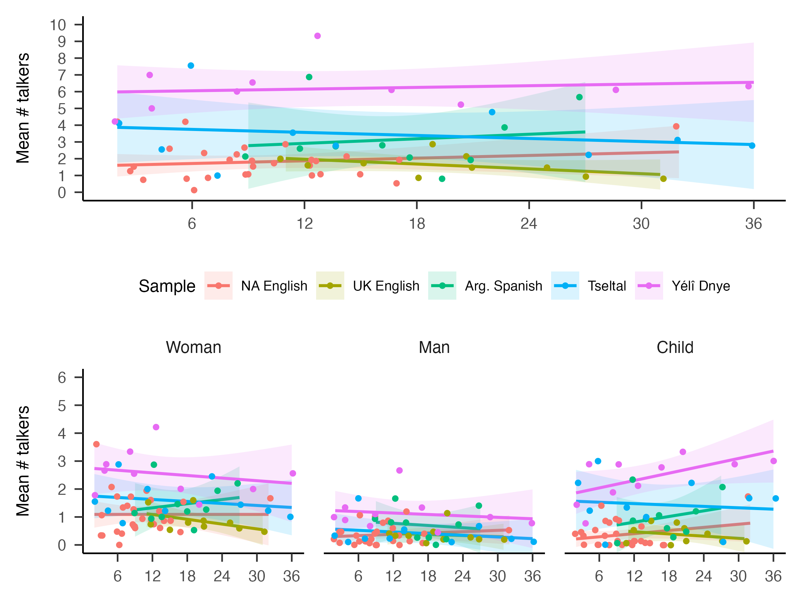
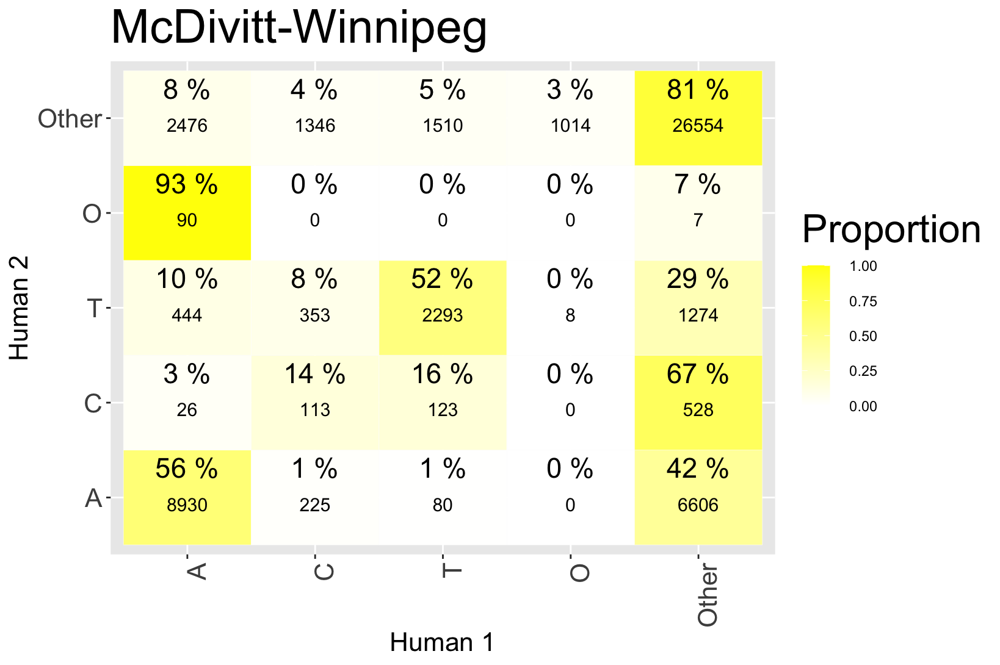

```{r setup, include = FALSE}
library(DHARMa)
library(ggpubr)
library(glmmTMB)
library(magrittr)
library(MASS)
library(papaja)
library(patchwork)
library(stringr)
library(tidyverse)
library(xtable)
library(scales)
library(ggridges)

plot.path <- "plots/"
supp.data.path <- "supplementary/"
processed.data.path <- "processed_data/"
samplelabels <- c("High activity  ", "Random  ")

m_and_sd.info <- read.csv(paste0(
  processed.data.path, "demog_mean_and_sd.csv"))
quantity.rand <- read_csv(paste0(
  processed.data.path, "quantity.rand.anon_col_subset.csv")) %>%
  mutate(
    tchiyr.m = m_and_sd.info$tchiyr.m,
    tchiyr.sd = m_and_sd.info$tchiyr.sd
  )
quantity.rand.bychild <- read_csv(paste0(
  processed.data.path, "quantity.rand.bychild.anon_col_subset.csv")) %>%
  mutate(
    tchiyr.m = m_and_sd.info$tchiyr.m,
    tchiyr.sd = m_and_sd.info$tchiyr.sd
  )
quantity.rand.st <- read_csv(paste0(
  processed.data.path, "quantity.rand.st.anon_col_subset.csv")) %>%
  mutate(
    tchiyr.m = m_and_sd.info$tchiyr.m,
    tchiyr.sd = m_and_sd.info$tchiyr.sd
  )

# Custom utilities

## Standard error of the mean (SEM)
sem <- function (x) {
  sd(x) / sqrt(length(x))
}
## Basic plotting theme
basic.theme <- theme(
  panel.background = element_rect(
    fill = "transparent",colour = NA),
  panel.grid.major = element_blank(),
  panel.grid.minor = element_blank(),
  plot.background = element_rect(
    fill = "transparent",colour = NA),
  legend.background = element_rect(
    fill="transparent"),
  legend.text = element_text(size=30),
  legend.title = element_text(size=30),
  legend.key = element_rect(colour = NA, fill = NA),
  legend.key.height = unit(2, "lines"),
  axis.text.x = element_text(size=30),
  axis.title.x = element_text(size=30),
  axis.text.y = element_text(size=30),
  axis.title.y = element_text(size=30),
  strip.text = element_text(size=30),
  panel.spacing = unit(2, "lines"),
  plot.margin = unit(c(0.5, 0.5, 0.5, 0.5), "cm"))

# Aids for pval display
p.levels <- c(0, 0.001, 0.01)
pval.display <- function(p.est) {
  level <- findInterval(p.est, p.levels)
  p.string <- ifelse(level == 3, paste0("= ", round(p.est, 2)),
                     ifelse(level == 2, "< 0.01", "< 0.001"))
  return(p.string)
}
```

```{r analysis-preferences, include = FALSE}
# Seed for random number generation
set.seed(42)
knitr::opts_chunk$set(cache.extra = knitr::rand_seed)
```

Before describing the contents of these Supplementary Materials, we remind the readers that our analyses are centered on the dependent variables of minutes-per-hour rate of target-child-directed language (TCDL), other-child-directed language (OCDL), all child-directed language (TCDL + OCDL), and adult-directed language (ADL). Please see the main manuscript for reasoning and details.

For those interested in knowing about the _total quantity_ of child-directed language in the children's environments (i.e., all input that is designed for children addressees), the first section includes analyses of all child-directed language (CDL) that parallel what is reported in the main text for target-child-directed language (TCDL).

The second section gives expanded analyses on the number of talkers present. The main manuscript demonstrates strong effects of the number of talkers present in a given clip and motivates the inclusion of number of talkers in the primary statistical models. This supplementary section gives more descriptive information about number of talkers typical in each language group and preliminarily explores how that may account for main-text patterns in different input source types across corpora and target child age.

The third section shows the distribution of target child age by corpus and delves further into discussion of the lack of primary age effects in the primary analyses.

The fourth section uses a set of alternative models of the three dependent variables---TCDL, CDL, and ADL---to examine cross-group differences in these input sources that are naïve to effects of number of talkers and talker type, which may partly reflect cultural patterns.

The fifth section breaks up the North American English language group into individual corpora for those interested in examining potential differences in future work.

The sixth section gives tabular regression outputs for the full binomial mixed-effects regression models of TCDL, CDL, and ADL from which the main-text and section 1 Supplementary Material results are reported.

The seventh section shows a marginal means plot of model-estimated rates of TCDL and ADL rates across language group and age given that the main-text plot illustrates raw data with no age effects.

The eigth and final section shows confusion matrices for addressee-type annotations (e.g., target-child vs. other-child status of an utterance) overall and for each contributed corpus individually.

As in the main text for this study, all statistical analyses were conducted in R with the glmmTMB package [@brooks2017modeling; @R-base] and all figures were generated with ggplot2  [@R-ggplot2]. Analysis scripts and anonymized data are available at  URL_MASKED_FOR_REVIEW.

\newpage

```{r tbl-analysis-prep, include = FALSE}
## Get variables ready for modeling
# Quantity rand
quantity.rand$child_sex <- as.factor(quantity.rand$child_sex)
# quantity.rand$mat_ed <- as.factor(quantity.rand$mat_ed)
nspkrs.m <- mean(quantity.rand$n_spkrs_clip)
nspkrs.sd <- sd(quantity.rand$n_spkrs_clip)
quantity.rand <- quantity.rand %>%
  mutate(
    ads_mph.nz = ifelse(ads_mph > 0, 1, 0),
    tds_mph.nz = ifelse(tds_mph > 0, 1, 0),
    cds_mph.nz = ifelse(cds_mph > 0, 1, 0),
    tchiyr.std = ((age_mo_round - tchiyr.m)/tchiyr.sd),
    chisx.std = recode_factor(child_sex,
                              "M" = "M", "F" = "F"),
    # mated.std = recode_factor(mat_ed,
    #                           "bhs" = "bhs", "hs" = "hs",
    #                           "sc" = "sc", "cd" = "cd", "ad"= "ad"),
    # mated.yrs = recode_factor(mat_ed,
    #                           "bhs" = "6+", "hs" = "12",
    #                           "sc" = "12+", "cd" = "14", "ad" = "16+"),
    # motyr.std = ((mother_age - motyr.m)/motyr.sd),
    # nsb.std = ((number_older_sibs - nsb.m)/nsb.sd),
    # hsz.std = ((household_size - hsz.m)/hsz.sd),
    nsk.std = ((n_spkrs_clip - nspkrs.m)/nspkrs.sd))
# NA_English as reference group
quantity.rand$group_corpNE <- factor(quantity.rand$group_corpNE, levels = c(
    "NA_English", "UK_English", "Arg_Spanish", "Tseltal", "Yeli_Dnye"))

# Quantity rand by speaker type
quantity.rand.st$child_sex <- as.factor(quantity.rand.st$child_sex)
# quantity.rand.st$mat_ed <- as.factor(quantity.rand.st$mat_ed)
nspkrs.sa.m <- mean(quantity.rand.st$n_spkrs_clip.st)
nspkrs.sa.sd <- sd(quantity.rand.st$n_spkrs_clip.st)
quantity.rand.st <- quantity.rand.st %>%
  mutate(
    ads_mph.st.nz = ifelse(ads_mph.st > 0, 1, 0),
    tds_mph.st.nz = ifelse(tds_mph.st > 0, 1, 0),
    cds_mph.st.nz = ifelse(cds_mph.st > 0, 1, 0),
    tchiyr.std = ((age_mo_round - tchiyr.m)/tchiyr.sd),
    chisx.std = recode_factor(child_sex,
      "M" = "M", "F" = "F"),
    # mated.std = recode_factor(mat_ed,
    #   "bhs" = "bhs", "hs" = "hs",
    #   "sc" = "sc", "cd" = "cd", "ad"= "ad"),
    # mated.yrs = recode_factor(mat_ed,
    #   "bhs" = "6+", "hs" = "12",
    #   "sc" = "12+", "cd" = "14", "ad" = "16+"),
    # motyr.std = ((mother_age - motyr.m)/motyr.sd),
    # nsb.std = ((number_older_sibs - nsb.m)/nsb.sd),
    # hsz.std = ((household_size - hsz.m)/hsz.sd),
    nsk.st.std = ((n_spkrs_clip.st - nspkrs.sa.m)/nspkrs.sa.sd))
quantity.rand.st$nsk.st_bin <- ifelse(quantity.rand.st$nsk.st.std > 0, 1, 0)
# add by-clip nsk scores (i.e., not divided by speaker type)
quantity.rand.st %<>%
  left_join(dplyr::select(quantity.rand, c(aclew_child_id, segment,
                                    n_spkrs_clip, nsk.std)))
# NA_English as reference group
quantity.rand.st$group_corpNE <- factor(quantity.rand.st$group_corpNE, levels = c(
    "NA_English", "UK_English", "Arg_Spanish", "Tseltal", "Yeli_Dnye"))
# Women speakers as reference group
quantity.rand.st$SpkrType <- factor(quantity.rand.st$SpkrType, levels = c(
    "Woman", "Man", "Child"))
```

```{r tab4, echo=FALSE, message=FALSE, warning=FALSE, results = "asis"}
by.corp.rates.TDS <- quantity.rand.bychild %>%
  group_by(group_corpNE) %>%
  summarize(
    mean_tds.mph = mean(tds_mph),
    median_tds.mph = median(tds_mph),
    min_tds.mph = min(tds_mph),
    max_tds.mph = max(tds_mph))

by.corp.rates.OCDS <- quantity.rand.bychild %>%
  group_by(group_corpNE) %>%
  summarize(
    mean_ocds.mph = mean(ocds_mph),
    median_ocds.mph = median(ocds_mph),
    min_ocds.mph = min(ocds_mph),
    max_ocds.mph = max(ocds_mph))

by.corp.rates.ADS <- quantity.rand.bychild %>%
  group_by(group_corpNE) %>%
  summarize(
    mean_ads.mph = mean(ads_mph),
    median_ads.mph = median(ads_mph),
    min_ads.mph = min(ads_mph),
    max_ads.mph = max(ads_mph))

by.corp.rates <- by.corp.rates.TDS %>%
  left_join(by.corp.rates.OCDS, by = "group_corpNE") %>%
  left_join(by.corp.rates.ADS, by = "group_corpNE") %>%
  mutate(
    group_corpNE = factor(group_corpNE,
      labels = c("NA English", "Arg. Spanish", "UK English",
        "Tseltal", "Yélî Dnye")),
    group_corpNE = factor(group_corpNE,
      levels = c("NA English", "UK English", "Arg. Spanish",
        "Tseltal", "Yélî Dnye")),
    TDS.rate = paste0(round(mean_tds.mph,2), " (", round(median_tds.mph,2),
      "; ", round(min_tds.mph,2), "-", round(max_tds.mph,2), ")"),
    OCDS.rate = paste0(round(mean_ocds.mph,2), " (", round(median_ocds.mph,2),
      "; ", round(min_ocds.mph,2), "-", round(max_ocds.mph,2), ")"),
    ADS.rate = paste0(round(mean_ads.mph,2), " (", round(median_ads.mph,2),
      "; ", round(min_ads.mph,2), "-", round(max_ads.mph,2), ")"),
    mean.TDS.prop = round(mean_tds.mph/
                            (mean_tds.mph + mean_ocds.mph + mean_ads.mph), 2),
    mean.CDS.prop = round((mean_tds.mph + mean_ocds.mph)/
                            (mean_tds.mph + mean_ocds.mph + mean_ads.mph), 2)) %>%
  rename("Language" = "group_corpNE",
    `TCDL rate` = TDS.rate,
    `OCDL rate` = OCDS.rate,
    `ADL rate` = ADS.rate,
    `Mean proportion TCDL` = mean.TDS.prop,
    `Mean proportion any CDL` = mean.CDS.prop) %>%
  dplyr::select(Language, `TCDL rate`, `OCDL rate`, `ADL rate`,
         `Mean proportion TCDL`, `Mean proportion any CDL`)

apa_table(by.corp.rates, caption="Average input rates per clip across participants for each corpus. Parentheses following the mean indicate the median and range across participants. OCDL indicates rate of input directed to non-target-child children; CDL sums rates of TCDL and OCDL.")
```

```{r CDS_cross_corp_analysis, message=FALSE, warning=FALSE, include=FALSE, paged.print=FALSE}
# CDS (speech from non-target child speakers directed to any child, which can
# include the target child when they are addressed w/ one other child PLUS
# speech exclusively directed to the target child ... i.e., all hearable CDS)
# TCDS + ODS
cds.rand.st.zinb <- glmmTMB(round(cds_mph.st,0) ~
    tchiyr.std + # no change with age (or slight increase)
    SpkrType + # Woman > {Man, Child}
    nsk.std + # more speakers = more speech
    group_corpNE + # more TCDS in WEIRD
    SpkrType:group_corpNE + # more child speakers in non-WEIRD
    tchiyr.std:SpkrType + # more TCDS from children (and perhaps also from men) with age
    (1|aclew_child_id),
  data=quantity.rand.st,
  # The probability of producing a structural zero
  ziformula=~tchiyr.std, # + group_corpNE, # removed group_corpNE for convergence
  family="nbinom1")
# summary(cds.rand.st.zinb)
# cds.rand.st.zinb.res = simulateResiduals(cds.rand.st.zinb)
# plot(cds.rand.st.zinb.res, rank = T)

cds.rand.st.zinb.disp <- round(sigma(cds.rand.st.zinb), 2)
cds.rand.st.zinb.COEF.age <-
  coef(summary(cds.rand.st.zinb))[[1]]["tchiyr.std",] 
cds.rand.st.zinb.COEF.man <-
  coef(summary(cds.rand.st.zinb))[[1]]["SpkrTypeMan",] 
cds.rand.st.zinb.COEF.child <-
  coef(summary(cds.rand.st.zinb))[[1]]["SpkrTypeChild",] 
cds.rand.st.zinb.COEF.nsk <-
  coef(summary(cds.rand.st.zinb))[[1]]["nsk.std",]
cds.rand.st.zinb.COEF.spanish <-
  coef(summary(cds.rand.st.zinb))[[1]]["group_corpNEArg_Spanish",]
cds.rand.st.zinb.COEF.tseltal <-
  coef(summary(cds.rand.st.zinb))[[1]]["group_corpNETseltal",]
cds.rand.st.zinb.COEF.ukenglish <-
  coef(summary(cds.rand.st.zinb))[[1]]["group_corpNEUK_English",]
cds.rand.st.zinb.COEF.yelidnye <-
  coef(summary(cds.rand.st.zinb))[[1]]["group_corpNEYeli_Dnye",]
cds.rand.st.zinb.COEF.manSpanish <-
  coef(summary(cds.rand.st.zinb))[[1]]["SpkrTypeMan:group_corpNEArg_Spanish",]
cds.rand.st.zinb.COEF.childSpanish <-
  coef(summary(cds.rand.st.zinb))[[1]]["SpkrTypeChild:group_corpNEArg_Spanish",]
cds.rand.st.zinb.COEF.manTseltal <-
  coef(summary(cds.rand.st.zinb))[[1]]["SpkrTypeMan:group_corpNETseltal",]
cds.rand.st.zinb.COEF.childTseltal <-
  coef(summary(cds.rand.st.zinb))[[1]]["SpkrTypeChild:group_corpNETseltal",]
cds.rand.st.zinb.COEF.manUKEnglish <-
  coef(summary(cds.rand.st.zinb))[[1]]["SpkrTypeMan:group_corpNEUK_English",]
cds.rand.st.zinb.COEF.childUKEnglish <-
  coef(summary(cds.rand.st.zinb))[[1]]["SpkrTypeChild:group_corpNEUK_English",]
cds.rand.st.zinb.COEF.manYeliDnye <-
  coef(summary(cds.rand.st.zinb))[[1]]["SpkrTypeMan:group_corpNEYeli_Dnye",]
cds.rand.st.zinb.COEF.childYeliDnye <-
  coef(summary(cds.rand.st.zinb))[[1]]["SpkrTypeChild:group_corpNEYeli_Dnye",]
cds.rand.st.zinb.COEF.ageMan <-
  coef(summary(cds.rand.st.zinb))[[1]]["tchiyr.std:SpkrTypeMan",]
cds.rand.st.zinb.COEF.ageChild <-
  coef(summary(cds.rand.st.zinb))[[1]]["tchiyr.std:SpkrTypeChild",]
cds.rand.st.zinb.COEF.age.ZI <-
  coef(summary(cds.rand.st.zinb))[[2]]["tchiyr.std",]
# cds.rand.st.zinb.COEF.spanish.ZI <-
#   coef(summary(cds.rand.st.zinb))[[2]]["group_corpNEArg_Spanish",]
# cds.rand.st.zinb.COEF.tseltal.ZI <-
#   coef(summary(cds.rand.st.zinb))[[2]]["group_corpNETseltal",]
# cds.rand.st.zinb.COEF.ukenglish.ZI <-
#   coef(summary(cds.rand.st.zinb))[[2]]["group_corpNEUK_English",]
# cds.rand.st.zinb.COEF.yelidnye.ZI <-
#   coef(summary(cds.rand.st.zinb))[[2]]["group_corpNEYeli_Dnye",]

cds.model.table <- broom.mixed::tidy(cds.rand.st.zinb) %>%
    mutate(model = "CDL_random_z-inb")
write_csv(cds.model.table, "CDL_random_z-inb.csv")
```

```{r cdsmodelcoeffs}
cds.rand.st.zinb.CIs.countonly <- confint(cds.rand.st.zinb) %>%
  as_tibble(rownames = "Predictor") %>%
  filter(!(grepl("zi", Predictor)) & !(grepl("Intercept", Predictor)))
cds.rand.st.zinb.CIs.countonly$Predictor <- gsub(
  "cond.|SpkrType|group_corpNE", "", cds.rand.st.zinb.CIs.countonly$Predictor)
cds.rand.st.zinb.CIs.countonly$Predictor <- gsub(
  "_", " ", cds.rand.st.zinb.CIs.countonly$Predictor)
cds.rand.st.zinb.CIs.countonly$Predictor <- gsub(
  "tchiyr.std", "Age", cds.rand.st.zinb.CIs.countonly$Predictor)
cds.rand.st.zinb.CIs.countonly$Predictor <- gsub(
  "nsk.std", "# Talkers", cds.rand.st.zinb.CIs.countonly$Predictor)
cds.rand.st.zinb.CIs.countonly$Predictor <- gsub(
  "Yeli Dnye", "Yélî Dnye", cds.rand.st.zinb.CIs.countonly$Predictor)
cds.rand.st.zinb.CIs.countonly$Predictor <- as.factor(
  cds.rand.st.zinb.CIs.countonly$Predictor)
cds.rand.st.zinb.CIs.countonly$Predictor <- factor(
  cds.rand.st.zinb.CIs.countonly$Predictor, levels = c(
   "Age", "# Talkers", "Man", "Child",
   "UK English", "Arg Spanish", "Tseltal", "Yélî Dnye",
   "Man:UK English", "Man:Arg Spanish", "Man:Tseltal", "Man:Yélî Dnye",
   "Child:UK English", "Child:Arg Spanish", "Child:Tseltal", "Child:Yélî Dnye",
   "Age:Man", "Age:Child"
  ))
cds.rand.st.zinb.CIs.countonly %<>%
  mutate(
    pointcolor = case_when(
      grepl("UK English", Predictor) ~ "yellow",
      grepl("Arg Spanish", Predictor) ~ "green",
      grepl("Tseltal", Predictor) ~ "blue",
      grepl("Yélî Dnye", Predictor) ~ "purple",
      TRUE ~ "black"
    ),
    shape = case_when(
      grepl("Man", Predictor) ~ "M",
      grepl("Child", Predictor) ~ "C",
      TRUE ~ ""
    )
  )
col.scale <- hue_pal()(5)

cds.mdl.plot <- ggplot(cds.rand.st.zinb.CIs.countonly,
                        aes(x = Estimate,
                            y = reorder(Predictor,desc(Predictor)),
                            xmin = `2.5 %`, xmax = `97.5 %`,
                            color = pointcolor, shape = shape)) +
  geom_vline(xintercept = 0, lty = "dashed") +
  geom_linerange() +
  geom_point(data = filter(cds.rand.st.zinb.CIs.countonly, shape == ""),
             shape = 19) +
  geom_text(aes(label = shape)) +
  scale_color_manual(values = c(
    "black", col.scale[4], col.scale[3], col.scale[5], col.scale[2])) +
  ylab("Predictor") +
  xlab("Coefficient [95% CI]") +
  scale_x_continuous(breaks = c(-4, -3, -2, -1, 0, 1, 2, 3, 4)) +
  coord_cartesian(xlim = c(-4.3, 4.3)) +
  theme_apa() +
  theme(legend.position = "none")
```

```{r TCDS_cross_corp_analysis, message=FALSE, warning=FALSE, include=FALSE, paged.print=FALSE}
# TCDS = any speech from non-target child speakers addressed to the target child
tds.rand.st.zinb <- glmmTMB(round(tds_mph.st,0) ~
    tchiyr.std + # no change with age (or slight increase)
    SpkrType + # Woman > {Man, Child}
    nsk.std + # more speakers = more speech
    group_corpNE + # more TCDS in WEIRD
    SpkrType:group_corpNE + # more child speakers in non-WEIRD
    tchiyr.std:SpkrType + # more TCDS from children (and perhaps also from men) with age
    (1|aclew_child_id),
  data=quantity.rand.st,
  # The probability of producing a structural zero
  ziformula=~tchiyr.std + group_corpNE,
  family="nbinom1")
# summary(tds.rand.st.zinb)
# tds.rand.st.zinb.res = simulateResiduals(tds.rand.st.zinb)
# plot(tds.rand.st.zinb.res, rank = T)
```

```{r tdsmodelcoeffs}
tds.rand.st.zinb.CIs.countonly <- confint(tds.rand.st.zinb) %>%
  as_tibble(rownames = "Predictor") %>%
  filter(!(grepl("zi", Predictor)) & !(grepl("Intercept", Predictor)))
tds.rand.st.zinb.CIs.countonly$Predictor <- gsub(
  "cond.|SpkrType|group_corpNE", "", tds.rand.st.zinb.CIs.countonly$Predictor)
tds.rand.st.zinb.CIs.countonly$Predictor <- gsub(
  "_", " ", tds.rand.st.zinb.CIs.countonly$Predictor)
tds.rand.st.zinb.CIs.countonly$Predictor <- gsub(
  "tchiyr.std", "Age", tds.rand.st.zinb.CIs.countonly$Predictor)
tds.rand.st.zinb.CIs.countonly$Predictor <- gsub(
  "nsk.std", "# Talkers", tds.rand.st.zinb.CIs.countonly$Predictor)
tds.rand.st.zinb.CIs.countonly$Predictor <- gsub(
  "Yeli Dnye", "Yélî Dnye", tds.rand.st.zinb.CIs.countonly$Predictor)
tds.rand.st.zinb.CIs.countonly$Predictor <- as.factor(
  tds.rand.st.zinb.CIs.countonly$Predictor)
tds.rand.st.zinb.CIs.countonly$Predictor <- factor(
  tds.rand.st.zinb.CIs.countonly$Predictor, levels = c(
   "Age", "# Talkers", "Man", "Child",
   "UK English", "Arg Spanish", "Tseltal", "Yélî Dnye",
   "Man:UK English", "Man:Arg Spanish", "Man:Tseltal", "Man:Yélî Dnye",
   "Child:UK English", "Child:Arg Spanish", "Child:Tseltal", "Child:Yélî Dnye",
   "Age:Man", "Age:Child"
  ))
tds.rand.st.zinb.CIs.countonly %<>%
  mutate(
    pointcolor = case_when(
      grepl("UK English", Predictor) ~ "yellow",
      grepl("Arg Spanish", Predictor) ~ "green",
      grepl("Tseltal", Predictor) ~ "blue",
      grepl("Yélî Dnye", Predictor) ~ "purple",
      TRUE ~ "black"
    ),
    shape = case_when(
      grepl("Man", Predictor) ~ "M",
      grepl("Child", Predictor) ~ "C",
      TRUE ~ ""
    )
  )
col.scale <- hue_pal()(5)

tds.mdl.plot <- ggplot(tds.rand.st.zinb.CIs.countonly,
                        aes(x = Estimate,
                            y = reorder(Predictor,desc(Predictor)),
                            xmin = `2.5 %`, xmax = `97.5 %`,
                            color = pointcolor, shape = shape)) +
  geom_vline(xintercept = 0, lty = "dashed") +
  geom_linerange() +
  geom_point(data = filter(tds.rand.st.zinb.CIs.countonly, shape == ""),
             shape = 19) +
  geom_text(aes(label = shape)) +
  scale_color_manual(values = c(
    "black", col.scale[4], col.scale[3], col.scale[5], col.scale[2])) +
  ylab("Predictor") +
  xlab("Coefficient [95% CI]") +
  scale_x_continuous(breaks = c(-4, -3, -2, -1, 0, 1, 2, 3, 4)) +
  coord_cartesian(xlim = c(-4.3, 4.3)) +
  theme_apa() +
  theme(legend.position = "none")
```

```{r modelcoeffsplotstdscds, echo=FALSE, fig.align = "center", fig.cap="Coefficients and 95% confidence intervals for the count models of TCDL (left) and CDL (i.e. TCDL + OCDL; right) for all included fixed effects. This figure differs from the similar one in the main text, which by contrast features TCDL and ADL, not CDL. Color indicates population (North American English is the modeled reference level), C and M indicate effects related to child- and man-produced utterances, respectively (woman-produced utterances are set as the model reference level).", out.width = '100%'}
# save the figure for later
ggarrange(tds.mdl.plot, cds.mdl.plot, ncol = 2, nrow = 1,
          labels = c("TCDL", "CDL")) %>%
  ggexport(filename = "plots/TCDL_CDL_mdl_summary.png",
           width = 2500, height = 1200,
           res = 300)

# show as saved
knitr::include_graphics("plots/TCDL_CDL_mdl_summary.png")
```

# All child-directed language (CDL)

The analysis of directed linguistic input in the main text focuses on TCDL; that is, input that is exclusively directed to the target child. And yet other types of child-directed input in the environment may also contain the linguistic and communicative features that are associated with facilitated language learning. We here analyze _all_ CDL in the recordings using the same factors as we did for TCDL in the main text. "CDL" here includes all utterances directed to the target child, plus all other observable child-directed language in the audio recording clips, including input directed at groups of children that may or may not include the target child. In other words "CDL" is here all hearable utterances that is directed to a child in the recording; comparable to what is measured, e.g., in @bergelsoncasillas2019what. Therefore this measure of CDL includes all input designed for a child-listener within earshot of the target child wearing the recorder. Keep in mind, however, that much of this input is likely to have been addressed to children of a different age than the target child, to children at a far distance to the target child, or even occasionally to children in a different language than what is typically used for the target child. We gloss over these issues here, as we do not have the annotations to tease each of them apart. Our aim instead is to provide a parallel statistical analysis of CDL to that of TCDL reported in the main text.

On average, across all corpora children were exposed to `r round(mean(quantity.rand.bychild$cds_mph),2)` minutes of CDL per hour across audio clips (median = `r round(median(quantity.rand.bychild$cds_mph),2)`), with wide variation between children (range = `r round(min(quantity.rand.bychild$cds_mph),2)`–`r round(max(quantity.rand.bychild$cds_mph),2)`). Our model of CDL rate was nearly identical to that used for TCDL rate in the main text: It included target child age, talker type, the number of talkers present in the clip, and linguistic community (i.e., corpus), with two additional two-way interactions (talker type by linguistic community and child age by talker type) and random intercepts by child, adding only child age in the zero-inflation model component. The only difference from the main-text model of TCDL was that we did not include linguistic community as a predictor in the zero-inflation component because its inclusion caused model non-convergence. As a reminder, there was no significant effect of corpus in the zero-inflation model component of the main-text TCDL model. This fact, together with the qualitatively similar pattern of findings for CDL in the present model suggests that the pattern of findings reported are robust to this small difference in model structure (N = `r nobs(cds.rand.st.zinb)`, log-likelihood = `r round(logLik(cds.rand.st.zinb)[1], 2)`, overdispersion estimate = `r cds.rand.st.zinb.disp`, formula = CDL_min_p_hr ~ child.age + talker.type + num.spkrs + corpus + talker.type:corpus + child.age:talker.type + (1 | child_id), ziformula = ~ child.age). The results are qualitatively highly similar to the TCDL model presented in the main text. The coefficients and 95% confidence intervals for all fixed effects in the CDL count model are shown in Figure \@ref(fig:modelcoeffsplotstdscds), side by side with the same plot from the TCDL model, replicated from the main text.

CDL input rate significantly differed by talker type, number of talker present, linguistic community, and the interaction between talker type and linguistic community. As with TCDL rate, CDL rate was significantly lower for men compared to women (_B_ = `r round(cds.rand.st.zinb.COEF.man[[1]],2)`, _SE_ = `r round(cds.rand.st.zinb.COEF.man[[2]],2)`, _z_ = `r round(cds.rand.st.zinb.COEF.man[[3]],2)`, _p_ `r pval.display(cds.rand.st.zinb.COEF.man[[4]])`) and for children compared to women (_B_ = `r round(cds.rand.st.zinb.COEF.child[[1]],2)`, _SE_ = `r round(cds.rand.st.zinb.COEF.child[[2]],2)`, _z_ = `r round(cds.rand.st.zinb.COEF.child[[3]],2)`, _p_ `r pval.display(cds.rand.st.zinb.COEF.child[[4]])`). CDL rate was, like TCDL rate, also significantly higher when there were more talkers present (_B_ = `r round(cds.rand.st.zinb.COEF.nsk[[1]],2)`, _SE_ = `r round(cds.rand.st.zinb.COEF.nsk[[2]],2)`, _z_ = `r round(cds.rand.st.zinb.COEF.nsk[[3]],2)`, _p_ `r pval.display(cds.rand.st.zinb.COEF.nsk[[4]])`).

As with TCDL, rates of CDL in Yélî Dnye were significantly lower compared to North American English (_B_ = `r round(cds.rand.st.zinb.COEF.yelidnye[[1]],2)`, _SE_ = `r round(cds.rand.st.zinb.COEF.yelidnye[[2]],2)`, _z_ = `r round(cds.rand.st.zinb.COEF.yelidnye[[3]],2)`, _p_ `r pval.display(cds.rand.st.zinb.COEF.yelidnye[[4]])`), with no significant differences between North American English and the other corpora (all _p_ > .3).

Interactions between talker type and linguistic community were overall similar, with some small differences. Men were previously found to produce significantly more TCDL in the Argentinian Spanish and Yélî Dnye samples (and marginally so for UK English) compared to North American English. When this measure is changed to CDL, the difference only remains apparent for Argentinian Spanish compared to North American English (_B_ = `r round(cds.rand.st.zinb.COEF.manSpanish[[1]],2)`, _SE_ = `r round(cds.rand.st.zinb.COEF.manSpanish[[2]],2)`, _z_ = `r round(cds.rand.st.zinb.COEF.manSpanish[[3]],2)`, _p_ `r pval.display(cds.rand.st.zinb.COEF.manSpanish[[4]])`), though the Yélî Dnye data still point in the same direction (_B_ = `r round(cds.rand.st.zinb.COEF.manYeliDnye[[1]],2)`, _SE_ = `r round(cds.rand.st.zinb.COEF.manYeliDnye[[2]],2)`, _z_ = `r round(cds.rand.st.zinb.COEF.manYeliDnye[[3]],2)`, _p_ `r pval.display(cds.rand.st.zinb.COEF.manYeliDnye[[4]])`) and the UK English difference remains marginal (_B_ = `r round(cds.rand.st.zinb.COEF.manUKEnglish[[1]],2)`, _SE_ = `r round(cds.rand.st.zinb.COEF.manUKEnglish[[2]],2)`, _z_ = `r round(cds.rand.st.zinb.COEF.manUKEnglish[[3]],2)`, _p_ `r pval.display(cds.rand.st.zinb.COEF.manUKEnglish[[4]])`). Children were previously found to produce significantly more TCDL in all four of the non-North American English samples compared to North American English. When this measure is changed to CDL, the difference remains apparent for all cases except UK English, which still goes in the same direction (UK English: _B_ = `r round(cds.rand.st.zinb.COEF.childUKEnglish[[1]],2)`, _SE_ = `r round(cds.rand.st.zinb.COEF.childUKEnglish[[2]],2)`, _z_ = `r round(cds.rand.st.zinb.COEF.childUKEnglish[[3]],2)`, _p_ `r pval.display(cds.rand.st.zinb.COEF.childUKEnglish[[4]])`; Argentinian Spanish: _B_ = `r round(cds.rand.st.zinb.COEF.childSpanish[[1]],2)`, _SE_ = `r round(cds.rand.st.zinb.COEF.childSpanish[[2]],2)`, _z_ = `r round(cds.rand.st.zinb.COEF.childSpanish[[3]],2)`, _p_ `r pval.display(cds.rand.st.zinb.COEF.childSpanish[[4]])`; Tseltal: _B_ = `r round(cds.rand.st.zinb.COEF.childTseltal[[1]],2)`, _SE_ = `r round(cds.rand.st.zinb.COEF.childTseltal[[2]],2)`, _z_ = `r round(cds.rand.st.zinb.COEF.childTseltal[[3]],2)`, _p_ `r pval.display(cds.rand.st.zinb.COEF.childTseltal[[4]])`; Yélî Dnye: _B_ = `r round(cds.rand.st.zinb.COEF.childYeliDnye[[1]],2)`, _SE_ = `r round(cds.rand.st.zinb.COEF.childYeliDnye[[2]],2)`, _z_ = `r round(cds.rand.st.zinb.COEF.childYeliDnye[[3]],2)`, _p_ `r pval.display(cds.rand.st.zinb.COEF.childYeliDnye[[4]])`).

Interactions between talker type and age differed between TCDL and CDL. Whereas the previous analysis suggested that child-produced, but not man-produced, TCDL grows more with age compared to woman-produced TCDL, there are no significant differences across age by talker type with the input measure of CDL. The only evidence for an age-related change by talker type in CDL is marginally slower change in CDL over age for man-produced CDL compared to woman-produced TCDL (_B_ = `r round(cds.rand.st.zinb.COEF.ageMan[[1]],2)`, _SE_ = `r round(cds.rand.st.zinb.COEF.ageMan[[2]],2)`, _z_ = `r round(cds.rand.st.zinb.COEF.ageMan[[3]],2)`, _p_ `r pval.display(cds.rand.st.zinb.COEF.ageMan[[4]])`).

Like the model of TCDL rate, the zero-inflation component of the CDL rate regression suggested that clips with no CDL were not more likely for younger children (_p_ `r pval.display(cds.rand.st.zinb.COEF.age.ZI[[4]])`).

```{r nskplots, echo=FALSE, fig.align = "center", fig.cap="Number of talkers present across language groups, talker types, and target child age. Each datapoint represents the mean from one recording.", out.width = '100%'}
# descriptive stats for text
by.corp.nsk.avgs <- quantity.rand %>%
  group_by(group_corp, aclew_child_id) %>%
  summarize(
    mean = mean(n_spkrs_clip),
    median = median(n_spkrs_clip)) %>%
  group_by(group_corp) %>%
  summarize(
    m.mean = mean(mean),
    m.median = mean(median))

by.corp.nsk.avgs.st <- quantity.rand.st %>%
  group_by(group_corp, aclew_child_id, SpkrType) %>%
  summarize(mean = mean(n_spkrs_clip.st),
            median = median(n_spkrs_clip.st)) %>%
  group_by(group_corp, SpkrType) %>%
  summarize(m.mean = mean(mean),
            m.median = mean(median))

overall.nsk.avgs.st <- by.corp.nsk.avgs.st %>%
  group_by(SpkrType) %>%
  summarize(m.m.mean = mean(m.mean),
            m.m.median = mean(m.median))

# now actually for the plots...
by.rec.ests.nsk.age <- quantity.rand.st %>%
  group_by(group_corpNE, aclew_child_id, age_mo_round, SpkrType) %>%
  summarize(
    .groups = "drop",
    mean.nsk.st = mean(n_spkrs_clip.st),
    sd.nsk.st = sd(n_spkrs_clip.st),
    median.nsk.st = median(n_spkrs_clip.st),
    min.nsk.st = min(n_spkrs_clip.st),
    max.nsk.st = max(n_spkrs_clip.st))

by.rec.ests.nsk.age$Sample <- factor(
  by.rec.ests.nsk.age$group_corpNE, labels = c(
      "NA English", "UK English",
      "Arg. Spanish", "Tseltal", "Yélî Dnye"))
# by.rec.ests.xds.age$Sample <- factor(
#   by.rec.ests.xds.age$Sample, levels = c(
#       "NA English", "UK English", "Arg. Spanish",
#       "Tseltal", "Yélî Dnye"))

nsk.x.lg.age <- ggplot(by.rec.ests.nsk.age, aes(
  x = age_mo_round, y = mean.nsk.st,
  color = Sample, fill = Sample)) +
  facet_wrap(~ SpkrType) + 
  scale_y_continuous(
    breaks = seq(0, 6, 1)) +
  coord_cartesian(ylim = c(0, 6)) +
  scale_x_continuous(
    breaks = seq(0, 36, 6)) +
  ylab("Mean # talkers") +
  geom_smooth(method = "lm", alpha = 0.15) +
  geom_jitter() +
  theme_apa() +
  theme(
    axis.title.x = element_blank(),
    legend.position = "none"
  )

by.rec.ests.nsk.age.overall <- quantity.rand.st %>%
  group_by(group_corpNE, aclew_child_id, age_mo_round) %>%
  summarize(
    .groups = "drop",
    mean.nsk = mean(n_spkrs_clip),
    sd.nsk = sd(n_spkrs_clip),
    median.nsk = median(n_spkrs_clip),
    min.nsk = min(n_spkrs_clip),
    max.nsk = max(n_spkrs_clip))

by.rec.ests.nsk.age.overall$Sample <- factor(
  by.rec.ests.nsk.age.overall$group_corpNE, labels = c(
      "NA English", "UK English",
      "Arg. Spanish", "Tseltal", "Yélî Dnye"))

nsk.x.lg.age.overall <- ggplot(by.rec.ests.nsk.age.overall, aes(
  x = age_mo_round, y = mean.nsk,
  color = Sample, fill = Sample)) +
  scale_y_continuous(
    breaks = seq(0, 10, 1)) +
  coord_cartesian(ylim = c(0, 10)) +
  scale_x_continuous(
    breaks = seq(0, 36, 6)) +
  ylab("Mean # talkers") +
  geom_smooth(method = "lm", alpha = 0.15) +
  geom_jitter() +
  theme_apa() +
  theme(
    axis.title.x = element_blank(),
    legend.position = "bottom"
  )

nsk.plot <- nsk.x.lg.age.overall /
  nsk.x.lg.age

ggsave(
  "NTK_age_summary.png",
  plot = nsk.plot,
  device = "png",
  path = "plots/",
  scale = 1,
  width = 20,
  height = 15,
  units = "cm",
  dpi = 300)

# show as saved

```

\newpage

# Typical numbers of talkers by corpus 

Our primary statistical models account for the number of talkers present in a clip, with the idea that the presence of more talkers leads to more talk in the clip. This is trivially true in the sense that a talker in the clip isn't "counted" unless they talk at least once. The model effects of TCDL, CDL, and ADL, all show very strong effects of number of talkers in the clip, and suggest that the presence of others has a more-than-minimal effect on how much input children encounter, particularly for ADL. Further, we anticipated that some of the differences apparent between linguistic communities is actually due to the greater or lesser number of people typically present around children. For example, we suspected that the organization of households and the number of children per household would lead to greater presence of both adults and children in the Yélî Dnye, Tseltal, and Argentinian Spanish recordings. Without controlling for the number of talkers present in our statistical models, it would have been impossible to tell what portion of cross-site differences in input rates is simply due to number of present talkers vs. other differences in culture, language, and daily life. Our main-text results thus reflect estimates of cultural difference controlling for number of talkers as a separate and significant factor. However, it is also the case that number of talkers may systematically differ between sites in a way that approximates important cultural differences. We here analyze the number of talkers detected in clips across sites and age, both overall and by talker type. Our aim is to illustrate the scale of cross-site differences in potential available interlocutors, which likely reflects differences in household size, household organization, and child caregiving practices. We only superficially characterize these differences here, leaving it to future work to more deeply engage with how these patterns reflect culture- and community-specific practices.

On average, and in addition to any vocalizations by the target child, a given child's clip included at least one utterance from `r round(mean(by.corp.nsk.avgs$m.mean),2)` other talkers (median = `r round(mean(by.corp.nsk.avgs$m.median),2)`; range over all clips = `r min(quantity.rand$n_spkrs_clip)`--`r max(quantity.rand$n_spkrs_clip)`). By talker type, those other interlocutors included an average of `r round(filter(overall.nsk.avgs.st, SpkrType == "Woman")$m.m.mean,2)` women, `r round(filter(overall.nsk.avgs.st, SpkrType == "Man")$m.m.mean,2)` men, and `r round(filter(overall.nsk.avgs.st, SpkrType == "Child")$m.m.mean,2)` children (medians are `r round(overall.nsk.avgs.st$m.m.median,2)[1]`, `r round(overall.nsk.avgs.st$m.m.median,2)[2]`, and `r round(overall.nsk.avgs.st$m.m.median,2)[3]`, respectively). However, these averages obscure significant crosscultural variation, which is apparent in Figure \@ref(fig:nskplots). In particular, the Yélî Dnye recordings show much higher rates of other talker presence compared to the other corpora, with averages of `r round(filter(by.corp.nsk.avgs.st, group_corp == "Yeli_Dnye" & SpkrType == "Woman")$m.mean,2)` women, `r round(filter(by.corp.nsk.avgs.st, group_corp == "Yeli_Dnye" & SpkrType == "Man")$m.mean,2)` men, and `r round(filter(by.corp.nsk.avgs.st, group_corp == "Yeli_Dnye" & SpkrType == "Child")$m.mean,2)` children. Compare to North American English with averages of `r round(filter(by.corp.nsk.avgs.st, group_corp == "NA_English" & SpkrType == "Woman")$m.mean,2)` women, `r round(filter(by.corp.nsk.avgs.st, group_corp == "NA_English" & SpkrType == "Man")$m.mean,2)` men, and `r round(filter(by.corp.nsk.avgs.st, group_corp == "NA_English" & SpkrType == "Child")$m.mean,2)` children and UK English, with `r round(filter(by.corp.nsk.avgs.st, group_corp == "UK_English" & SpkrType == "Woman")$m.mean,2)` women, `r round(filter(by.corp.nsk.avgs.st, group_corp == "UK_English" & SpkrType == "Man")$m.mean,2)` men, and `r round(filter(by.corp.nsk.avgs.st, group_corp == "UK_English" & SpkrType == "Child")$m.mean,2)` children. The Tseltal and Argentinian Spanish communities fall between, with the Tseltal group showing averages of `r round(filter(by.corp.nsk.avgs.st, group_corp == "Tseltal" & SpkrType == "Woman")$m.mean,2)` women, `r round(filter(by.corp.nsk.avgs.st, group_corp == "Tseltal" & SpkrType == "Man")$m.mean,2)` men, and `r round(filter(by.corp.nsk.avgs.st, group_corp == "Tseltal" & SpkrType == "Child")$m.mean,2)` children and the Argentinian Spanish group averages of `r round(filter(by.corp.nsk.avgs.st, group_corp == "Arg_Spanish" & SpkrType == "Woman")$m.mean,2)` women, `r round(filter(by.corp.nsk.avgs.st, group_corp == "Arg_Spanish" & SpkrType == "Man")$m.mean,2)` men, and `r round(filter(by.corp.nsk.avgs.st, group_corp == "Arg_Spanish" & SpkrType == "Child")$m.mean,2)` children.

Overall presence of other talkers looks similar across age, though we observe a slight downward trend in the presence of women contributing input and a slight uptick in children contributing input in some communities. We do not statistically analyze these data given that the measure relies on the inferred number of talkers present rather than the actual number, which would require video data or time-sampled annotations. Thereby the current measure gives insight into effects of household and routine by site, but not adequately to make well substantiated claims at present.

```{r ageplots, echo=FALSE, fig.align = "center", fig.cap="Target child age for each corpus. Each datapoint represents the mean from one recording.", out.width = '100%'}
age.by.corp.allNA <- quantity.rand %>%
  filter(group_corp == "NA_English") %>%
  dplyr::select(group_corp, aclew_child_id, age_mo_round) %>%
  distinct() %>%
  group_by(group_corp, age_mo_round) %>%
  summarize(
    .groups = "drop",
    n.recs = n()) %>%
  mutate(corpus = "NA English (all)") %>%
  select(-group_corp)

age.by.corp <- quantity.rand %>%
  mutate(indiv_corpus = case_when(
    group_corp == "NA_English" & corp == "BER" ~ "Northeastern US (Bergelson)",
    group_corp == "NA_English" & corp == "SOD" ~ "Central Canada (McDivitt-Winnipeg)",
    group_corp == "NA_English" & corp == "WAR" ~ "Western US (Warlaulmont)",
    TRUE ~ group_corp
  )) %>%
  dplyr::select(indiv_corpus, aclew_child_id, age_mo_round) %>%
  distinct() %>%
  group_by(indiv_corpus, age_mo_round) %>%
  summarize(
    .groups = "drop",
    n.recs = n()) %>%
  rename("corpus" = indiv_corpus) %>%
  full_join(age.by.corp.allNA)

age.by.corp$corpus <- factor(age.by.corp$corpus, labels = rev(c(
  "Yélî Dnye", "Western US (Warlaumont)", "UK English", "Tseltal",
  "Northeastern US (Bergelson)", "NA English (all)",
  "Central Canada (McDivitt-Winnipeg)", "Arg Spanish")))
age.by.corp$corpus <- factor(age.by.corp$corpus, levels = rev(c(
  "NA English (all)", "Northeastern US (Bergelson)",
  "Central Canada (McDivitt-Winnipeg)", "Western US (Warlaumont)",
  "UK English", "Arg Spanish", "Tseltal", "Yélî Dnye")))

age.by.corp.fig <- ggplot(age.by.corp, aes(
  x = age_mo_round, y = corpus)) +
  ylab("Corpus") +
  xlab("Target child age (mo)") +
  geom_density_ridges(
    alpha = 0.2,
    jittered_points = TRUE,
    position = position_points_jitter(width = 0.05, height = 0.1)) +
  xlim(0, 40) +
  theme_apa()

# save the figure for later
ggexport(age.by.corp.fig,
         filename = "plots/age_by_corpus_summary.png",
         width = 2500, height = 1875, res = 300)

# show as saved


# age-by-corpus diffs
age.by.corp.nonsummed <- quantity.rand %>%
  mutate(indiv_corpus = case_when(
    group_corp == "NA_English" & corp == "BER" ~ "Northeastern US (Bergelson)",
    group_corp == "NA_English" & corp == "SOD" ~ "Central Canada (McDivitt-Winnipeg)",
    group_corp == "NA_English" & corp == "WAR" ~ "Western US (Warlaumont)",
    TRUE ~ group_corp
  )) %>%
  dplyr::select(group_corp, indiv_corpus, aclew_child_id, age_mo_round) %>%
  distinct() %>%
  rename("corpus" = indiv_corpus)
age.by.corp.nonsummed$group_corp <- factor(
  age.by.corp.nonsummed$group_corp, levels = c(
    "NA_English", "UK_English", "Arg_Spanish", "Tseltal", "Yeli_Dnye"))
# one rec per child, so no random effect of aclew id
age.by.corp.mdl <- lm(age_mo_round ~ group_corp,
                        data = age.by.corp.nonsummed)
# UK Eng, Arg Sp, and Tseltal kids are significantly older than NA Eng
```

\newpage

# (Non-/)effects of target child age by corpus

The distribution of child age across corpora (Figure \@ref(fig:ageplots)) varied somewhat due to the fact that each corpus was collected at a different time and for different purposes by the contributing researchers, long before the present study was initiated. If we use simple linear regression to analyze the sampled 69 recordings to test whether age differs across corpora, we do find that children are significantly younger in the North American English corpora compared to all the other corpora except Yélî Dnye (Age_in_months ~ Site; _p_ < .05 for UK English, Argentinian Spanish, and Tseltal and _p_ = `r round(coef(summary(age.by.corp.mdl))["group_corpYeli_Dnye",][4],3)` for Yélî Dnye). 

In principle, age differences between corpora, even if present, are not necessarily a problem for the present study---in layperson's terms, each mixed-effects regression accounts for all modeled dimensions of each datapoint (including age, corpus, number of talkers in the clip, etc. in addition to a random effect of child) when estimating the direction and significance of impact that each predictor has on the dependent variable. That said, the relatively small sample size here combined with variance in age distribution between corpora could mean that there are true age effects present in the data that we cannot detect under present circumstances (i.e., supposing increased data would substantially change the linear fits of age in the model). As a reminder, we found no evidence for an overall effect of target child age (neither a decrease nor an increase) in the primary models of child-directed language (i.e., TCDL in the main text and CDL here in the supplementary materials). We do find a significant decrease in ADL associated with child age. In our view, the primary concern is then whether we are missing overall effects of child age on TCDL and CDL. However, considering the much better age coverage of our four other corpora---which do not support overall age effects---and that the findings are in line with prior work on North American English showing no increase in CDL with age [@bergelsoncasillas2019what], we are satisfied with the current dataset and analysis.

We here visualize the effect of child age on the dependent variables of interest in each corpus (Figure \@ref(fig:ageplots)) so that the interested reader can get some informal and qualitative impression of potential differences that might be detected if more data were to be added in future work. Please note that any apparent visual differences here, as in the main text figures and tables, do not have the benefit of random-effects controls that are applied in our analysis via the use of statistical models.

```{r xds-age-plots, echo=FALSE, fig.align = "center", fig.cap="TCDL (above) and ADL (below) min/hr rates across language groups and talker types across target child age. Each datapoint represents the mean from one recording. This figure is similar to Figure 2 in the main text, but now additionall displays the data by child age. As is apparent, age effects are minimal for TCDL across corpora and talker type whereas there is a general decrease in ADL across corpora and talker type.", out.width = '100%'}
by.rec.ests.xds.age <- quantity.rand.st %>%
  group_by(group_corpNE, aclew_child_id, age_mo_round, SpkrType) %>%
  summarize(
    .groups = "drop",
    mean.tds_mph = mean(tds_mph.st),
    mean.ads_mph = mean(ads_mph.st))

by.rec.ests.xds.age$Sample <- factor(
  by.rec.ests.xds.age$group_corpNE, labels = c(
      "NA English", "Arg. Spanish",
      "Tseltal", "UK English", "Yélî Dnye"))
by.rec.ests.xds.age$Sample <- factor(
  by.rec.ests.xds.age$Sample, levels = c(
      "NA English", "UK English", "Arg. Spanish",
      "Tseltal", "Yélî Dnye"))
xds.y.unit <- 5

by.spkrtype.ylim.max.ads.age <- by.rec.ests.xds.age %>%
  group_by(age_mo_round, SpkrType) %>%
  summarize(
    .groups = "drop",
    mean.ads_mph = ceiling(
      max(mean.ads_mph)/xds.y.unit)*xds.y.unit + xds.y.unit) %>%
  left_join(distinct(dplyr::select(by.rec.ests.xds.age,
                                   c("Sample", "SpkrType"))))

ads.x.lg.age <- ggplot(by.rec.ests.xds.age, aes(
  x = age_mo_round, y = mean.ads_mph,
  color = Sample, fill = Sample)) +
  geom_blank(data = by.spkrtype.ylim.max.ads.age, aes(
  x = age_mo_round, y = mean.ads_mph,
  color = Sample, fill = Sample)) +
  facet_wrap(~ SpkrType, scales = "free_y") + 
  expand_limits(y = 0) +
  scale_y_continuous(
    expand = c(0, 0),
    breaks = seq(0, max(
      by.spkrtype.ylim.max.ads.age$mean.ads_mph), xds.y.unit)) +
  scale_x_continuous(
    expand = c(0, 0),
    breaks = seq(0, 36, 6)) +
  ylab("Mean ADL min/hr") +
  geom_smooth(method = "lm", alpha = 0.15) +
  geom_jitter() +
  theme_apa() +
  theme(
    axis.title.x = element_blank(),
    legend.position = "none",
    strip.text.x = element_blank()
  )

by.spkrtype.ylim.max.tds.age <- by.rec.ests.xds.age %>%
  group_by(SpkrType, age_mo_round) %>%
  summarize(
    .groups = "drop",
    mean.tds_mph = ceiling(
      max(mean.tds_mph)/xds.y.unit)*xds.y.unit
  ) %>%
  left_join(dplyr::select(by.rec.ests.xds.age,
                          c("Sample", "SpkrType")))

tds.x.lg.age <- ggplot(by.rec.ests.xds.age, aes(
  x = age_mo_round, y = mean.tds_mph,
  color = Sample, fill = Sample)) +
  geom_blank(data = by.spkrtype.ylim.max.tds.age, aes(
  x = age_mo_round, y = mean.tds_mph,
  color = Sample, fill = Sample)) +
  facet_wrap(~ SpkrType, scales = "free_y") + 
  expand_limits(y = 0) +
  scale_y_continuous(
    expand = c(0, 0),
    breaks = seq(0, max(
      by.spkrtype.ylim.max.tds.age$mean.tds_mph), xds.y.unit)) +
  scale_x_continuous(
    expand = c(0, 0),
    breaks = seq(0, 36, 6)) +
  ylab("Mean TCDL min/hr") +
  geom_smooth(method = "lm", alpha = 0.15) +
  geom_jitter() +
  theme_apa() +
  theme(
    axis.title.x = element_blank(),
    legend.position = "none"
  )

# save the figure for later
ggarrange(tds.x.lg.age, ads.x.lg.age, ncol = 1, nrow = 2,
          common.legend = TRUE, legend = "bottom") %>%
  ggexport(filename = "plots/XDL_age_summary.png",
           width = 2500, height = 1875,
           res = 300)

# show as saved
knitr::include_graphics("plots/XDL_age_summary.png")
```


\newpage

# Simple models of age and cross-site difference in TCDL, CDL, and ADL rates

Up until now we have analyzed cross-corpus and age-based differences in TCDL, CDL, and ADL rate while _also_ accounting for other factors that may drive variation in input rate. These factors include: the number of talkers known to be present in a given clip and the different talker types who produce this talk (male and female adults and non-target children). There are arguments for and against including these factors in our model of cross-cultural differences, depending on one's theoretical goals. 

By including these factors in the model, as we have in the main-text models of TCDL and ADL and in the model of CDL above, we can gain a more detailed perspective on the shared features that drive variation in input rate between and within corpora. For example, by adding in the number of talkers in a clip to our model, we can account for the fact that the presence of more people generally leads to more talk, regardless of the child's developmental context---indeed, we find that this effect drives variation in general and thereby affects children regardless of whether they grow up in North America, the UK, Argentina, Tenejapa, or Rossel Island. A similar case can be made for talker types: the fact that women are more likely to produce all three types of input than men or children illustrates a general finding that crosscuts the corpora, though our main models show that this effect of talker type is slightly different from context to context. By modeling these effects, we can make fairly detailed predictions about the input a child is likely to hear in a given clip (e.g., we can predict how much ADL a Tseltal-acquiring child at age 12 months with 4 other voices present will hear, and how likely it is to come from a woman vs. child vs. man).

However, a valid alternative perspective is that these cross-corpus differences in the type and number of talkers are reflective of the children's broader cultural and linguistic milieu and therefore variance due to these factors should not be separately accounted for in the model if we wish to obtain a more general picture of the differences in children's language experiences across these communities. Consider number of talkers present in the clip.

As shown above, there is systematic variation across our corpora in the number of present talkers: for example, Yélî Dnye-acquiring children are surrounded by substantially more talkers than children in the other corpora. There may be two ways of looking at Yélî children's experience of TCDL: (1) All else being equal, Yélî Dnye-acquiring children hear significantly less TCDL compared to North American English, _but_ the situation is not equal; because they have so many more people present than the North American English case, their overall TCDL input experienced is the same as (if not more than) what is heard by North American English-acquiring children or (2) considering children's overall linguistic environment, Yélî Dnye-acquiring children hear approximately the same rates of TCDL as North American English-acquiring children, if not more.

As the reader can tell, the first interpretation provides greater nuance, but more importantly, it speaks to useful avenues forward in understanding the levers of cross-cultural difference (e.g., number of talkers present as a proxy for household size and composition or everyday routines; types of talker input as a proxy for alloparenting practices and (non-)overlap in work vs. home settings). It can, however, obscure overall differences that are apparent when all these cultural effects add up in an individual child's experience.

In this analysis, therefore, we replicate our models of TCDL, CDL, and ADL, only now removing predictors relating to number of talkers present and type of talker. Therefore each count model only includes effects of child age (in months; centered and standardized) and corpus (North American English/UK English/Argentinian Spanish/Tseltal/Yélî Dnye), and the zero-inflation component includes the same two predictors, with a random effect of child (formula = XDS_min_p_hr ~ child.age + corpus + (1 | child_id), ziformula = ~ child.age + corpus).

```{r simplermodels_cross_corp_analysis, message=FALSE, warning=FALSE, include=FALSE, paged.print=FALSE}
# Overall differences between corpora
tds.rand.st.zinb.mini <- glmmTMB(round(tds_mph,0) ~
    tchiyr.std + # no change with age (or slight increase)
    group_corpNE + # more TCDS in WEIRD
    (1|aclew_child_id),
  data=quantity.rand,
  # The probability of producing a structural zero
  ziformula=~tchiyr.std + group_corpNE,
  family="nbinom1")
# summary(tds.rand.st.zinb.mini)
# tds.rand.st.zinb.mini.res = simulateResiduals(tds.rand.st.zinb.mini)
# plot(tds.rand.st.zinb.mini.res, rank = T)
tds.rand.st.zinb.mini.disp <- round(sigma(tds.rand.st.zinb.mini), 2)
tds.rand.st.zinb.mini.COEF.age <-
  coef(summary(tds.rand.st.zinb.mini))[[1]]["tchiyr.std",] 
tds.rand.st.zinb.mini.COEF.spanish <-
  coef(summary(tds.rand.st.zinb.mini))[[1]]["group_corpNEArg_Spanish",]
tds.rand.st.zinb.mini.COEF.tseltal <-
  coef(summary(tds.rand.st.zinb.mini))[[1]]["group_corpNETseltal",]
tds.rand.st.zinb.mini.COEF.ukenglish <-
  coef(summary(tds.rand.st.zinb.mini))[[1]]["group_corpNEUK_English",]
tds.rand.st.zinb.mini.COEF.yelidnye <-
  coef(summary(tds.rand.st.zinb.mini))[[1]]["group_corpNEYeli_Dnye",]
# zi
tds.rand.st.zinb.mini.COEF.age.ZI <-
  coef(summary(tds.rand.st.zinb.mini))[[2]]["tchiyr.std",]
tds.rand.st.zinb.mini.COEF.spanish.ZI <-
  coef(summary(tds.rand.st.zinb.mini))[[2]]["group_corpNEArg_Spanish",]
tds.rand.st.zinb.mini.COEF.tseltal.ZI <-
  coef(summary(tds.rand.st.zinb.mini))[[2]]["group_corpNETseltal",]
tds.rand.st.zinb.mini.COEF.ukenglish.ZI <-
  coef(summary(tds.rand.st.zinb.mini))[[2]]["group_corpNEUK_English",]
tds.rand.st.zinb.mini.COEF.yelidnye.ZI <-
  coef(summary(tds.rand.st.zinb.mini))[[2]]["group_corpNEYeli_Dnye",]


cds.rand.st.zinb.mini <- glmmTMB(round(cds_mph,0) ~
    tchiyr.std + # no change with age (or slight increase)
    group_corpNE + # more TCDS in WEIRD
    (1|aclew_child_id),
  data=quantity.rand,
  # The probability of producing a structural zero
  ziformula=~tchiyr.std + group_corpNE,
  family="nbinom1")
# summary(cds.rand.st.zinb.mini)
# cds.rand.st.zinb.mini.res = simulateResiduals(cds.rand.st.zinb.mini)
# plot(cds.rand.st.zinb.mini.res, rank = T)
cds.rand.st.zinb.mini.disp <- round(sigma(cds.rand.st.zinb.mini), 2)
cds.rand.st.zinb.mini.COEF.age <-
  coef(summary(cds.rand.st.zinb.mini))[[1]]["tchiyr.std",] 
cds.rand.st.zinb.mini.COEF.spanish <-
  coef(summary(cds.rand.st.zinb.mini))[[1]]["group_corpNEArg_Spanish",]
cds.rand.st.zinb.mini.COEF.tseltal <-
  coef(summary(cds.rand.st.zinb.mini))[[1]]["group_corpNETseltal",]
cds.rand.st.zinb.mini.COEF.ukenglish <-
  coef(summary(cds.rand.st.zinb.mini))[[1]]["group_corpNEUK_English",]
cds.rand.st.zinb.mini.COEF.yelidnye <-
  coef(summary(cds.rand.st.zinb.mini))[[1]]["group_corpNEYeli_Dnye",]
# zi
cds.rand.st.zinb.mini.COEF.age.ZI <-
  coef(summary(cds.rand.st.zinb.mini))[[2]]["tchiyr.std",]
cds.rand.st.zinb.mini.COEF.spanish.ZI <-
  coef(summary(cds.rand.st.zinb.mini))[[2]]["group_corpNEArg_Spanish",]
cds.rand.st.zinb.mini.COEF.tseltal.ZI <-
  coef(summary(cds.rand.st.zinb.mini))[[2]]["group_corpNETseltal",]
cds.rand.st.zinb.mini.COEF.ukenglish.ZI <-
  coef(summary(cds.rand.st.zinb.mini))[[2]]["group_corpNEUK_English",]
cds.rand.st.zinb.mini.COEF.yelidnye.ZI <-
  coef(summary(cds.rand.st.zinb.mini))[[2]]["group_corpNEYeli_Dnye",]


ads.rand.st.zinb.mini <- glmmTMB(round(ads_mph,0) ~
    tchiyr.std + # decrease with age
    group_corpNE + # more ADS in non-WEIRD
    (1|aclew_child_id),
  data=quantity.rand,
  # The probability of producing a structural zero
  ziformula=~tchiyr.std + group_corpNE,
  family="nbinom1")
# summary(ads.rand.st.zinb.mini)
# ads.rand.st.zinb.mini.res = simulateResiduals(ads.rand.st.zinb.mini)
# plot(ads.rand.st.zinb.mini.res, rank = T)
ads.rand.st.zinb.mini.disp <- round(sigma(ads.rand.st.zinb.mini), 2)
ads.rand.st.zinb.mini.COEF.age <-
  coef(summary(ads.rand.st.zinb.mini))[[1]]["tchiyr.std",] 
ads.rand.st.zinb.mini.COEF.spanish <-
  coef(summary(ads.rand.st.zinb.mini))[[1]]["group_corpNEArg_Spanish",]
ads.rand.st.zinb.mini.COEF.tseltal <-
  coef(summary(ads.rand.st.zinb.mini))[[1]]["group_corpNETseltal",]
ads.rand.st.zinb.mini.COEF.ukenglish <-
  coef(summary(ads.rand.st.zinb.mini))[[1]]["group_corpNEUK_English",]
ads.rand.st.zinb.mini.COEF.yelidnye <-
  coef(summary(ads.rand.st.zinb.mini))[[1]]["group_corpNEYeli_Dnye",]
# zi
ads.rand.st.zinb.mini.COEF.age.ZI <-
  coef(summary(ads.rand.st.zinb.mini))[[2]]["tchiyr.std",]
ads.rand.st.zinb.mini.COEF.spanish.ZI <-
  coef(summary(ads.rand.st.zinb.mini))[[2]]["group_corpNEArg_Spanish",]
ads.rand.st.zinb.mini.COEF.tseltal.ZI <-
  coef(summary(ads.rand.st.zinb.mini))[[2]]["group_corpNETseltal",]
ads.rand.st.zinb.mini.COEF.ukenglish.ZI <-
  coef(summary(ads.rand.st.zinb.mini))[[2]]["group_corpNEUK_English",]
ads.rand.st.zinb.mini.COEF.yelidnye.ZI <-
  coef(summary(ads.rand.st.zinb.mini))[[2]]["group_corpNEYeli_Dnye",]

```

## Target-child-directed language (TCDL)

The count model of the simpler regression of TCDL (N = `r nobs(tds.rand.st.zinb.mini)`, log-likelihood = `r round(logLik(tds.rand.st.zinb.mini)[1], 2)`, overdispersion estimate = `r tds.rand.st.zinb.mini.disp`) showed a marginal effect of child age (_B_ = `r round(tds.rand.st.zinb.mini.COEF.age[[1]],2)`, _SE_ = `r round(tds.rand.st.zinb.mini.COEF.age[[2]],2)`, _z_ = `r round(tds.rand.st.zinb.mini.COEF.age[[3]],2)`, _p_ `r pval.display(tds.rand.st.zinb.mini.COEF.age[[4]])`) and no significant effects of corpus in the count model (all _p_ > .34). The zero-inflation component similarly showed no significant effects of age or corpus (all _p_ > .15).

## All child-directed language (CDL)

The count model of the simpler regression of CDL (N = `r nobs(cds.rand.st.zinb.mini)`, log-likelihood = `r round(logLik(cds.rand.st.zinb.mini)[1], 2)`, overdispersion estimate = `r cds.rand.st.zinb.mini.disp`) showed no effect of child age (_B_ = `r round(cds.rand.st.zinb.mini.COEF.age[[1]],2)`, _SE_ = `r round(cds.rand.st.zinb.mini.COEF.age[[2]],2)`, _z_ = `r round(cds.rand.st.zinb.mini.COEF.age[[3]],2)`, _p_ `r pval.display(cds.rand.st.zinb.mini.COEF.age[[4]])`) but a significant effect of corpus: CDL rates were significantly higher for Yélî Dnye-acquiring children compared to North American English-acquiring children (_B_ = `r round(cds.rand.st.zinb.mini.COEF.yelidnye[[1]],2)`, _SE_ = `r round(cds.rand.st.zinb.mini.COEF.yelidnye[[2]],2)`, _z_ = `r round(cds.rand.st.zinb.mini.COEF.yelidnye[[3]],2)`, _p_ `r pval.display(cds.rand.st.zinb.mini.COEF.yelidnye[[4]])`). No other corpus showed significant difference in the rate of CDL compared to North American English (all _p_ > 0.2). However, in this case the zero-inflation component showed that both Tseltal and Yélî Dnye were significantly less likely than North American English to have clips with zero CDL (Tseltal: _B_ = `r round(cds.rand.st.zinb.mini.COEF.tseltal.ZI[[1]],2)`, _SE_ = `r round(cds.rand.st.zinb.mini.COEF.tseltal.ZI[[2]],2)`, _z_ = `r round(cds.rand.st.zinb.mini.COEF.tseltal.ZI[[3]],2)`, _p_ `r pval.display(cds.rand.st.zinb.mini.COEF.tseltal.ZI[[4]])`; Yélî Dnye: _B_ = `r round(cds.rand.st.zinb.mini.COEF.yelidnye.ZI[[1]],2)`, _SE_ = `r round(cds.rand.st.zinb.mini.COEF.yelidnye.ZI[[2]],2)`, _z_ = `r round(cds.rand.st.zinb.mini.COEF.yelidnye.ZI[[3]],2)`, _p_ `r pval.display(cds.rand.st.zinb.mini.COEF.yelidnye.ZI[[4]])`; UK English _p_ = .49; Arg. Spanish _p_ = .99). Put differently, the combined outcomes of the model show that zero-CDL clips were significantly more likely for North American English-acquiring children than Tseltal and Yélî Dnye-acquiring children and that, for clips with some non-zero amount of CDL, the rate of CDL is significantly higher for Yélî Dnye-acquiring children than North American English-acquiring children. The zero-inflation component demonstrated no effect of child age.

## Adult-directed language (ADL)

The count model of the simpler regression of ADL (N = `r nobs(ads.rand.st.zinb.mini)`, log-likelihood = `r round(logLik(ads.rand.st.zinb.mini)[1], 2)`, overdispersion estimate = `r ads.rand.st.zinb.mini.disp`) showed significant effects of both child age and corpus. ADL decreased with child age (_B_ = `r round(ads.rand.st.zinb.mini.COEF.age[[1]],2)`, _SE_ = `r round(ads.rand.st.zinb.mini.COEF.age[[2]],2)`, _z_ = `r round(ads.rand.st.zinb.mini.COEF.age[[3]],2)`, _p_ `r pval.display(ads.rand.st.zinb.mini.COEF.age[[4]])`). ADL rates were also significantly higher in Yélî Dnye compared to North American English (_B_ = `r round(ads.rand.st.zinb.mini.COEF.yelidnye[[1]],2)`, _SE_ = `r round(ads.rand.st.zinb.mini.COEF.yelidnye[[2]],2)`, _z_ = `r round(ads.rand.st.zinb.mini.COEF.yelidnye[[3]],2)`, _p_ `r pval.display(ads.rand.st.zinb.mini.COEF.yelidnye[[4]])`). No other corpus showed significant difference in the rate of ADL compared to North American English (all _p_ > 0.19). As with CDL, the zero-inflation model component revealed further structure in the data: zero-ADL clips were significantly less likely in Yélî Dnye data and marginally less likely in Tseltal data compared to North American English (Yélî Dnye: _B_ = `r round(ads.rand.st.zinb.mini.COEF.yelidnye.ZI[[1]],2)`, _SE_ = `r round(ads.rand.st.zinb.mini.COEF.yelidnye.ZI[[2]],2)`, _z_ = `r round(ads.rand.st.zinb.mini.COEF.yelidnye.ZI[[3]],2)`, _p_ `r pval.display(ads.rand.st.zinb.mini.COEF.yelidnye.ZI[[4]])`; Tseltal: _B_ = `r round(ads.rand.st.zinb.mini.COEF.tseltal.ZI[[1]],2)`, _SE_ = `r round(ads.rand.st.zinb.mini.COEF.tseltal.ZI[[2]],2)`, _z_ = `r round(ads.rand.st.zinb.mini.COEF.tseltal.ZI[[3]],2)`, _p_ `r pval.display(ads.rand.st.zinb.mini.COEF.tseltal.ZI[[4]])`; UK English _p_ = .31; Arg. Spanish _p_ = .20). Again then, the combined output of the model shows that zero-ADL clips were significantly more likely for North American English-acquiring children than Yélî Dnye-acquiring children (and marginally for Tseltal-acquiring children) and that, for clips with non-zero amounts of ADL, the rate of ADL is significantly higher for Yélî Dnye-acquiring children than North American English-acquiring children. Consistent with the other models, there is no evidence of an age effect in the zero-inflation model component.

Pulling these results together with those reported in the main text (TCDL, ADL) and above (CDL), two primary points are worth highlighting. First, Yélî Dnye looks very different when number of talkers is removed from the model---it has equivalent overall rates of TCDL, higher rates of CDL and ADL, and is less likely to have a zero-CDL or zero-ADL clip compared to North American English. This pattern falls in line with the main-text results and the fact that there are simply more people present in the language environment of Yélî Dnye-acquiring kids compared to the other corpora included here. Second, we lose sight of the critical and cross-corpus effects that account for fluctuations in talker presence and types of talkers present that we know, from the primary analyses, have a significant impact on the data.

\newpage

# Individual North American English data

In the main-text analyses we pool together the North American English datasets. We here present the primary descriptive figure from the main text, but with data broken out by individual corpus and not by language variety.

```{r xds-byfinecorp-plots, echo=FALSE, fig.align = "center", fig.cap="TCDL (above) and ADL (below) min/hr rates across individual North American English corpora and talker types across target child age. Each datapoint represents the mean from one recording.", out.width = '100%'}
by.rec.ests.xds.corp <- quantity.rand.st %>%
  filter(group_corp == "NA_English") %>%
  group_by(corp, aclew_child_id, age_mo_round, SpkrType) %>%
  summarize(
    .groups = "drop",
    mean.tds_mph = mean(tds_mph.st),
    mean.ads_mph = mean(ads_mph.st))

by.rec.ests.xds.corp$Sample <- factor(by.rec.ests.xds.corp$corp, labels = c(
      "Northeastern US (Bergelson)", "Central Canada (McDivitt-Winnipeg)", "Western US (Warlaumont)"))
xds.y.unit <- 5

by.spkrtype.ylim.max.ads.corp <- by.rec.ests.xds.corp %>%
  group_by(SpkrType, age_mo_round) %>%
  summarize(
    .groups = "drop",
    mean.ads_mph = ceiling(max(mean.ads_mph)/xds.y.unit)*xds.y.unit + xds.y.unit) %>%
  left_join(distinct(dplyr::select(by.rec.ests.xds.corp, c("Sample", "SpkrType"))))

ads.x.lg.corp <- ggplot(by.rec.ests.xds.corp, aes(
  x = age_mo_round, y = mean.ads_mph,
  color = Sample, fill = Sample)) +
  geom_blank(data = by.spkrtype.ylim.max.ads.corp, aes(
  x = age_mo_round, y = mean.ads_mph,
  color = Sample, fill = Sample)) +
  facet_wrap(~ SpkrType, scales = "free_y") + 
  expand_limits(y = 0) +
  scale_y_continuous(
    expand = c(0, 0),
    breaks = seq(0, max(
      by.spkrtype.ylim.max.tds.age$mean.tds_mph), xds.y.unit)) +
  scale_x_continuous(
    expand = c(0, 0),
    breaks = seq(0, 36, 6)) +
  ylab("Mean ADL min/hr") +
  geom_smooth(method = "lm", alpha = 0.15) +
  geom_jitter() +
  theme_apa() +
  theme(
    axis.title.x = element_blank(),
    legend.position = "none",
    strip.text.x = element_blank()
  )

by.spkrtype.ylim.max.tds.corp <- by.rec.ests.xds.corp %>%
  group_by(SpkrType, age_mo_round) %>%
  summarize(
    .groups = "drop",
    mean.tds_mph = ceiling(max(mean.tds_mph)/xds.y.unit)*xds.y.unit
  ) %>%
  left_join(dplyr::select(by.rec.ests.xds.corp, c("Sample", "SpkrType")))

tds.x.lg.corp <- ggplot(by.rec.ests.xds.corp, aes(
  x = age_mo_round, y = mean.tds_mph,
  color = Sample, fill = Sample)) +
  geom_blank(data = by.spkrtype.ylim.max.tds.corp, aes(
  x = age_mo_round, y = mean.tds_mph,
  color = Sample, fill = Sample)) +
  facet_wrap(~ SpkrType, scales = "free_y") + 
  expand_limits(y = 0) +
  scale_y_continuous(
    expand = c(0, 0),
    breaks = seq(0, max(
      by.spkrtype.ylim.max.tds.age$mean.tds_mph), xds.y.unit)) +
  scale_x_continuous(
    expand = c(0, 0),
    breaks = seq(0, 36, 6)) +
  ylab("Mean TCDL min/hr") +
  geom_smooth(method = "lm", alpha = 0.15) +
  geom_jitter() +
  theme_apa() +
  theme(
    axis.title.x = element_blank(),
    legend.position = "none"
  )

# save the figure for later
ggarrange(tds.x.lg.corp, ads.x.lg.corp, ncol = 1, nrow = 2,
          common.legend = TRUE, legend = "bottom") %>%
  ggexport(filename = "plots/XDL_indivNAcorpus_summary.png",
           width = 2500, height = 1875,
           res = 300)

# show as saved
knitr::include_graphics("plots/XDL_indivNAcorpus_summary.png")
```


\newpage

# Full model output for TCDL, CDL, and ADL

The full zero-inflated negative binomial mixed-effects regression output tables for TCDL, CDL, and ADL rate are presented below.

```{r mdl-full-prep, include = FALSE}
# TCDS
tds.model.results <- read_csv("TDL_random_z-inb.csv")
tds.model.results <- tds.model.results %>%
  select(-effect, -group, -model) %>%
  mutate(
    component = case_when(
      component == "cond" ~ "count",
      component == "zi" ~ "zero-inflation",TRUE ~ ""),
    p.value = case_when(
      p.value < 0.001 ~ pval.display(p.value),
      is.na(p.value) ~ "",
      TRUE ~ as.character(round(p.value, 3))),
    estimate = round(estimate, 3),
    std.error = as.character(round(std.error, 3)),
    statistic = as.character(round(statistic, 3))) %>%
  replace_na(list(std.error = "", statistic = "")) %>%
  arrange(component)
names(tds.model.results) <- c(
  "Model component", "Term", "Estimate (B)", "Std. Error", "t-value", "p-value")

# CDS
cds.model.results <- read_csv("CDL_random_z-inb.csv")
cds.model.results <- cds.model.results %>%
  select(-effect, -group, -model) %>%
  mutate(
    component = case_when(
      component == "cond" ~ "count",
      component == "zi" ~ "zero-inflation",TRUE ~ ""),
    p.value = case_when(
      p.value < 0.001 ~ pval.display(p.value),
      is.na(p.value) ~ "",
      TRUE ~ as.character(round(p.value, 3))),
    estimate = round(estimate, 3),
    std.error = as.character(round(std.error, 3)),
    statistic = as.character(round(statistic, 3))) %>%
  replace_na(list(std.error = "", statistic = "")) %>%
  arrange(component)
names(cds.model.results) <- c(
  "Model component", "Term", "Estimate (B)", "Std. Error", "t-value", "p-value")

# ADS
ads.model.results <- read_csv("ADL_random_z-inb.csv")
ads.model.results <- ads.model.results %>%
  select(-effect, -group, -model) %>%
  mutate(
    component = case_when(
      component == "cond" ~ "count",
      component == "zi" ~ "zero-inflation",TRUE ~ ""),
    p.value = case_when(
      p.value < 0.001 ~ pval.display(p.value),
      is.na(p.value) ~ "",
      TRUE ~ as.character(round(p.value, 3))),
    estimate = round(estimate, 3),
    std.error = as.character(round(std.error, 3)),
    statistic = as.character(round(statistic, 3))) %>%
  replace_na(list(std.error = "", statistic = "")) %>%
  arrange(component)
names(ads.model.results) <- c(
  "Model component", "Term", "Estimate (B)", "Std. Error", "t-value", "p-value")

```

```{r mdl-full-tds, echo=FALSE, results='asis', message=FALSE, warning=FALSE}
apa_table(tds.model.results,
          caption="Full output of the zero-inflated negative binomial mixed-effects regression of TCDL min/hr")
```

```{r mdl-full-cds, echo=FALSE, results='asis', message=FALSE, warning=FALSE}
apa_table(cds.model.results,
          caption="Full output of the zero-inflated negative binomial mixed-effects regression of CDL min/hr")
```

```{r mdl-full-ads, echo=FALSE, results='asis', message=FALSE, warning=FALSE}
apa_table(ads.model.results,
          caption="Full output of the zero-inflated negative binomial mixed-effects regression of ADL min/hr")
```

\newpage

# Marginal means estimates of TCDL and ADL

In the main manuscript the plotted data of TCDL and ADL across corpora and linguistic community are shown based on the actual data. However, our analyses take into account a number of factors that are not visible in that main-text plot. Here we show marginal-means plots from the models of ADL and TCDL, displaying estimated values of each over child age, and talker type, for each corpus.

```{r tds-mms-plots, echo=FALSE, fig.align = "center", fig.cap="Model estimated rates of TCDL min/hr by target child age and corpus, shown all together in the top panel and split by talker type in the bottom panel. Each datapoint represents the mean from one recording.", out.width = '100%'}
# show as saved
knitr::include_graphics("plots/tdl-estimates-plot.png")
```

```{r ads-mms-plots, echo=FALSE, fig.align = "center", fig.cap="Model estimated rates of ADL min/hr by target child age and corpus, shown all together in the top panel and split by talker type in the bottom panel. Each datapoint represents the mean from one recording.", out.width = '100%'}
# show as saved
knitr::include_graphics("plots/adl-estimates-plot.png")
```

\newpage

# Confusion among addressee annotation types

The agreement scores for addressee ranged from slight to substantial across corpora. We lay out here further information about how these agreement scores are derived and distributed in this continuous, naturalistic dataset.

We show below a confusion matrix displaying the first vs. second annotator’s impressions of addressee across all corpora. To deal with the fact that we have continuous data (not, e.g., individual clips that are multiply coded, as in @bergelsoncasillas2019what or @weisleder2013talking) we compute reliability over very short audio frames in the transcriptions. If the annotation from Human 1 matches the annotation from Human 2 during a given frame, then it is a match. Otherwise, it is a mismatch. So if, for example, Human 1 annotates a 1000 msec stretch as addressee “T” and Human 2 annotates an overlapping 500 msec stretch as addressee “T”, they only agree for half of the frames. As the reader can see, this means that if one annotator misses an utterance, or if there is a lot of overlap in talkers (for which we cannot straightforwardly compute an addressee value for a frame), agreement declines.

The actual addressee categories in our reliability analysis are T (target child), C (other child), A (adult), or O (other, including all other types and unsure). The “Other” category shown in the confusion matrix below includes cases where one annotator’s frame included silence or overlapping talk. Each row sums to 100% (note that cell estimates are rounded). As is apparent in the figure, for the cases when the two annotators agree that there is a single talker producing talk, confusion is relatively low and the correct category assignment is reliably visible against the other choices (i.e., note the apparent darker diagonal across the matrix). Confusion between T and C is slightly higher than the other cases of addressee type, but not much so. Most cases of disagreement are really only with the cases of silence or overlapping speech—a kind of error inherited from the process of speech diarization.

```{r allconfmat, echo=FALSE, fig.align = "center", fig.cap="Confusion matrix across all corpora for addressee annotations between the two human annotators.", out.width = '100%'}
# show as saved

```

However, this is the sum over _all_ of the data that we have. We had anticipated that reliability would be substantially worse in the Argentinian Spanish, Tseltal, and Yélî Dnye data because the reliability annotators did not actually fluently speak (if they had any knowledge at all) of the data they were annotating. Only the English-based corpora always had native-speaking annotators. Indeed, the reliability patterns are less clear for the non-English corpora, likely due to this language barrier, which prevents the annotator from taking all context into account in their decision. This pattern is visible in the same matrix, but now created for each individual corpus. We take this as indirect evidence in favor of the only _partial_ recoverability of register and addressee-specific features across diverse languages [see also @soderstrom2021english].

```{r berconfmat, echo=FALSE, fig.align = "center", fig.cap="Confusion matrix for the Bergelson (US English) corpus for addressee annotations between the two human annotators.", out.width = '50%'}
# show as saved

```

```{r warconfmat, echo=FALSE, fig.align = "center", fig.cap="Confusion matrix for the Warlaumont (US English) corpus for addressee annotations between the two human annotators.", out.width = '50%'}
# show as saved

```

```{r sodconfmat, echo=FALSE, fig.align = "center", fig.cap="Confusion matrix for the McDivitt/Winnipeg (Canadian English) corpus for addressee annotations between the two human annotators.", out.width = '50%'}
# show as saved

```

```{r rowconfmat, echo=FALSE, fig.align = "center", fig.cap="Confusion matrix for the LuCiD Lang0--5 (UK English) corpus for addressee annotations between the two human annotators.", out.width = '50%'}
# show as saved

```

```{r rosconfmat, echo=FALSE, fig.align = "center", fig.cap="Confusion matrix for the Rosemberg (Arg. Spanish) corpus for addressee annotations between the two human annotators. Reliability annotators had non-native familiarity with a different variety of Spanish.", out.width = '50%'}
# show as saved

```

```{r tseconfmat, echo=FALSE, fig.align = "center", fig.cap="Confusion matrix for the Tseltal corpus for addressee annotations between the two human annotators. Reliability annotators were completely unfamiliar with the language but there are occasional words used in Spanish that may have been familiar to the annotators.", out.width = '50%'}
# show as saved

```

```{r yelconfmat, echo=FALSE, fig.align = "center", fig.cap="Confusion matrix for the Yélî Dnye corpus for addressee annotations between the two human annotators. Reliability annotators were completely unfamiliar with the language.", out.width = '50%'}
# show as saved

```


# References
```{r create_r-references, include=FALSE}
r_refs(file = "ACLEW-CDLquantity.bib")
```

\begingroup
\setlength{\parindent}{-0.5in}
\setlength{\leftskip}{0.5in}

<div id = "refs"></div>
\endgroup
