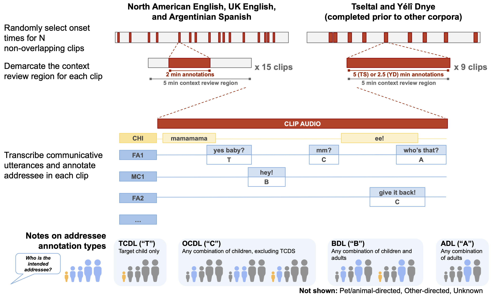
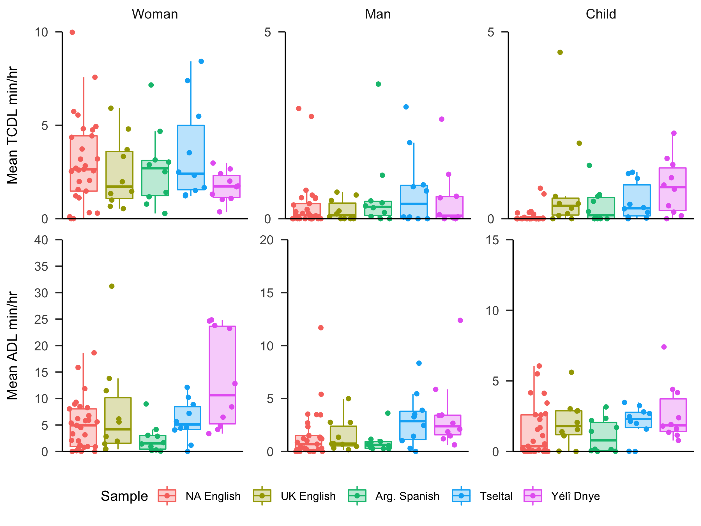
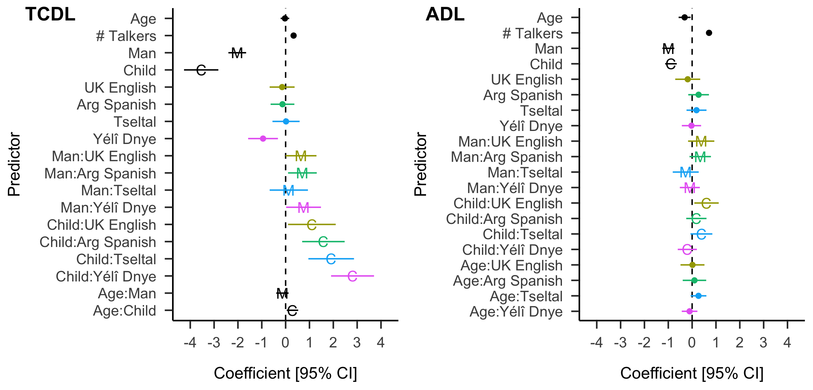

```{r setup, include = FALSE}
library(DHARMa)
library(ggpubr)
library(glmmTMB)
library(magrittr)
library(MASS)
library(papaja)
library(patchwork)
library(stringr)
library(tidyverse)
library(xtable)
library(scales)

plot.path <- "plots/"
supp.data.path <- "supplementary/"
processed.data.path <- "processed_data/"
samplelabels <- c("High activity  ", "Random  ")

m_and_sd.info <- read.csv(paste0(
  processed.data.path, "demog_mean_and_sd.csv"))
quantity.rand <- read_csv(paste0(
  processed.data.path, "quantity.rand.anon_col_subset.csv")) %>%
  mutate(
    tchiyr.m = m_and_sd.info$tchiyr.m,
    tchiyr.sd = m_and_sd.info$tchiyr.sd
  )
quantity.rand.bychild <- read_csv(paste0(
  processed.data.path, "quantity.rand.bychild.anon_col_subset.csv")) %>%
  mutate(
    tchiyr.m = m_and_sd.info$tchiyr.m,
    tchiyr.sd = m_and_sd.info$tchiyr.sd
  )
quantity.rand.st <- read_csv(paste0(
  processed.data.path, "quantity.rand.st.anon_col_subset.csv")) %>%
  mutate(
    tchiyr.m = m_and_sd.info$tchiyr.m,
    tchiyr.sd = m_and_sd.info$tchiyr.sd
  )

# Custom utilities

## Standard error of the mean (SEM)
sem <- function (x) {
  sd(x) / sqrt(length(x))
}
## Basic plotting theme
basic.theme <- theme(
  panel.background = element_rect(
    fill = "transparent",colour = NA),
  panel.grid.major = element_blank(),
  panel.grid.minor = element_blank(),
  plot.background = element_rect(
    fill = "transparent",colour = NA),
  legend.background = element_rect(
    fill="transparent"),
  legend.text = element_text(size=30),
  legend.title = element_text(size=30),
  legend.key = element_rect(colour = NA, fill = NA),
  legend.key.height = unit(2, "lines"),
  axis.text.x = element_text(size=30),
  axis.title.x = element_text(size=30),
  axis.text.y = element_text(size=30),
  axis.title.y = element_text(size=30),
  strip.text = element_text(size=30),
  panel.spacing = unit(2, "lines"),
  plot.margin = unit(c(0.5, 0.5, 0.5, 0.5), "cm"))

# Aids for pval display
p.levels <- c(0, 0.001, 0.01)
pval.display <- function(p.est) {
  level <- findInterval(p.est, p.levels)
  p.string <- ifelse(level == 3, paste0("= ", round(p.est, 2)),
                     ifelse(level == 2, "< 0.01", "< 0.001"))
  return(p.string)
}
```

```{r analysis-preferences, include = FALSE}
# Seed for random number generation
set.seed(42)
knitr::opts_chunk$set(cache.extra = knitr::rand_seed)
```

```{r tbl-analysis-prep, include = FALSE}
## Get variables ready for modeling
# Quantity rand
quantity.rand$child_sex <- as.factor(quantity.rand$child_sex)
# quantity.rand$mat_ed <- as.factor(quantity.rand$mat_ed)
nspkrs.m <- mean(quantity.rand$n_spkrs_clip)
nspkrs.sd <- sd(quantity.rand$n_spkrs_clip)
quantity.rand <- quantity.rand %>%
  mutate(
    ads_mph.nz = ifelse(ads_mph > 0, 1, 0),
    tds_mph.nz = ifelse(tds_mph > 0, 1, 0),
    cds_mph.nz = ifelse(cds_mph > 0, 1, 0),
    ocds_mph.nz = ifelse(ocds_mph > 0, 1, 0),
    tchiyr.std = ((age_mo_round - tchiyr.m)/tchiyr.sd),
    chisx.std = recode_factor(child_sex,
                              "M" = "M", "F" = "F"),
    # mated.std = recode_factor(mat_ed,
    #                           "bhs" = "bhs", "hs" = "hs",
    #                           "sc" = "sc", "cd" = "cd", "ad"= "ad"),
    # mated.yrs = recode_factor(mat_ed,
    #                           "bhs" = "6+", "hs" = "12",
    #                           "sc" = "12+", "cd" = "14", "ad" = "16+"),
    # motyr.std = ((mother_age - motyr.m)/motyr.sd),
    # nsb.std = ((number_older_sibs - nsb.m)/nsb.sd),
    # hsz.std = ((household_size - hsz.m)/hsz.sd),
    nsk.std = ((n_spkrs_clip - nspkrs.m)/nspkrs.sd)
    )
# NA_English as reference group
quantity.rand$group_corpNE <- factor(quantity.rand$group_corpNE, levels = c(
    "NA_English", "UK_English", "Arg_Spanish", "Tseltal", "Yeli_Dnye"))

# Quantity rand by speaker type
quantity.rand.st$child_sex <- as.factor(quantity.rand.st$child_sex)
# quantity.rand.st$mat_ed <- as.factor(quantity.rand.st$mat_ed)
nspkrs.sa.m <- mean(quantity.rand.st$n_spkrs_clip.st)
nspkrs.sa.sd <- sd(quantity.rand.st$n_spkrs_clip.st)
quantity.rand.st <- quantity.rand.st %>%
  mutate(
    ads_mph.st.nz = ifelse(ads_mph.st > 0, 1, 0),
    tds_mph.st.nz = ifelse(tds_mph.st > 0, 1, 0),
    cds_mph.st.nz = ifelse(cds_mph.st > 0, 1, 0),
    ocds_mph.st.nz = ifelse(ocds_mph.st > 0, 1, 0),
    tchiyr.std = ((age_mo_round - tchiyr.m)/tchiyr.sd),
    chisx.std = recode_factor(child_sex,
      "M" = "M", "F" = "F"),
    # mated.std = recode_factor(mat_ed,
    #   "bhs" = "bhs", "hs" = "hs",
    #   "sc" = "sc", "cd" = "cd", "ad"= "ad"),
    # mated.yrs = recode_factor(mat_ed,
    #   "bhs" = "6+", "hs" = "12",
    #   "sc" = "12+", "cd" = "14", "ad" = "16+"),
    # motyr.std = ((mother_age - motyr.m)/motyr.sd),
    # nsb.std = ((number_older_sibs - nsb.m)/nsb.sd),
    # hsz.std = ((household_size - hsz.m)/hsz.sd),
    nsk.st.std = ((n_spkrs_clip.st - nspkrs.sa.m)/nspkrs.sa.sd)
    )
quantity.rand.st$nsk.st_bin <- ifelse(quantity.rand.st$nsk.st.std > 0, 1, 0)
# add by-clip nsk scores (i.e., not divided by speaker type)
quantity.rand.st %<>%
  left_join(select(quantity.rand, c(aclew_child_id, segment,
                                    n_spkrs_clip, nsk.std)))
# NA_English as reference group
quantity.rand.st$group_corpNE <- factor(
  quantity.rand.st$group_corpNE, levels = c(
    "NA_English", "UK_English", "Arg_Spanish", "Tseltal", "Yeli_Dnye"))
# Women speakers as reference group
quantity.rand.st$SpkrType <- factor(quantity.rand.st$SpkrType, levels = c(
    "Woman", "Man", "Child"))
```

Across cultures, early language experiences vary substantially with respect to who talks to children, what is talked about, and what the children themselves are expected to contribute [e.g., @brown2011cultural; @brown2014language; @casillas2020tseltal; @deleon2011language; @demuth1979introduction; @gaskins2006cultural; @ochs1984language; @pye1986quiche; @rogoff2003firsthand; @shneidman2012language; @vogt2015communicative]. For example, home pedagogical techniques, including caregiver use of rhetorical questions and directly addressed instructions, are more common in some cultural contexts than others (e.g., US vs. Mayan communities, see e.g., @gaskins1996how; @rogoff2003firsthand; @shneidman2016child). Indeed, even when these pedagogical techniques are common _within_ a society, they are deployed variably across social sub-groups, reflecting broader economic and educational trends (e.g., more such pedagogy in higher-SES families and with newer generations, e.g., @snow1976mothers and @yu2019pedagogical). 

Research today, primarily revolving around urban, Western contexts, situates child-directed language (CDL)---and more specifically interactive adult-produced speech---as a keystone for early language development [e.g., @cartmill2013quality; @hoff2003specificity; @ramirezesparza2014look; @ramirezesparza2017look; @ramirezesparza2017impact]. Momentum on CDL research has recently increased due in part to the finding that "high quality" CDL is a consistent and robust predictor of children's growing vocabulary [e.g., @rowe2008child]. This consistent association with vocabulary has drawn attention from researchers, policy makers, educators, clinicians, and parents because of its implications for school readiness. However, the primary elements of this scientific discourse are highly _culturally embedded_: the particular focus on (and commodification of) vocabulary and CDL reflects the political and economic priorities of a growing, urban society and its need for a unified and literate workforce [@ochs2020ethical; @sperry2015there]. That is, it reflects these cultural priorities beyond any fundamentally scientific argument for the greater importance of words and CDL relative to other language phenomena (e.g., grammatical systems, rhetorical practices, etc.).

The focus on CDL also largely overlooks documented variation in typical language exposure within and across the world’s linguistic communities [though see @shneidman2012language; @ramirezesparza2017impact]. For communities where child-directed language is less frequent [e.g., @cristia2018talker; @shneidman2012language], there is a great deal yet to learn about how language learning is bolstered by sources of input other than adult CDL. These other sources include observable adult conversation, CDL produced by other children, and multiparty interactions. The present paper takes a first step toward describing variable sources of input across a diverse sample of language communities. We first describe definitional and methodological challenges in making meaningful cross-cultural comparisons of this nature, and then describe the specific research questions and predicted patterns of variation.

## What is considered "child-directed" input?

Researchers have taken many approaches to classifying different sources and styles of linguistic input in children's language environments. For that reason, we clarify here what we mean by "CDL". In the present paper, "CDL" refers to any communicative utterance that is directed to a child, regardless of its formal status as "speech".^[The families in our study do not use sign language and we do not include gesture in our analyses, but we use "language" instead of "speech" partly to promote more modality-inclusive vocabulary for language acquisition research. Also, our definition of utterances here includes all communicative vocalizations which sometimes includes non-"speech", e.g., laughter, imitation of babble, etc..]

We eschew the issue of "quality" vs. "quantity" [e.g., @masek2021beyond], focusing instead on language that is more versus less intended for the recipient (i.e., target-child- vs. other-directed), regardless of its stylistic characteristics. Someone talking to a child could theoretically do so with zero, some, or many elements typically described as relating to a child-directed register. For example, the English utterance "I see your stomach" addressed to an 18-month-old could be produced while employing high and variable intonation (or not) or could use babytalk-specific labels (e.g., "tummy", or not). What these different possible utterances have in common is that they are directed to an 18-month-old child---in each case the utterance is designed by the producer to convey an idea to _that specific_ addressee at _that specific_ moment in time. Addressees have an advantage in comprehension compared to non-addressed others precisely because the utterance in question is suited to their immediate comprehension, including timing, word choice, and omitted information [@bell1984language; @foushee2021self; @schober1989understanding].

Because there is no universal "babytalk" register, we can only rely on addressee to reliably and comparably identify child-directed input in the present cross-cultural dataset. Prior work has sometimes shown cross-cultural consistencies in the production of language for infants and young children. In particular, simplification, high and variable pitch, and some vocal timbre characteristics have been recognized across culturally and linguistically diverse datasets of child-directed speech and sign [e.g., @bornstein1992functional; @brentari2011sensitivity; @broesch2015prosody; @farran2016cross; @fernald1989cross; @hilton2022acoustic; @masataka1998perception]. However, these effects are not universal. They are not observed (or are only partly observed) in some cultural groups, with the universally predicted characteristics (e.g., high pitch, simplification) sometimes running counter to cultural norms [e.g., @broesch2015prosody; @brown2014interactional; @hilton2022acoustic; @ochs1984language; @pye1986quiche]. Further, the use of these same characteristics can be heavily impacted by recording type---the surprising and variable quality of intonation associated with US English infant-directed speech is obvious in short, elicited recordings but subtle in spontaneously produced speech from daylong home recordings [@macdonald2020measuring]. Considering the lack of an identifiable babytalk register across our corpora and the fact that we use daylong recordings, addressee is a more reliable and comparable method for examining different sources of input in children's language environments compared to register or style of language, e.g., "parentese/babytalk". The benefit of this approach, as we lay out below, is that basic principles of audience design [@bell1984language] partition the child's linguistic environment into three different sources of input that may make distinct contributions to learning: target-child-directed language ("designed for me"), other-child-directed language ("designed for someone like me"), and adult-directed language ("designed for someone unlike me").
 
By focusing on target-child-directed language (TCDL) we can analyze utterances that are (theoretically) considered optimally comprehensible and appropriate for children in each site. In other words, we expect that utterances directed specifically to a child will a) be tailored in some way to that child as the intended recipient (e.g., @bell1984language; @foushee2021self; @schober1989understanding), and thus b) are more likely to engender attentional capture to a greater extent than utterances _not_ directed to them. By focusing on TCDL we can then home in on relatively high-comprehensibility utterances that are valuable for language socialization, but _without_ pre-specifying what makes input more comprehensible or appropriate in one group vs. another. Complementarily, we can expect that utterances intended for other recipients (e.g., older children, adults) may nonetheless contain useful information for supporting current and future learning (e.g., more diverse prosodic and syntactic structures, exposure to storytelling/teasing/argumentation practices, new vocabulary, etc.). It is therefore variation across two dimensions of input (TCDL vs. ADL) that is of interest in the current study.

Our decision to focus on TCDL rather than _all_ CDL (i.e., TCDL + OCDL, other-child-directed language) is especially important for the subset of our corpora in which we can expect several children to be present---some much older than the target children (e.g., 10 years old) and some younger (e.g., a newborn). In samples with large child playgroups, such as in the Yélî Dnye community, there is abundant OCDL from other children, skewing our view of both (a) how often children are directly addressed and (b) who produces that directed directly-addressed language. Our analysis therefore contrasts the input patterns for two highly distinct sources of linguistic input, one as closely intended for the child as possible (TCDL) and one intended for recipients very unlike the target child (ADL). Parallel analyses with _all_ CDL (i.e., TCDL + OCDL) are available in the Supplementary Materials but show broadly similar results to what we report below.

## How can we get representative input samples?

Generating representative data on children's home language environments requires multi-hour recordings of real, everyday life at home that are either comprehensively analyzed or sampled and analyzed at random or periodic intervals. This means going beyond the dyadic interaction audio or video recordings used in much foundational past work, which are typically made with just a mother and a child in the home or lab [e.g., 10--15 minutes of free play; see, e.g., the variety of corpora available on the CHILDES database @childes]. We note that comparative cross-linguistic and cross-cultural research on child language production, input, and and socialization also often uses this short recording technique but tends to go beyond the dyadic child-mother frame and selects the recorded activities in an ethnographically informed manner [e.g., @allen1996early;  @deleon2011language; @demuth1979introduction; @kline2010factors; @lucy1993metapragmatic; @pye1986quiche; @bornstein2015mother; @broesch2016similarities; @brown2011cultural; @brown2014language; @crago1997exploring; @gaskins2006cultural; @heath1983ways; @moran2018universal; @ochs1984language; @ratner1984higher; @rogoff1993guided; @shneidman2012language; @vogt2015communicative].

Daylong recordings are an excellent tool for gaining a representative view of the child's input across a variety of day-to-day experiences [e.g., with the LENA system, @greenwood2011assessing], but technological and practical limitations exist. While algorithms exist to identify and estimate "near and clear" speech [@greenwood2011assessing] and other broad class aspects such as silence or differentiating female from male adults, no existing algorithms successfully identify caregiver speech registers or intended addressee [e.g., distinguishing ADL from TCDL \; @pisaniIPlong, 15.2]. However, manual annotation of daylong recording has been paired with automated acoustic analysis and manual data annotation in past work to explore children's at-home CDL in several populations [e.g., @bergelson2019day; @casillas2020tseltal; @casillas2021papuan; @weisleder2013talking].

For example, Weisleder and Fernald [-@weisleder2013talking] used LENA to record the everyday experiences of infants in a low-SES Spanish and English speaking population in California. They then manually classified 5-min blocks of time as primarily child-directed or adult-directed. Using this approach, they found that the quantity of child-directed, but not adult-directed, input predicted word comprehension in these groups. Similarly, a series of studies by Ramírez-Esparza and colleagues [@ramirezesparza2014look; @ramirezesparza2017look; @ramirezesparza2017impact] manually annotated speech-dense clips of audio using LENA. Notably, these researchers differentiated in their coding scheme between (1) speech addressed to the child, (2) speech containing the parentese register features of CDL vs. ADL (independent of addressee) and (3) who was present as a conversational partner. They found that the amount of parentese-style CDL in one-on-one contexts at 11 and 14 months predicted vocabulary outcomes at 24 and 33 months better than other types of input in their monolingual US English and bilingual US English-Spanish speakers. They also found some evidence for cross-cultural differences, with the bilingual Spanish-English sample showing stronger effects for group-based CDL [@ramirezesparza2017impact], and a greater role for non-parentese-styled CDL and group CDL in older children [@ramirezesparza2017look]. These and other recent studies have demonstrated the importance of nuance in mapping out the role of CDL in language development [e.g., @laing2018mothers; @sperry2019language].

A final example, from Bergelson, Casillas, and colleagues [-@bergelsoncasillas2019what] also manually annotated input from speech-dense clips of audio, though in this case they extracted individual utterances and annotated them as child- or adult-directed. For their sample of 61 children between ages 3 and 20 months in Canada and the US, they found that most input---both adult- and child-directed---came from women and that ADL rates were initially high but decreased over age, while CDL rates remained relatively constant over age. They also reported a very small effect of SES, consistent with prior research on US English-learning samples [e.g., @bornstein2010parenting; @hart1995meaningful; @hoff2003causes]. While these studies examine CDL and ADL in large and highly naturalistic datasets, they either take a very coarse perspective (e.g., examining 5-minute intervals), or tell us about input patterns during the day's _interactional peaks_ rather than illustrating patterns in children's _average language experiences_ over the course of a day.

In order to estimate a representative measure of linguistic input, i.e., how much language children encounter from different types of people in different types of activities across their day (including typical "down" time), we need to take random or periodic samples of the language environment [@casillas2019stepbystep] rather than only analyzing interactional peaks or estimating across time periods. Alternatively, one could comprehensively analyze children's daylong input, but manually annotating CDL at the utterance level in this way is a many-years-long undertaking---it is even intensive at the 5-minute clip level [e.g., @weisleder2013talking, but see @cychosz2020efficient for emerging efficient techniques in input rate estimation].

## The current work

We examine baseline rates of target-child-directed and adult-directed language (TCDL and ADL) for children growing up in five culturally and linguistically distinct groups: North American English (US & Canadian), UK English, Argentinian Spanish, Tseltal (Tenejapa, Mayan), and Yélî Dnye (Rossel Island, Papuan). This unique metacorpus draws on pre-existing collections of daylong recordings that were gathered with a variety of different recording devices (i.e., not all LENA) and for a range of different research purposes. Our primary objective was to quantitatively measure the exposure of young children in these communities to different sources of linguistic input, and to examine variation in this exposure across development. A second, critical objective was therefore to generate an audio sampling and annotation approach that could be fruitfully employed across recordings made in diverse linguistic sites, under lab _or_ field working conditions, and using different types of recording devices.

An essential change in approach from prior work is the use of random sampling to get baseline measures of different linguistic input sources, which gives a more representative picture of variation in children's language experiences over the course of a day at home. Also, as motivated above, our annotation scheme distinguishes between target-child-directed language "TCDL" and other-child-directed language "OCDL" in addition to adult-directed language "ADL" and other inputs (see Figure \@ref(fig:samplingmethods)). We test how a variety of factors shape these input sources in the present metacorpus, homing in on differences between maximally child-focused (TCDL) and minimally child-focused (ADL) sources of input (analyses of _all_ CDL, which includes both TCDL and CDL directed to other various children within earshot of the target children are located in the Supplementary Materials). The present work thus builds on prior work to make both theoretical and methodological contributions toward better understanding how children's early language experiences across diverse home environments. 

### Hypothesized patterns in TCDL and ADL rate

In order to comprehensively examine patterns in these children's at-home language exposure, we must account for the known range of factors that impact how and when they are likely to encounter input from different types of talkers. We discuss each factor below. We anticipated having insufficient power to test all of these factors together with their interactions in a single statistical model. We thus planned our analyses of TCDL and ADL around a set of specific predicted effects for each input source based on prior work. Note that the included hypotheses for TCDL and ADL are slightly different (Tables 2 and 3 show a prediction overview). We discuss each primary factor along with its predicted effects and interactions for TCDL and ADL below:

#### Target child age
@shneidman2012language and @bergelsoncasillas2019what both find that older children encounter proportionally more CDL than younger children (in Yucatec Mayan- (1;1--2;11) and North American English-speaking (0;3--1;8) samples respectively). @bergelsoncasillas2019what suggests this change is due to a decrease in ADL rates rather than an increase in CDL rates for the North American English data. @shneidman2012language attributes much of the age-related change to an increase in CDL from other children. Relatedly, @ramirezesparza2017look also find age effects in the CDL encountered by US English monolingual and US English-Spanish bilingual children (0;11--2;7), but of a different sort: their clip-based measure [see also @weisleder2013talking] distinguished different _types_ of CDL and showed that children experienced increases in non-parentese-style CDL and multiparty CDL by 2;7, with a concurrent decrease in parentese-style CDL over the same period. Finally, @casillas2020tseltal find no effect of target child age on TCDL but do find decreases in ADL rate in the same Tseltal daylong recordings that are incorporated into the present analysis. Because Tseltal caregivers tend to use a non-child-centric form of infant interaction they might be predicted to show a different age-related trajectory than children in the other corpora. However, a similar lack of an age effect in (T)CDL and decrease in ADL across that study and others [@bergelsoncasillas2019what; @casillas2021papuan] leads to an _a priori_ expectation for an age-by-cultural context interaction in the present data. **Prediction:** We therefore predicted little or no change in TCDL and significant decreases in ADL with age.

#### Talker identity

Prior research suggests that most CDL appears to be produced by adults in the North American English contexts [@bergelsoncasillas2019what], with much weaker evidence for this kind of adult dominance in the Yucatec context [@shneidman2012language]. For example, @shneidman2012language find that US adults were responsible for an average of 10 times the CDL provided by other children, whereas in the Yucatec sample the contributions of adults and children were much more balanced, with relative child input increasing over age. Over the early developmental period, most CDL also appears to be produced by females [e.g. @bergelsoncasillas2019what]. Integrating the results of this prior work, we can infer that CDL comes primarily from adult females (termed "women" in the present paper) in the US and Canadian English contexts but that this pattern may be weaker (with greater contribution from children, increasing over age) in the Yucatec contexts, and likely others [e.g., @bergelsoncasillas2019what; @brownIPchildrearing; @deleon2011language; @ochs1984language; @shneidman2012language]. We also infer that the greater prevalence of woman-produced CDL likely arises because there are more women physically proximal to the child---therefore ADL should also primary be produced by women. **Prediction:** We predicted that most TCDL and ADL will come from women (as compared to men and other children) but that this effect will be impacted significantly by child age, such that older children encounter more TCDL from other children.

#### Cultural group

There is immense cross-cultural variability in how often children are talked to, by whom, and what is talked about (see above references). Most cross-cultural work on CDL and ADL analyzes content-based features of the input, typically examining how children become socialized to use language in locally relevant ways [see @gaskins2006cultural for an accessible introduction]. Rather than trying to pick out general patterns from this varied literature, we here focus exclusively on predictions for the included corpora. Ethnographic and linguistic evidence from the Tseltal and Yélî Dnye communities suggests that neither engages in Western-style pedagogical language, and that multi-party interactional contexts are the norm [@brown2011cultural; @brown2014interactional; @brownIPchildrearing]. However, the model for interacting with infants differs between them: Tseltal caregivers tend to use a non-child-centric approach in which the child is not the center of social attention and are instead encouraged to attend to the ongoing interactions around them, whereas Yélî caregivers tend to take a more child-centric approach in which the child can expect to be the center of social attention often. As children outgrow infancy and engage in more independent talk, they are recognizable as interactants in both sites [@brown2011cultural; @brown2014interactional; @brownIPchildrearing]. In the Argentinian Spanish data, too, multi-party interactional contexts are more common than would be expected on the basis of past Western, English-centric data [e.g., @bergelsoncasillas2019what]. In all three corpora---Argentinian Spanish, Tseltal, and Yélî Dnye---a significant role for caregiving by other children and more children present in the home can also be expected [@brownIPchildrearing; @rosemberg2020nouns]. **Prediction:** Based on their frequent exposure to multi-party interaction, we predicted that children acquiring Argentinian Spanish, Tseltal, and Yélî Dnye would encounter less TCDL and more ADL compared to children acquiring North American English. We also predicted that more TCDL and ADL would come from other children in these communities compared to children acquiring North American English. Finally, we predicted that the age effect of decreasing ADL would be stronger for children in these three corpora---if these children really are initially encountering more ADL, the change with age once they can walk away from adult conversations may appear more dramatic.^[The lack of age-related CDL effects mentioned above for these cultural groups led to no clear hypothesis of an age-by-cultural group interaction, so that was not included in our model. By reviewer request we attempted to run this additional model but it did not converge.] We do not have specific predictions regarding the UK sample relative to the North American English sample. While some differences have been suggested between the UK parentese characteristics and those of North American English [see @floccia2016british], we are not aware of research comparing rates of directed language.

#### Number of talkers present

This predictor captures a basic maxim---when there are more talkers, there is more talk. The presence of each additional talker increases competition for the floor in conversation, when four or more talkers are present, group conversations often split into simultaneous sub-conversations, multiplying the amount of observable talk (i.e., conversational "schism", on competition and schism see, e.g., @sacks1978simplest and @holler2021competition). In this sense, number of talkers can be considered a "nuisance" variable or otherwise a kind of fact of life that must be controlled for in the data.

However, the ethnographic findings summarized above also suggest that the typical number of talkers present varies systematically between communities, with more talkers expected in the Argentinian Spanish, Tseltal, and Yélî Dnye communities due to the local organization of family activities, housing, and community infrastructure. In this sense, number of talkers partly captures cultural differences, as well as within-participant variation. We suspect that, even for children in talker-dense communities, variation in the number of talkers present from moment to moment impacts how much CDL and ADL they encounter. We thus add this factor as separate from culture into our statistical model (see the Supplemental Materials for models without this factor). **Prediction:** More talkers leads to more talk for both ADL and TCDL.

Briefly summarizing our predictions (see Tables 2 and 3 for an overview), we expect that TCDL rate will: (a) vary between cultural contexts and (b) most often come from women, but that (c) some corpora will show more child-produced TCDL than others and that (d) across corpora child-produced TCDL will increase with age, all in addition to overall effects of (e) more TCDL when more talkers are present. For ADL we expect that rates will: (a) vary between cultural contexts and (b) decrease with child age, (c) especially in the high-ADL-rate corpora, and also that ADL (d) most often comes from women, though (e) some corpora will show more child ADL than others, all in addition to overall effects of (f) more ADL when more talkers are present.

We note that the present paper is the first to bring together all these factors known to influence TCDL and ADL and to examine their joint effects across multiple language communities. We examine these factors in order to identify axes of consistency and variation across the multi-corpus sample, though we do so without going into in-depth pairwise comparison of each corpus against the other.^[Unfortunately, because our statistical approach only allows us to test for the difference between one corpus and each of the others in the group, we cannot test for pairwise differences between all corpora. We decided to treat the largest subcorpus, North American English, as the reference corpus in the analyses below given that it also has the strongest associated predictions from related prior work. We in no way imply with this decision that the North American English data are a global "norm"---if anything our results demonstrate that the North American English data are somewhat unusual with respect to the other corpora. The weight of existing data and prior work simply makes this corpus the most convenient as a statistical reference level at present.] The latter type of analysis would require a much richer overall engagement with the caregiving and everyday circumstances of children in each cultural group, far beyond the scope of the present analysis. In addition, while we identify key points of theoretically relevant cultural variation across our samples, we do not argue that these corpora represent the spectrum of global diversity, even within the communities we sample from (as detailed below).


# Methods

We explain the methods in some detail in what follows given that, in addition to the theoretical contributions of the present paper, we also illustrate a successful method for sampling and annotating child language environments in a unified manner across diverse corpora [see also @soderstrom2021developing].

## Corpus Construction

We use the Analyzing Child Language Experiences around the World (ACLEW) metacorpus [@soderstrom2021developing] of long-form audio recordings of children’s everyday language environments, comprising seven corpora, spanning five culturally and linguistically distinct groups: North American English, UK English, Argentinian Spanish, Tseltal, and Yélî Dnye. Each group is represented by a single corpus, except North American English, for which we had access to three corpora. Recordings for each corpus were originally collected for the unique research purposes of the individual lab contributing the corpus, and therefore there is variation across corpora in the recruitment practices, recording equipment (i.e., not all LENA), recording length, target child ages (see Supplementary Materials), and other demographic characteristics.

* Bergelson [@bergelson2016bergelson]: A longitudinal study of monolingual English-learning, generally middle-class infants from Rochester, NY, with repeated sampling from 6 to 17 months.

* Warlaumont [@warlaumont2016warlaumont; @HomeBank]: A sample of English- and Spanish-learning infants in Merced, California. Recordings were collected at multiple timepoints from 3 to 18 months.

* McDivitt-Winnipeg [@mcdivitt2016mcdivitt]: The sample consists primarily of Canadian (Winnipeg) English-learning infants with young mothers from low-SES backgrounds. Two participants come from a different, middle-class sample, one of whom is French-speaking. Multiple recordings were taken at a single age point for each infant, with the sampled recordings ranging from 2 to 32 months.

* LuCiD Lang0-5 [@rowland2018language]: A longitudinal sample of children of diverse socioeconomic status in Northwestern England. The recordings were sampled from children between 11 and 31 months.

* Rosemberg [@rosemberg2015entornos]: A low- and middle-SES sample of Argentinian Spanish-learning infants in Buenos Aires. Recordings are collected at multiple developmental timepoints. The recordings used here were sampled between 9 and 27 months.

* Tseltal [@Casillas-HB]: Cross-sectional sample of recordings from infants between 2 and 36 months in a Tseltal Mayan rural subsistence farming village in Chiapas, Mexico. Recordings are primarily in Tseltal, with occasional Spanish.

* Yélî Dnye [@Casillas-HB]: Cross-sectional sample of recordings from infants between 2 and 36 months in a cluster of hamlets on a remote island in Papua New Guinea. Most caregivers are subsistence farmers. The primary language spoken is Yélî Dnye, although other languages are found in the recordings, including Tok Pisin, English, and other geographically near (primarily Austronesian) languages.

For more elaborated information on the caregiving and early language environments of Argentinian Spanish-, Tseltal-, and Yélî Dnye-acquiring children, we refer the reader to other work [@brownIPchildrearing; @brown1998conversational; @brown2011cultural; @brown2014interactional; @rosemberg2020nouns]. We mention the specific attributes of everyday life that drive our predictions in the present paper in the "hypothesized patterns" subsection above.

```{r samplingmethods, echo=FALSE, fig.align = "center", fig.cap="Summary of clip selection and annotation method across corpora.", out.width = '100%'}

```

### Sampling technique

One of the contributions of the present work is a process for sampling from daylong audio and annotating it for language behavior in a way that works for daylong recordings of different durations made with different recording devices, for annotation done in a lab or in the field, and for diverse linguistic and cultural settings. We first summarize our technique for sampling clips from recordings before we then describe our technique for transcribing and annotating audio clips.

We selected a single day's recording for 10 children from each corpus, except the McDivitt-Winnipeg corpus from which we selected 9 recordings due to a sampling error (total recording _N_ = 69); this size reflects what was possible with the smallest corpora in our sample. We used a script to select recordings that were as balanced within corpus and as matched as possible across corpora in reported child gender (male/female), maternal education (below high school--advanced degree), and child age (0;2--3;0; see OSF_URL_MASKED_FOR_REVIEW for details). A demographic overview of the sampled recordings is given in Table 1. The range of available ages was more limited in North American English compared to the other corpora but our statistical approach accounts for this (also see the Supplementary Materials). We also note that five of the included recordings overlap with those used in @bergelsoncasillas2019what.

We next had to decide which parts of the recordings to manually annotate. The sample process we ultimately designed maximizes analyzable data given the significant resource and time limitations of some corpora. For example, the Tseltal and Yélî Dnye data were annotated by a local native speaker together with the associated researcher and could thus only be worked on during her in-person community visits (see @casillas2020tseltal and @casillas2021papuan for details). As motivated above, we also planned to take random samples from the daylong recordings to ensure broad coverage over a variety of activity contexts. Finally, to ensure that annotators had sufficient information to produce high-quality transcriptions, we designed our sampling process to give annotators significant recording context for each clip. These primary elements inspired the design of our sampling process described below. Note also that while it is a somewhat common practice to exclude “naptime” from consideration in analyses of longform audio recording, "naptime" is not a culturally appropriate construct in some of our sampled communities. Further, our baseline estimates of input were meant to cover children's daytime hours on average, which include many moments of downtime---bouts of sleep being one type of downtime.

Our method for sampling and preparing clips for annotation from the corpora is illustrated in Figure \@ref(fig:samplingmethods). We wrote a Python script to randomly pick start times from throughout the day of each recording, excluding any possibility of clip overlap. The script added the start and stop times of each clip, as well as the start and stop times of the associated context period for each clip, to a single ELAN [@ELAN] audio annotation file that spanned the entire recording. The resulting ELAN annotation file then indicated the location of all selected clips for a recording and marked out each clip's related context periods. Most corpora (49 of the 69 recordings) used a version of the process with 15 clips, each two minutes long, resulting in 30 total minutes of annotation per recording. The context audio for each of those selected clips was one preceding minute and two following minutes around each annotated two-minute clip. The Tseltal and Yélî Dnye corpora (20 of the 69 recordings) used a different method wherein only 9 clips were randomly selected. Tseltal clips were 5 minutes long and Yélî Dnye clips were 2.5 minutes long, resulting in a total of 45 minutes and 22.5 minutes of annotation per recording for the Tseltal and Yélî Dnye corpora, respectively. The five-minute clips in Tseltal had no additional context; this length of clip already provides significant context. The 2.5-minute clips for Yélî Dnye were followed by an additional 2.5 minutes of recording context. Thus, the total context review period for annotation clips across all corpora was five minutes (Figure \@ref(fig:samplingmethods)).

Minor deviations in the sampling process between corpora are not expected to have meaningful effects on the analyses: all clips are short and randomly selected from throughout the child's waking day. Why did these deviations arise? The Tseltal and Yélî Dnye datasets required significant contributions from native local speakers in each remote community. To better suit the associated researcher's fieldwork schedule, annotation on these two corpora was initiated before the others. The Yélî Dnye data was found to be particularly time-intensive because of the high rates of observable language, so clip duration was reduced from 5 to 2.5 minutes. Later, when annotation resources were ready for the other corpora, this initial workflow was adapted to meet the constraints of the labs contributing annotation hours, leading to the change to 15 two-minute clips. The final clip collection therefore consists of 35.8 hours of transcribed and annotated recording time, of which 16.3 hours consists of communicative vocalization.

Our sample process maximizes the manual annotation data we could generate for analysis given the various constraints of our teams (e.g., fieldwork scheduling, limited RA access, etc.). It was unknown in advance how many recording minutes would be needed to produce meaningful results. That said, @casillas2020tseltal and @casillas2021papuan found that the present amount and distribution of recording minutes were sufficient to detect many of the effects predicted here. Their findings are especially promising for the current set of analyses, which includes a similar statistical approach and re-uses those two datasets (now with additional corpora for comparison). Of course, it would have been ideal to have a more concrete estimation of the likely required annotation minutes for the planned analyses. Recent studies [@cychosz2020efficient; @micheletti2020optimal] have started building up a more general approach to sampling naturalistic behavior from daylong recordings. However, our lack of prior knowledge about the distribution of different input densities from different types of talkers across these groups prevented us from being able to confidently peg our sampling technique to anticipated underlying effects. To counteract what we anticipated would be limited statistical power, we planned to only analyze effects for which we had strong a priori predictions (see an overview in Tables 2 and 3).

## Annotation technique

Each of the randomly selected segments were annotated using the ACLEW Annotation Scheme [https://osf.io/b2jep/, @casillas2017workflow; @soderstrom2021developing], an ELAN-based system  [@ELAN] with a highly structured independent training protocol. Each annotator undergoes a rigorous training and testing process to ensure intra- and inter-lab consistency in coding. Annotators segmented and transcribed all hearable human communicative vocalizations in the samples, with a separate tier for each individuable talker to allow for overlapping talk. Each tier was identified by the talker's perceived age and gender category (adult/child/unknown and female/male/unknown; e.g., FA1 = female adult 1 in Figure \@ref(fig:samplingmethods)). All utterances (except the target child's) were also annotated for the intended addressee (exclusively target-child-directed/other type of child-only-directed/adult-only directed/mixed-age-directed/animal-directed/other-directed/unknown) on the basis of contextual and interactional information within the audio recordings.

Annotator reliability was checked by the complete re-annotation of one-minute from each recording by a new annotator. We then compared the original minute's annotations to the re-coded minutes'. A full reliability report is available at URL_MASKED_FOR_REVIEW, but to briefly summarize, error estimates for talker type annotations (e.g., disagreements about whether the talker is the target child or a different child) are far better than prior work has found between human and LENA (i.e., automated) annotations. Further, comprehensive kappa scores reflect moderate-to-substantial agreement (cross-corpus _k_ range = 0.55--0.68) for talker types and slight-to-substantial agreement (cross-corpus _k_ range = 0.32--0.64) for addressee, with wide variability in agreement between corpora. Despite the fact that CDL can have some cross-linguistic recognizable features [e.g., @bornstein1992functional; @fernald1989cross; @hilton2022acoustic], we had expected somewhat lower reliability scores for addressee annotations because the reliability annotators did not always understand the language of the file they were annotating; their annotation decisions were thus less informed by lexicosyntactic content than the (native-speaking) original annotators'. Most cases of disagreement come from instances when one annotator indicated silence or overlapping talk where the other annotator indicated talk from a single person---confusion between actual addressee categories was relatively low (see Supplementary Materials for more details).

```{r tab1, echo=FALSE, message=FALSE, warning=FALSE, results = "asis"}
corp.dem <- read_delim("corpora_breakdown-utf8.csv",
  delim = ",",
  locale = locale(encoding = "UTF-8")) %>%
  mutate(Language = replace_na(Language, ""),
    `Region` = replace_na(`Region`, ""))
apa_table(corp.dem, caption="Details for the corpora in the dataset (Bergelson et al., 2018; Casillas, Brown & Levinson, 2017; McDivitt & Soderstrom, 2016; Rosemberg et al., 2015; Rowland et al., 2020; Warlaumont et al., 2016). Parentheses following the mean indicate the range across participants.")
```

## Data analysis
All statistical analyses were conducted in R with the glmmTMB package [@brooks2017modeling; @R-base] and all figures were generated with ggplot2 [@R-ggplot2]. Analysis scripts and raw anonymized data are available at URL_MASKED_FOR_REVIEW. Our two dependent measures were the rates of TCDL and ADL (both expressed in minutes per hour). We calculated TCDL and ADL rate for each clip for each of three talker types: female adults, male adults and children. All other annotated utterances (e.g., language addressed to animals and language produced by electronic devices) were excluded. 'TCDL' includes communicative utterances that were addressed exclusively to the target child (from an adult or another child). 'ADL' includes communicative utterances addressed to one or more adults (from an adult or another child).

TCDL and ADL rate cannot be negative. In practice, they are modally zero or close to zero; given our random sampling technique, which can include periods of silence, many clips include no TCDL or ADL. These "down" times for input are part of the representative pattern of children's language experience but also present an analytical challenge: a peak of observed cases of 0 TCDL/ADL in some clips combined with a skewed non-negative distribution of >0 TCDL/ADL in other clips. This distribution cannot be modeled with the assumption of normality. We therefore used zero-inflated negative binomial mixed-effects regressions for our analysis. This regression type uses a two-model approach to overcome non-negative, overdispersed data with extra cases of zero---the case for the present data [@brooks2017modeling; @smithson2013generalized]. The two models constructed for each analysis are: (1) a __zero-inflation model__, which uses a logistic regression to model the likelihood of the _presence_ of 'zero' cases in the data (e.g., answering questions like 'are zero-TCDL clips less likely for older target children?') and (2) a __count model__, which uses linear regression to model how the _rate_ of TCDL/ADL is influenced by the predictors of interest (e.g., answering questions like 'is TCDL rate higher for older target children?'). The a priori predictions we laid out above can be applied to both model components, as shown in Tables 2 and 3.

The simple effects included in the models were target child age (centered and standardized from age in months), number of talkers present in that clip (centered and standardized from the unique number of talkers across all clips), talker type (woman vs. man/child), and language sample (North American English vs. UK English/Argentinian Spanish/Tseltal/Yélî Dnye). We only included interactions for which we had a strong a priori hypothesis and thus the models for TCDL and ADL differ slightly in their structure (see the Results for the regression formulae).

As mentioned above, we had to choose reference levels for factorial predictors in our models. Considering that North American English and linguistic input from female adults are the most well represented in prior work among our sampled communities, we set these two levels (North American English and woman-produced input) as the reference levels for corpus type and talker type in each of our models. Therefore, these models give us pairwise difference information between North American English and each other corpus, but not for the pairwise differences between other corpora (e.g., no direct comparison of Tseltal vs. Argentinian Spanish), and for pairwise differences between input from women vs. men and women vs. non-target children, but not men vs. non-target children. As noted in Footnote 3, we chose to treat North American English as the reference corpus because it is the largest corpus and also has the strongest _a priori_ predictions based on past work. In no way does this analysis presume that North American English data should be treated as a global "norm".

\pagebreak

```{r tab2, echo=FALSE, message=FALSE, warning=FALSE, results = "asis"}
tds.predictions <- read_delim("TDL-predictions.csv", delim = ";") %>%
  mutate(`Hypothesized outcome` = replace_na(`Hypothesized outcome`, ""),
         Supported = replace_na(Supported, ""))
apa_table(tds.predictions, caption="Predictions for TCDL analysis. Asterisk indicates previously observed with daylong child language data (Casillas et al., 2020, 2021; Scaff et al., in preparation). The 'Supported' column reflects the extent to each finding from the current study aligns with its predicted outcome.")
```

\pagebreak

```{r tab3, echo=FALSE, message=FALSE, warning=FALSE, results = "asis"}
ads.predictions <- read_delim("ADL-predictions.csv", delim = ";") %>%
  mutate(`Hypothesized outcome` = replace_na(`Hypothesized outcome`, ""),
         Supported = replace_na(Supported, ""))
apa_table(ads.predictions, caption="Predictions for ADL analysis. Asterisk indicates predictions on the basis of related or similar data. The 'Supported' column reflects the extent to each finding from the current study aligns with its predicted outcome")
```

\pagebreak

# Results

Descriptive statistics for observed TCDL and ADL rates by corpus and talker type are shown in Table 4 and in Figure \@ref(fig:xdsplots). A visual summary of statistical model outcomes from the count models of TCDL and ADL rate is shown in Figure \@ref(fig:modelcoeffsplots). Further, marginal means plots of model-predicted TCDL and ADL rates across age, corpus, and talker type are available in the Supplementary Materials. In Tables 2 and 3 we provide a quick summary of which hypothesized outcomes were statistically supported in the regressions described below.

```{r tab4, echo=FALSE, message=FALSE, warning=FALSE, results = "asis"}
by.corp.rates.TDS <- quantity.rand.bychild %>%
  group_by(group_corpNE) %>%
  summarize(
    mean_tds.mph = mean(tds_mph),
    median_tds.mph = median(tds_mph),
    min_tds.mph = min(tds_mph),
    max_tds.mph = max(tds_mph))

by.corp.rates.ADS <- quantity.rand.bychild %>%
  group_by(group_corpNE) %>%
  summarize(
    mean_ads.mph = mean(ads_mph),
    median_ads.mph = median(ads_mph),
    min_ads.mph = min(ads_mph),
    max_ads.mph = max(ads_mph))

corp.rename.tbl <- tibble(
  group_corpNE = c("NA_English", "UK_English", "Arg_Spanish",
                   "Tseltal", "Yeli_Dnye"),
  Language = c("NA English", "UK English", "Arg. Spanish", 
               "Tseltal", "Yélî Dnye"),
  Order = c(1, 2, 3, 4, 5))

by.corp.rates <- left_join(
  by.corp.rates.TDS, by.corp.rates.ADS,
  by = "group_corpNE") %>%
  left_join(corp.rename.tbl,
            by = "group_corpNE") %>%
  mutate(
    TDS.rate = paste0(round(mean_tds.mph,2), " (", round(median_tds.mph,2),
      "; ", round(min_tds.mph,2), "-", round(max_tds.mph,2), ")"),
    ADS.rate = paste0(round(mean_ads.mph,2), " (", round(median_ads.mph,2),
      "; ", round(min_ads.mph,2), "-", round(max_ads.mph,2), ")"),
    mean.TDS.prop = round(mean_tds.mph/(mean_tds.mph + mean_ads.mph), 2)) %>%
  arrange(Order) %>%
  rename(
    `TCDL rate` = TDS.rate,
    `ADL rate` = ADS.rate,
    `Mean proportion TCDL` = mean.TDS.prop) %>%
  select(Language, `TCDL rate`, `ADL rate`, `Mean proportion TCDL`)

apa_table(by.corp.rates, caption="Average input rates per clip across participants for each corpus. Note that these descriptive statistics are raw rates and therefore reflect overall differences between corpora without controlling for, e.g., number of talkers present. Such controls are in place for the statistical analyses. Parentheses following the mean indicate the median and range across participants.")
```

```{r TCDS_cross_corp_analysis, message=FALSE, warning=FALSE, include=FALSE, paged.print=FALSE}
# TCDS = any speech from non-target child speakers addressed to the target child
tds.rand.st.zinb <- glmmTMB(round(tds_mph.st,0) ~
    tchiyr.std + # no change with age (or slight increase)
    SpkrType + # Woman > {Man, Child}
    nsk.std + # more speakers = more speech
    group_corpNE + # more TCDS in WEIRD
    SpkrType:group_corpNE + # more child speakers in non-WEIRD
    tchiyr.std:SpkrType + # more TCDS from children (and perhaps also from men) with age
    (1|aclew_child_id),
  data=quantity.rand.st,
  # The probability of producing a structural zero
  ziformula=~tchiyr.std + group_corpNE,
  family="nbinom1")
# summary(tds.rand.st.zinb)
# tds.rand.st.zinb.res = simulateResiduals(tds.rand.st.zinb)
# plot(tds.rand.st.zinb.res, rank = T)

tds.rand.st.zinb.disp <- round(sigma(tds.rand.st.zinb), 2)
tds.rand.st.zinb.COEF.age <-
  coef(summary(tds.rand.st.zinb))[[1]]["tchiyr.std",] 
tds.rand.st.zinb.COEF.man <-
  coef(summary(tds.rand.st.zinb))[[1]]["SpkrTypeMan",] 
tds.rand.st.zinb.COEF.child <-
  coef(summary(tds.rand.st.zinb))[[1]]["SpkrTypeChild",] 
tds.rand.st.zinb.COEF.nsk <-
  coef(summary(tds.rand.st.zinb))[[1]]["nsk.std",]
tds.rand.st.zinb.COEF.spanish <-
  coef(summary(tds.rand.st.zinb))[[1]]["group_corpNEArg_Spanish",]
tds.rand.st.zinb.COEF.tseltal <-
  coef(summary(tds.rand.st.zinb))[[1]]["group_corpNETseltal",]
tds.rand.st.zinb.COEF.ukenglish <-
  coef(summary(tds.rand.st.zinb))[[1]]["group_corpNEUK_English",]
tds.rand.st.zinb.COEF.yelidnye <-
  coef(summary(tds.rand.st.zinb))[[1]]["group_corpNEYeli_Dnye",]
tds.rand.st.zinb.COEF.manSpanish <-
  coef(summary(tds.rand.st.zinb))[[1]]["SpkrTypeMan:group_corpNEArg_Spanish",]
tds.rand.st.zinb.COEF.childSpanish <-
  coef(summary(tds.rand.st.zinb))[[1]][
    "SpkrTypeChild:group_corpNEArg_Spanish",]
tds.rand.st.zinb.COEF.manTseltal <-
  coef(summary(tds.rand.st.zinb))[[1]]["SpkrTypeMan:group_corpNETseltal",]
tds.rand.st.zinb.COEF.childTseltal <-
  coef(summary(tds.rand.st.zinb))[[1]]["SpkrTypeChild:group_corpNETseltal",]
tds.rand.st.zinb.COEF.manUKEnglish <-
  coef(summary(tds.rand.st.zinb))[[1]]["SpkrTypeMan:group_corpNEUK_English",]
tds.rand.st.zinb.COEF.childUKEnglish <-
  coef(summary(tds.rand.st.zinb))[[1]]["SpkrTypeChild:group_corpNEUK_English",]
tds.rand.st.zinb.COEF.manYeliDnye <-
  coef(summary(tds.rand.st.zinb))[[1]]["SpkrTypeMan:group_corpNEYeli_Dnye",]
tds.rand.st.zinb.COEF.childYeliDnye <-
  coef(summary(tds.rand.st.zinb))[[1]]["SpkrTypeChild:group_corpNEYeli_Dnye",]
tds.rand.st.zinb.COEF.ageMan <-
  coef(summary(tds.rand.st.zinb))[[1]]["tchiyr.std:SpkrTypeMan",]
tds.rand.st.zinb.COEF.ageChild <-
  coef(summary(tds.rand.st.zinb))[[1]]["tchiyr.std:SpkrTypeChild",]
tds.rand.st.zinb.COEF.age.ZI <-
  coef(summary(tds.rand.st.zinb))[[2]]["tchiyr.std",]
tds.rand.st.zinb.COEF.spanish.ZI <-
  coef(summary(tds.rand.st.zinb))[[2]]["group_corpNEArg_Spanish",]
tds.rand.st.zinb.COEF.tseltal.ZI <-
  coef(summary(tds.rand.st.zinb))[[2]]["group_corpNETseltal",]
tds.rand.st.zinb.COEF.ukenglish.ZI <-
  coef(summary(tds.rand.st.zinb))[[2]]["group_corpNEUK_English",]
tds.rand.st.zinb.COEF.yelidnye.ZI <-
  coef(summary(tds.rand.st.zinb))[[2]]["group_corpNEYeli_Dnye",]

tds.model.table <- broom.mixed::tidy(tds.rand.st.zinb) %>%
    mutate(model = "TDL_random_z-inb")
write_csv(tds.model.table, "TDL_random_z-inb.csv")

source("plot-predvals-tdl.R")
```

```{r tdsmodelcoeffs, message=FALSE, warning=FALSE, include=FALSE, paged.print=FALSE}
tds.rand.st.zinb.CIs.countonly <- confint(tds.rand.st.zinb) %>%
  as_tibble(rownames = "Predictor") %>%
  filter(!(grepl("zi", Predictor)) & !(grepl("Intercept", Predictor)))
tds.rand.st.zinb.CIs.countonly$Predictor <- gsub(
  "cond.|SpkrType|group_corpNE", "", tds.rand.st.zinb.CIs.countonly$Predictor)
tds.rand.st.zinb.CIs.countonly$Predictor <- gsub(
  "_", " ", tds.rand.st.zinb.CIs.countonly$Predictor)
tds.rand.st.zinb.CIs.countonly$Predictor <- gsub(
  "tchiyr.std", "Age", tds.rand.st.zinb.CIs.countonly$Predictor)
tds.rand.st.zinb.CIs.countonly$Predictor <- gsub(
  "nsk.std", "# Talkers", tds.rand.st.zinb.CIs.countonly$Predictor)
tds.rand.st.zinb.CIs.countonly$Predictor <- gsub(
  "Yeli Dnye", "Yélî Dnye", tds.rand.st.zinb.CIs.countonly$Predictor)
tds.rand.st.zinb.CIs.countonly$Predictor <- as.factor(
  tds.rand.st.zinb.CIs.countonly$Predictor)
tds.rand.st.zinb.CIs.countonly$Predictor <- factor(
  tds.rand.st.zinb.CIs.countonly$Predictor, levels = c(
   "Age", "# Talkers", "Man", "Child",
   "UK English", "Arg Spanish", "Tseltal", "Yélî Dnye",
   "Man:UK English", "Man:Arg Spanish", "Man:Tseltal", "Man:Yélî Dnye",
   "Child:UK English", "Child:Arg Spanish", "Child:Tseltal", "Child:Yélî Dnye",
   "Age:Man", "Age:Child"
  ))
tds.rand.st.zinb.CIs.countonly %<>%
  mutate(
    pointcolor = case_when(
      grepl("UK English", Predictor) ~ "yellow",
      grepl("Arg Spanish", Predictor) ~ "green",
      grepl("Tseltal", Predictor) ~ "blue",
      grepl("Yélî Dnye", Predictor) ~ "purple",
      TRUE ~ "black"
    ),
    shape = case_when(
      grepl("Man", Predictor) ~ "M",
      grepl("Child", Predictor) ~ "C",
      TRUE ~ ""
    )
  )
col.scale <- hue_pal()(5)

tds.mdl.plot <- ggplot(tds.rand.st.zinb.CIs.countonly,
                        aes(x = Estimate,
                            y = reorder(Predictor,desc(Predictor)),
                            xmin = `2.5 %`, xmax = `97.5 %`,
                            color = pointcolor, shape = shape)) +
  geom_vline(xintercept = 0, lty = "dashed") +
  geom_linerange() +
  geom_point(data = filter(tds.rand.st.zinb.CIs.countonly, shape == ""),
             shape = 19) +
  geom_text(aes(label = shape)) +
  scale_color_manual(values = c(
    "black", col.scale[4], col.scale[3], col.scale[5], col.scale[2])) +
  ylab("Predictor") +
  xlab("Coefficient [95% CI]") +
  scale_x_continuous(breaks = c(-4, -3, -2, -1, 0, 1, 2, 3, 4)) +
  coord_cartesian(xlim = c(-4.3, 4.3)) +
  theme_apa() +
  theme(legend.position = "none")
```


```{r xdsplots, echo=FALSE, fig.align = "center", fig.cap="Mean by-recording rates of TCDL (above) and ADL (below) min/hr rates across language groups and talker types. For example, the upper-leftmost datapoint shows a recording with an average of 10 minutes per hour of TCDL from women talkers in North American English. Left-to-right order of language group within each panel matches the order shown in the legend.", out.width = '100%'}
by.rec.ests.xds <- quantity.rand.st %>%
  group_by(group_corpNE, aclew_child_id, SpkrType) %>%
  summarize(
    .groups = "drop",
    mean.tds_mph = mean(tds_mph.st),
    mean.ads_mph = mean(ads_mph.st))

by.rec.ests.xds$Sample <- factor(by.rec.ests.xds$group_corpNE, labels = c(
      "NA English", "Arg. Spanish",
      "Tseltal", "UK English", "Yélî Dnye"))
by.rec.ests.xds$Sample <- factor(by.rec.ests.xds$Sample, levels = c(
      "NA English", "UK English", "Arg. Spanish",
      "Tseltal", "Yélî Dnye"))
xds.y.unit <- 5

# figure out max increment for each facet's y-axis
by.spkrtype.ylim.max.ads <- by.rec.ests.xds %>%
  group_by(SpkrType) %>%
  summarize(
    .groups = "drop",
    mean.ads_mph = ceiling(max(mean.ads_mph)/xds.y.unit)*
      xds.y.unit + xds.y.unit) %>%
  left_join(distinct(dplyr::select(by.rec.ests.xds, c("Sample", "SpkrType"))))

ads.x.lg <- ggplot(by.rec.ests.xds, aes(
  x = Sample, y = mean.ads_mph,
  color = Sample, fill = Sample)) +
  geom_blank(data = by.spkrtype.ylim.max.ads, aes(
  x = Sample, y = mean.ads_mph,
  color = Sample, fill = Sample)) +
  facet_wrap(~ SpkrType, scales = "free_y") + 
  expand_limits(y = 0) +
  scale_y_continuous(expand = c(0, 0),
                     breaks = seq(
                       0, max(by.spkrtype.ylim.max.ads$mean.ads_mph),
                       xds.y.unit)) +
  ylab("Mean ADL min/hr") +
  geom_jitter() +
  geom_boxplot(alpha = 0.3, outlier.shape = NA) +
  coord_cartesian(clip = "off") +
  theme_apa() +
  theme(
    axis.text.x = element_blank(),
    axis.ticks.x = element_blank(),
    axis.title.x = element_blank(),
    legend.position = "none",
    strip.text.x = element_blank()
  )

# figure out max increment for each facet's y-axis
by.spkrtype.ylim.max.tds <- by.rec.ests.xds %>%
  group_by(SpkrType) %>%
  summarize(
    .groups = "drop",
    mean.tds_mph = ceiling(max(mean.tds_mph)/xds.y.unit)*
      xds.y.unit) %>%
  left_join(dplyr::select(by.rec.ests.xds, c("Sample", "SpkrType")))

tds.x.lg <- ggplot(by.rec.ests.xds, aes(
  x = Sample, y = mean.tds_mph,
  color = Sample, fill = Sample)) +
  geom_blank(data = by.spkrtype.ylim.max.tds, aes(
  x = Sample, y = mean.tds_mph,
  color = Sample, fill = Sample)) +
  facet_wrap(~ SpkrType, scales = "free_y") + 
  expand_limits(y = 0) +
  scale_y_continuous(expand = c(0, 0),
                     breaks = seq(
                       0, max(by.spkrtype.ylim.max.tds$mean.tds_mph),
                       xds.y.unit)) +
  ylab("Mean TCDL min/hr") +
  geom_jitter() +
  geom_boxplot(alpha = 0.3, outlier.shape = NA) +
  coord_cartesian(clip = "off") +
  theme_apa() +
  theme(
    axis.text.x = element_blank(),
    axis.ticks.x = element_blank(),
    axis.title.x = element_blank(),
    legend.position = "none"
  )

# save the figure for later
ggarrange(tds.x.lg, ads.x.lg, ncol = 1, nrow = 2,
          common.legend = TRUE, legend = "bottom") %>%
  ggexport(filename = "plots/XDL_summary.png",
           width = 2500, height = 1875,
           res = 300)

# show as saved

```

## Target-child-directed language

On average, across all recordings, children were exposed to `r round(mean(quantity.rand.bychild$tds_mph),2)` minutes of TCDL per hour (median = `r round(median(quantity.rand.bychild$tds_mph),2)`), with substantial individual variation between children (range = `r round(min(quantity.rand.bychild$tds_mph),2)`–`r round(max(quantity.rand.bychild$tds_mph),2)`). Our model of TCDL rate included target child age, talker type, the number of talkers present in the clip, and linguistic community, with two additional two-way interactions (talker type by linguistic community and child age by talker type) and random intercepts by child. The zero-inflation model component included child age and linguistic community as predictors (_N_ = `r nobs(tds.rand.st.zinb)` clips, log-likelihood = `r round(logLik(tds.rand.st.zinb)[1], 2)`, overdispersion estimate = `r tds.rand.st.zinb.disp`; formula = TCDL_min_p_hr ~ child.age + talker.type + num.spkrs.in.clip + corpus + talker.type:corpus + child.age:talker.type + (1 | child_id), zero_infl_formula = ~ child.age + corpus).

TCDL input rate significantly differed by talker type, number of talkers present in the clip, linguistic community, and the interaction between talker type and linguistic community. As predicted, TCDL rate was significantly lower for men compared to women (_B_ = `r round(tds.rand.st.zinb.COEF.man[[1]],2)`, _SE_ = `r round(tds.rand.st.zinb.COEF.man[[2]],2)`, _z_ = `r round(tds.rand.st.zinb.COEF.man[[3]],2)`, _p_ `r pval.display(tds.rand.st.zinb.COEF.man[[4]])`) and for children compared to women (_B_ = `r round(tds.rand.st.zinb.COEF.child[[1]],2)`, _SE_ = `r round(tds.rand.st.zinb.COEF.child[[2]],2)`, _z_ = `r round(tds.rand.st.zinb.COEF.child[[3]],2)`, _p_ `r pval.display(tds.rand.st.zinb.COEF.child[[4]])`). TCDL rate was significantly higher when there were more talkers present (_B_ = `r round(tds.rand.st.zinb.COEF.nsk[[1]],2)`, _SE_ = `r round(tds.rand.st.zinb.COEF.nsk[[2]],2)`, _z_ = `r round(tds.rand.st.zinb.COEF.nsk[[3]],2)`, _p_ `r pval.display(tds.rand.st.zinb.COEF.nsk[[4]])`). There was significantly less TCDL in the Yélî Dnye clips compared to North American English (_B_ = `r round(tds.rand.st.zinb.COEF.yelidnye[[1]],2)`, _SE_ = `r round(tds.rand.st.zinb.COEF.yelidnye[[2]],2)`, _z_ = `r round(tds.rand.st.zinb.COEF.yelidnye[[3]],2)`, _p_ `r pval.display(tds.rand.st.zinb.COEF.yelidnye[[4]])`); UK English, Argentinian Spanish, and Tseltal were found to have comparable overall rates of TCDL compared to North American English (all _p_ > 0.5). TCDL from men and non-target children was more prevalent in multiple corpora compared to North American English (see below). TCDL from children increased significantly more with target child age compared to TCDL from women (_B_ = `r round(tds.rand.st.zinb.COEF.ageChild[[1]],2)`, _SE_ = `r round(tds.rand.st.zinb.COEF.ageChild[[2]],2)`, _z_ = `r round(tds.rand.st.zinb.COEF.ageChild[[3]],2)`, _p_ `r pval.display(tds.rand.st.zinb.COEF.ageChild[[4]])`), with no such effect for TCDL from men (_B_ = `r round(tds.rand.st.zinb.COEF.ageMan[[1]],2)`, _SE_ = `r round(tds.rand.st.zinb.COEF.ageMan[[2]],2)`, _z_ = `r round(tds.rand.st.zinb.COEF.ageMan[[3]],2)`, _p_ `r pval.display(tds.rand.st.zinb.COEF.ageMan[[4]])`). The zero-inflation component of the regression suggested that clips with zero TCDL were not more likely for younger children or for children from any linguistic community compared to North American English (all _p_ > 0.2).

Most corpora showed more frequent TCDL from men and non-target children than found in the North American data. TCDL from men was significantly more frequent in the Argentinian Spanish and Yélî Dnye datasets than it was in North American English (Argentinian Spanish: _B_ = `r round(tds.rand.st.zinb.COEF.manSpanish[[1]],2)`, _SE_ = `r round(tds.rand.st.zinb.COEF.manSpanish[[2]],2)`, _z_ = `r round(tds.rand.st.zinb.COEF.manSpanish[[3]],2)`, _p_ `r pval.display(tds.rand.st.zinb.COEF.manSpanish[[4]])`; Yélî Dnye: _B_ = `r round(tds.rand.st.zinb.COEF.manYeliDnye[[1]],2)`, _SE_ = `r round(tds.rand.st.zinb.COEF.manYeliDnye[[2]],2)`, _z_ = `r round(tds.rand.st.zinb.COEF.manYeliDnye[[3]],2)`, _p_ `r pval.display(tds.rand.st.zinb.COEF.manYeliDnye[[4]])`). Meanwhile TCDL from men was only marginally more frequent in the UK English dataset than in North American English (_B_ = `r round(tds.rand.st.zinb.COEF.manUKEnglish[[1]],2)`, _SE_ = `r round(tds.rand.st.zinb.COEF.manUKEnglish[[2]],2)`, _z_ = `r round(tds.rand.st.zinb.COEF.manUKEnglish[[3]],2)`, _p_ `r pval.display(tds.rand.st.zinb.COEF.manUKEnglish[[4]])`), with no differences in men's TCDL between Tseltal and North American English (_p_ `r pval.display(tds.rand.st.zinb.COEF.manTseltal[[4]])`). TCDL from non-target children was significantly more frequent in all corpora than it was in North American English (UK English: _B_ = `r round(tds.rand.st.zinb.COEF.childUKEnglish[[1]],2)`, _SE_ = `r round(tds.rand.st.zinb.COEF.childUKEnglish[[2]],2)`, _z_ = `r round(tds.rand.st.zinb.COEF.childUKEnglish[[3]],2)`, _p_ `r pval.display(tds.rand.st.zinb.COEF.childUKEnglish[[4]])`; Argentinian Spanish: _B_ = `r round(tds.rand.st.zinb.COEF.childSpanish[[1]],2)`, _SE_ = `r round(tds.rand.st.zinb.COEF.childSpanish[[2]],2)`, _z_ = `r round(tds.rand.st.zinb.COEF.childSpanish[[3]],2)`, _p_ `r pval.display(tds.rand.st.zinb.COEF.childSpanish[[4]])`; Yélî Dnye: _B_ = `r round(tds.rand.st.zinb.COEF.childYeliDnye[[1]],2)`, _SE_ = `r round(tds.rand.st.zinb.COEF.childYeliDnye[[2]],2)`, _z_ = `r round(tds.rand.st.zinb.COEF.childYeliDnye[[3]],2)`, _p_ `r pval.display(tds.rand.st.zinb.COEF.childYeliDnye[[4]])`; Tseltal: _B_ = `r round(tds.rand.st.zinb.COEF.childTseltal[[1]],2)`, _SE_ = `r round(tds.rand.st.zinb.COEF.childTseltal[[2]],2)`, _z_ = `r round(tds.rand.st.zinb.COEF.childTseltal[[3]],2)`, _p_ `r pval.display(tds.rand.st.zinb.COEF.childTseltal[[4]])`).

In brief, the model results suggest that, when TCDL is present (i.e., in the count model), the rates are mostly comparable between North American English and the other corpora (with one exception: lower baseline rates in Yélî Dnye) and that TCDL from children increases overall with target child age, but that the number of talkers is a critical determinant of the ultimate TCDL rate. In fact, when number of talkers present isn't included in the model and that variance can be picked up by systematic differences between cultural groups, this difference between North American English and Yélî Dnye disappears. In other words, due to the high prevalence of talkers in the Yélî Dnye context, the actual _experienced_ rates of TCDL are similar to what North American English-learning children encounter (see Supplementary Materials for details). The model also showed that TCDL is much more likely to come from women than men and children, but that TCDL from men and (especially) children is significantly more common in the other corpora compared to North American English and that TCDL from children increases with target child age.

```{r ADS_cross_corp_analysis, message=FALSE, warning=FALSE, include=FALSE, paged.print=FALSE}
# ADS = any adult-directed speech from non-target child speakers
# could be directed to any adult

# Full predictions model
ads.rand.st.zinb <- glmmTMB(round(ads_mph.st,0) ~
    tchiyr.std + # decrease with age
    SpkrType + # Woman > {Man, Child}
    nsk.std + # more speakers = more speech
    group_corpNE + # more ADS in non-WEIRD
    SpkrType:group_corpNE + # more child speakers in non-WEIRD
    tchiyr.std:group_corpNE + # bigger decrease in non-WEIRD
    (1|aclew_child_id),
  data=quantity.rand.st,
  # The probability of producing a structural zero
  ziformula=~ group_corpNE, # removed age bc convergence issues
  family="nbinom1")
# summary(ads.rand.st.zinb)
# ads.rand.st.zinb.res = simulateResiduals(ads.rand.st.zinb)
# plot(ads.rand.st.zinb.res, rank = T)

ads.rand.st.zinb.disp <- round(sigma(ads.rand.st.zinb), 2)
ads.rand.st.zinb.COEF.age <-
  coef(summary(ads.rand.st.zinb))[[1]]["tchiyr.std",] 
ads.rand.st.zinb.COEF.man <-
  coef(summary(ads.rand.st.zinb))[[1]]["SpkrTypeMan",] 
ads.rand.st.zinb.COEF.child <-
  coef(summary(ads.rand.st.zinb))[[1]]["SpkrTypeChild",] 
ads.rand.st.zinb.COEF.nsk <-
  coef(summary(ads.rand.st.zinb))[[1]]["nsk.std",] 
ads.rand.st.zinb.COEF.spanish <-
  coef(summary(ads.rand.st.zinb))[[1]]["group_corpNEArg_Spanish",]
ads.rand.st.zinb.COEF.tseltal <-
  coef(summary(ads.rand.st.zinb))[[1]]["group_corpNETseltal",]
ads.rand.st.zinb.COEF.ukenglish <-
  coef(summary(ads.rand.st.zinb))[[1]]["group_corpNEUK_English",]
ads.rand.st.zinb.COEF.yelidnye <-
  coef(summary(ads.rand.st.zinb))[[1]]["group_corpNEYeli_Dnye",]
ads.rand.st.zinb.COEF.manSpanish <-
  coef(summary(ads.rand.st.zinb))[[1]]["SpkrTypeMan:group_corpNEArg_Spanish",]
ads.rand.st.zinb.COEF.childSpanish <-
  coef(summary(ads.rand.st.zinb))[[1]][
    "SpkrTypeChild:group_corpNEArg_Spanish",]
ads.rand.st.zinb.COEF.manTseltal <-
  coef(summary(ads.rand.st.zinb))[[1]]["SpkrTypeMan:group_corpNETseltal",]
ads.rand.st.zinb.COEF.childTseltal <-
  coef(summary(ads.rand.st.zinb))[[1]]["SpkrTypeChild:group_corpNETseltal",]
ads.rand.st.zinb.COEF.manUKEnglish <-
  coef(summary(ads.rand.st.zinb))[[1]]["SpkrTypeMan:group_corpNEUK_English",]
ads.rand.st.zinb.COEF.childUKEnglish <-
  coef(summary(ads.rand.st.zinb))[[1]]["SpkrTypeChild:group_corpNEUK_English",]
ads.rand.st.zinb.COEF.manYeliDnye <-
  coef(summary(ads.rand.st.zinb))[[1]]["SpkrTypeMan:group_corpNEYeli_Dnye",]
ads.rand.st.zinb.COEF.childYeliDnye <-
  coef(summary(ads.rand.st.zinb))[[1]]["SpkrTypeChild:group_corpNEYeli_Dnye",]
ads.rand.st.zinb.COEF.agespanish <-
  coef(summary(ads.rand.st.zinb))[[1]]["tchiyr.std:group_corpNEArg_Spanish",]
ads.rand.st.zinb.COEF.agetseltal <-
  coef(summary(ads.rand.st.zinb))[[1]]["tchiyr.std:group_corpNETseltal",]
ads.rand.st.zinb.COEF.ageukenglish <-
  coef(summary(ads.rand.st.zinb))[[1]]["tchiyr.std:group_corpNEUK_English",]
ads.rand.st.zinb.COEF.ageyelidnye <-
  coef(summary(ads.rand.st.zinb))[[1]]["tchiyr.std:group_corpNEYeli_Dnye",]
# ZI
ads.rand.st.zinb.COEF.age.spanish.ZI <-
  coef(summary(ads.rand.st.zinb))[[2]]["group_corpNEArg_Spanish",]
ads.rand.st.zinb.COEF.age.tseltal.ZI <-
  coef(summary(ads.rand.st.zinb))[[2]]["group_corpNETseltal",]
ads.rand.st.zinb.COEF.age.ukenglish.ZI <-
  coef(summary(ads.rand.st.zinb))[[2]]["group_corpNEUK_English",]
ads.rand.st.zinb.COEF.age.yelidnye.ZI <-
  coef(summary(ads.rand.st.zinb))[[2]]["group_corpNEYeli_Dnye",]

ads.model.table <- broom.mixed::tidy(ads.rand.st.zinb) %>%
    mutate(model = "ADL_random_z-inb")
write_csv(ads.model.table, "ADL_random_z-inb.csv")

source("plot-predvals-adl.R")
```

```{r adsmodelcoeffs, message=FALSE, warning=FALSE, include=FALSE, paged.print=FALSE}
ads.rand.st.zinb.CIs.countonly <- confint(ads.rand.st.zinb) %>%
  as_tibble(rownames = "Predictor") %>%
  filter(!(grepl("zi", Predictor)) & !(grepl("Intercept", Predictor)))
ads.rand.st.zinb.CIs.countonly$Predictor <- gsub(
  "cond.|SpkrType|group_corpNE", "", ads.rand.st.zinb.CIs.countonly$Predictor)
ads.rand.st.zinb.CIs.countonly$Predictor <- gsub(
  "_", " ", ads.rand.st.zinb.CIs.countonly$Predictor)
ads.rand.st.zinb.CIs.countonly$Predictor <- gsub(
  "tchiyr.std", "Age", ads.rand.st.zinb.CIs.countonly$Predictor)
ads.rand.st.zinb.CIs.countonly$Predictor <- gsub(
  "nsk.std", "# Talkers", ads.rand.st.zinb.CIs.countonly$Predictor)
ads.rand.st.zinb.CIs.countonly$Predictor <- gsub(
  "Yeli Dnye", "Yélî Dnye", ads.rand.st.zinb.CIs.countonly$Predictor)
ads.rand.st.zinb.CIs.countonly$Predictor <- as.factor(
  ads.rand.st.zinb.CIs.countonly$Predictor)
ads.rand.st.zinb.CIs.countonly$Predictor <- factor(
  ads.rand.st.zinb.CIs.countonly$Predictor, levels = c(
   "Age", "# Talkers", "Man", "Child",
   "UK English", "Arg Spanish", "Tseltal", "Yélî Dnye",
   "Man:UK English", "Man:Arg Spanish", "Man:Tseltal", "Man:Yélî Dnye",
   "Child:UK English", "Child:Arg Spanish", "Child:Tseltal", "Child:Yélî Dnye",
   "Age:UK English", "Age:Arg Spanish", "Age:Tseltal", "Age:Yélî Dnye"
  ))
ads.rand.st.zinb.CIs.countonly %<>%
  mutate(
    pointcolor = case_when(
      grepl("UK English", Predictor) ~ "yellow",
      grepl("Arg Spanish", Predictor) ~ "green",
      grepl("Tseltal", Predictor) ~ "blue",
      grepl("Dnye", Predictor) ~ "purple",
      TRUE ~ "black"
    ),
    shape = case_when(
      grepl("Man", Predictor) ~ "M",
      grepl("Child", Predictor) ~ "C",
      TRUE ~ ""
    )
  )
col.scale <- hue_pal()(5)

ads.mdl.plot <- ggplot(ads.rand.st.zinb.CIs.countonly,
                        aes(x = Estimate,
                            y = reorder(Predictor,desc(Predictor)),
                            xmin = `2.5 %`, xmax = `97.5 %`,
                            color = pointcolor, shape = shape)) +
  geom_vline(xintercept = 0, lty = "dashed") +
  geom_linerange() +
  geom_point(data = filter(ads.rand.st.zinb.CIs.countonly, shape == ""),
             shape = 19) +
  geom_text(aes(label = shape)) +
  scale_color_manual(values = c(
    "black", col.scale[4], col.scale[3], col.scale[5], col.scale[2])) +
  ylab("Predictor") +
  xlab("Coefficient [95% CI]") +
  scale_x_continuous(breaks = c(-4, -3, -2, -1, 0, 1, 2, 3, 4)) +
  coord_cartesian(xlim = c(-4.3, 4.3)) +
  theme_apa() +
  theme(legend.position = "none")

```

```{r modelcoeffsplots, echo=FALSE, fig.align = "center", fig.cap="Coefficients with 95% confidence intervals from the count models of TCDL (left) and ADL (right) for all included fixed effects. Intervals not overlapping with zero indicate significance. Color indicates population (North American English is the modeled reference level), C and M indicate effects related to child- and man-produced utterances, respectively (woman-produced utterances are set as the model reference level). For example, both the left and the right panels show that both child- and man-produced input are  significantly less frequent compared to the reference levels of woman-produced input. Note that the fixed effects for each model are determined by the predictions laid out above separately for TCDL and ADL.", out.width = '100%'}
# save the figure for later
ggarrange(tds.mdl.plot, ads.mdl.plot, ncol = 2, nrow = 1,
          labels = c("TCDL", "ADL")) %>%
  ggexport(filename = "plots/XDL_mdl_summary.png",
           width = 2500, height = 1200,
           res = 300)

# show as saved

```


## Adult-directed language

On average, across all recordings, children were exposed to `r round(mean(quantity.rand.bychild$ads_mph),2)` minutes of ADL per hour (median = `r round(median(quantity.rand.bychild$ads_mph),2)`), again with considerable variation between children (range = `r round(min(quantity.rand.bychild$ads_mph),2)`–`r round(max(quantity.rand.bychild$ads_mph),2)`). Our model of ADL rate included target child age, talker type, number of talkers in the clip, and linguistic community (i.e., corpus), with two additional two-way interactions (talker type by linguistic community and child age by linguistic community) and random intercepts by child. The zero-inflation model component included linguistic community; we had also planned to include child age in this component, but its inclusion led to issues of model non-convergence. Child age remained a predictor in the count model (_N_ = `r nobs(ads.rand.st.zinb)` clips, log-likelihood = `r round(logLik(ads.rand.st.zinb)[1], 2)`, overdispersion estimate = `r ads.rand.st.zinb.disp`; formula = ADL_min_p_hr ~ child.age + talker.type + num.spkrs.in.clip + corpus + talker.type:corpus + child.age:corpus + (1 | child_id), zero_infl_formula = ~ corpus).

ADL input rate significantly differed by child age, talker type, linguistic community, and the number of talkers in the clip, with a single interaction between talker type and linguistic community. As predicted, and replicating past work on North American English [@bergelsoncasillas2019what], ADL rate decreased overall with child age (_B_ = `r round(ads.rand.st.zinb.COEF.age[[1]],2)`, _SE_ = `r round(ads.rand.st.zinb.COEF.age[[2]],2)`, _z_ = `r round(ads.rand.st.zinb.COEF.age[[3]],2)`, _p_ `r pval.display(ads.rand.st.zinb.COEF.age[[4]])`). Also as predicted, ADL rate was significantly lower for men compared to women (_B_ = `r round(ads.rand.st.zinb.COEF.man[[1]],2)`, _SE_ = `r round(ads.rand.st.zinb.COEF.man[[2]],2)`, _z_ = `r round(ads.rand.st.zinb.COEF.man[[3]],2)`, _p_ `r pval.display(ads.rand.st.zinb.COEF.man[[4]])`) and for children compared to women (_B_ = `r round(ads.rand.st.zinb.COEF.child[[1]],2)`, _SE_ = `r round(ads.rand.st.zinb.COEF.child[[2]],2)`, _z_ = `r round(ads.rand.st.zinb.COEF.child[[3]],2)`, _p_ `r pval.display(ads.rand.st.zinb.COEF.child[[4]])`). Rates of ADL were overall comparable across the corpora (all _p_ > 0.2). ADL rates from men and non-target children were similar between North American English and the other corpora with one exception: ADL from non-target children was significantly more frequent in UK English than North American English (_B_ = `r round(ads.rand.st.zinb.COEF.childUKEnglish[[1]],2)`, _SE_ = `r round(ads.rand.st.zinb.COEF.childUKEnglish[[2]],2)`, _z_ = `r round(ads.rand.st.zinb.COEF.childUKEnglish[[3]],2)`, _p_ `r pval.display(ads.rand.st.zinb.COEF.childUKEnglish[[4]])`); all other corpora _p_ > 0.09 for child-produced ADS; all corpora _p_ > 0.1 for man-produced ADL). The zero-inflation component of the regression suggested that clips with zero ADL were not more likely for any of the corpora compared to North American English (all _p_ > 0.9).

In brief, the model results suggest that, when ADL is present, the rates are comparable between North American English and the other corpora, but that child age and the number of talkers present are important determinants of ADL rate, and that ADL (like TCDL) is much more likely to come from women than men and children.


# Discussion
We examined how patterns of two input sources, TCDL and ADL, are shaped by child age, talker type, cultural group, and number of talkers present in a metacorpus of 69 daylong recordings from children under three in five culturally and linguistically distinct groups. The present paper is the first to examine the joint effects of these factors across multiple language communities and can thereby help us build a more detailed model of what types of language children tend to encounter, as well as identifying which factors seem to drive variation in their experiences. This paper also presented a successful model for sampling and annotating in a unified manner across diverse corpora to make these analyses possible. In this discussion we highlight four major findings: (1) Age strongly affects ADL but not TCDL, (2) women's input predominates, men's is rare, and children's varies between sites, (3) there is minimal evidence for overall _baseline_ differences in cultural group, and (4) more talkers leads to more talk. While many of the predictions we made held, some were not supported (Tables 2 and 3). In what follows, we briefly discuss each of the four major findings highlighted, raising the most relevant implications of our findings for each.
 
<!--On the basis of past work, we had predicted that there would be little or no change in TCDL with age but decreases in ADL with age. We also predicted that most input (TCDL and ADL) would come from women, but that older children would encounter more TCDL from other children, and that children from corpora with more frequent sibling/peer/cousin presence would also have higher rates of input (TCDL and ADL) from other children. We also predicted that children acquiring Argentinian Spanish, Tseltal, and Yélî Dnye would encounter less TCDL and more ADL compared to children acquiring North American English; concomitantly we expected a more dramatic age-related decrease in these communities compared to the North American English data. Finally, we predicted that the presence of more talkers would lead to more TCDL and more ADL overall.-->

## Age strongly affects ADL but not TCDL
Regarding age, as anticipated, TCDL showed no significant change in this period (under 3;0) whereas we saw a significant overall decrease in ADL rate, with no evidence for differences in age effects between corpora. The result replicates prior findings on daylong ADL that have used somewhat different measures [@bergelsoncasillas2019what; @casillas2020tseltal; @casillas2021papuan]. Note that this appears inconsistent with the findings reported in Ramírez-Esparza at al. [-@ramirezesparza2017look], but the significant differences in constructs (i.e., TCDL vs. “parentese” register) and measurement approach make direct comparison with that study more challenging. It is not clear what leads to the decrease in ADL that we observed. One existing proposal is that children become independently able to wander away from adult conversation as they gain mobility and independence. This proposal is consistent with our results, though of course confirming it would require information beyond the speech recordings available for analysis.

At least two implications of this finding are worth mentioning and merit further exploration in future work. First, potential beneficial effects of observable talk between others (e.g., exposure to syntactically complex prosodic structures in adult-adult conversation) decrease over the first few years of life. ADL input during this period may play an important role in children's foundational knowledge about language. Second, as a result of this decreased ADL, children's proportional TCDL may be an indication of their elevated interactional status; proportionally much more of the language they encounter directly involves them. We may take this metric of proportional TCDL as an indicator of the child's status as a suitable and effective conversational partner. Such observable behavioral tendencies may be crucial for drawing links between qualitative work on language socialization and quantitative work in language acquisition research. Bridges between these fields will be needed to take seriously the sources and outcomes of cross-cultural and cross-linguistic variation in how children learn language.

## Women's input predominates, men's is rare, and children's varies between sites
Regarding the talkers producing children's input, we found that women predominate in children's language environments. The prevalence of woman-produced language over man- and child-produced language was especially evident in the North American English data, suggesting that the children in these recordings were outliers relative to the other corpora with respect to the centrality of female input. In the other corpora, input from men and/or children was more frequent. TCDL from men was significantly more frequent in the in Argentinian Spanish and Yélî Dnye corpora (and marginally more frequent in UK English) compared to North American English. TCDL from children was significantly more frequent from all corpora compared to North American English but did, overall, increase for older children. ADL was much more cross-culturally consistent in the dominance of female talkers: only UK English showed a significant increase in child-produced ADL compared to North American English, with no evidence of culturally-linked differences in ADL produced by men.

We note at least two implications of the talker type findings worth further consideration in future work. First, across these diverse corpora, women's input plays an outsized role in their children's input, both in terms of directed and observable language. While there was very clear cross-cultural variation in the contribution of different talker types, this central role for women-produced linguistic input was strong and consistent in our dataset. We are far from the first researchers to make this general observation for child language input [see, e.g., @bateson1979epigenesis; @bergelsoncasillas2019what; @bruner1983childs; @mannle1992two], the effects of which have been shown in experimental tests of implicit language knowledge [e.g., @bergelson2018young; @hillairet2015perception; @martin2015mothers]. However, our findings underscore how cross-culturally pervasive this effect may be, urging further work on the talker-specific properties of infants' early linguistic representations and the mechanisms by which these early representations become more robust to different talker types over time. Second, again, seeking bridges to anthropologically inspired characterizations of child development, we suggest that separately observing rates of woman, man, and child TCDL and ADL (especially the former) quantitatively encodes alloparenting and child caregiving practices that may be critical context to understanding children's language development in many contexts around the globe. Here the benefits of daylong recording data shine, as the communicative contributions of these different caregivers may be simultaneously or complementarily distributed in time. Further descriptive work sussing out how patterns in present talkers relates to daytime activities and caregiving practices would be immensely useful for enriching the interpretive utility of TCDL and ADL rates from talkers of different types.

## Minimal evidence for overall _baseline_ differences in cultural group
Regarding baseline effects of cultural group, we had predicted that children acquiring Argentinian Spanish, Tseltal, and Yélî Dnye would encounter less TCDL and more ADL compared to North American English acquiring children, with no prediction of difference with UK English-acquiring children. In fact, once we accounted for the other factors---particularly number of talkers present---there were few cross-cultural differences observable in baseline input rates. Our prediction that children in these cultural groups would encounter less TCDL and more ADL was based on the idea that multiparty interactional contexts are more common in these communities. Indeed, these three corpora showed more talkers present, on average, than the other two, with an average of 6.06 talkers in addition to the target child for Yélî Dnye-acquiring children, 3.44 for Tseltal, and 3.15 for Argentinian Spanish in comparison to 1.81 for North American English and 1.59 for UK English (see Supplementary Materials for more details). However, the inclusion of number of talkers present in the statistical model accounts for quite a lot of this variance such that, when all else is equal (including the number of present potential interactants), baseline input rates are statistically similar across these groups.

The only exception to this pattern is that TCDL rates were significantly lower for Yélî Dnye-acquiriring children compared to children acquiring North American English. This finding, if anything, goes against prior ethnographic characterizations of child-caregiver interaction on Rossel Island, where infants are considered suitable addressees from early on and where adult social attention is often centered on infant and toddler engagement. Future work with a larger sample of Yélî Dnye-acquiring kids, and ideally incorporating richer perspectives on the ongoing activities, will be critical to interpreting this finding in the long run. Of course, baseline rate indicates the "all else being equal" case, which is not necessarily the reality for these individuals---Yélî Dnye-acquiring children are surrounded by a greater-than-average number of talkers such the total quantities of TCDL they encounter is _in total_ statistically similar to North American English-acquiring kids (with statistically more ADL; see Supplementary Materials for details).

Our takeaway from the (lack of) cultural group effects is simply that capturing cross-cultural differences with highly simplified quantifications, like the measure we use here is fairly clumsy. We find it worthwhile to disaggregate the factors that can have independent effects in child input, such as number of talkers. Doing so enables us to account for the fact that, on Rossel Island (as in Canada), more talkers leads to more talk from one moment to the next. However, systematic cross-community differences in number of talkers is an important potential proxy for household size and organization. To deeply understand how cross-cultural differences in children's caregiving contexts and everyday lives influences their early language experiences and language development, we will require at least three things: (1) detailed generative models of how much input children encounter, from whom, and under what conditions, (2) the content of that input and how it fluctuates under different conditions, and (3) the local cultural, social, and economic realities that may radically change the experienced linguistic input---the parameters to the input model, for example growing up with many co-present talkers or with significant caregiving from older children.

It is also worth noting that our findings do not cleanly divide between so-called "WEIRD" and "non-WEIRD" [@henrich2010beyond] communities. We see compelling differences, for example, between our Tseltal Mayan and Yélî Dnye corpora as well as between our North American and UK English samples. This highlights the importance of considering each community in its own cultural context when making claims about cultural similarities and differences. While ultimately we hope to pinpoint areas of similarity and systematic variation across cultures, including how these factors influence language development, it is too early yet to make generalized claims about patterns in children's real-world language experiences around the globe. The WEIRD or non-WEIRD distinction, while being helpful to illustrate cultural biases in behavioral research, has the potential to reinforce those same biases if taken too literally.

## More talkers leads to more talk
Lastly, as predicted, we found that more talkers leads to more input, both for TCDL and ADL. As just discussed, systematic cross-cultural differences in multiparty interaction suggests that some of this effect can be classified as relating to culture. Here we briefly discuss the other side of the effect---the simple finding that, all else being equal, more talkers leads to more talk. Our interpretation of this simpler effect---which is not mutually exclusive with the cultural interpretation---is that the presence of more talkers increases competition for the floor [@holler2021competition; @sacks1978simplest], thereby reducing the duration of between-turn gaps and potentially increasing the length of interactional sequences (i.e., so each talker can get their contributions in). Further, when there are four or more talkers present, as is the average case with the target child included in all but the English-speaking corpora, there is an opportunity for conversational schism. In cases of schism, subgroups break off into smaller conversations (e.g., two two-person conversations; @sacks1978simplest). Such conversational schisms have the potential to double the observable talk in the input. Future work might selectively examine subsets of the present data to determine how often these interactionally-driven factors account for the increase in input we see with more talkers, both within and across corpora.

## Limitations

There were minor methodological variations in sampling due to the logistical constraints in doing annotation across corpora. We have no specific reason to believe that these discrepancies impacted our findings in any meaningful way. Of greater concern, however, is whether our collection of annotated clips constitute enough data to reveal true underlying effects. We sampled randomly over the course of the daylong recording to capture a representative sample of young children's input, which often includes downtime moments. Also, given the diversity of populations in our metacorpus, random sampling was the most straightforward way to ensure that our sampling method itself did not introduce confounds across corpora (e.g., if we had picked "peaks" or otherwise activity-centered moments like "play"). However, the highly zero-inflated nature of children’s daily experiences [@mendoza2019everyday] provides challenges both for statistical modeling and for interpreting the findings. Best estimates to date suggest that our sample size (22.5--45 minutes per recording) is reasonable for obtaining preliminary stable estimates, but _is_ on the lower end of that range [@cychosz2020efficient; @micheletti2020optimal]. We leave it to future work, which will hopefully add to the present annotations, to evaluate the optimal sample size for this set of measures and this type of recording.

Importantly, we see the present study as an initial assessment of differences between these populations in children's home linguistic experiences, and do not believe that any single study should be considered the final word in comparisons of this nature. Indeed, another weakness of the current study is a lack of depth in the incorporation of ethnographic and language socialization claims about these populations, which more typically deal with what is and isn't being done with language and what children can infer about expectations of them [@brown2014language; @gaskins2006cultural; @ochs1984language]. What our findings _do_ highlight is that specific facets of behavioral complexes (e.g., housing arrangements, child caregivers, etc.) are actually visible in quantitative measures of children's language environment in ways that allow us to identify axes of cross-cultural variation that are critical to account for in theories of how children around the globe come to learn language. For example, some of these properties will relate to locally or internationally meaningful variation in socioeconomic status, which we do not investigate here.^[While we do have indicators of maternal education for the recordings used here, we are not convinced that this indicator is similarly meaningful across such economically and culturally diverse populations.] That said, these findings are preliminary and still limited to a very small set of language groups. We therefore strongly urge readers to take caution in generalizing our results (or those of other researchers) to new communities.

Finally, the present set of analyses examines input without taking into account patterns in target child vocalization, turn-taking with the target child, or examining how overlapping vocalizations would change the estimates presented here. Examinations of the target children's vocalizations and their active interaction with other talkers is outside of the scope of the present paper but is an active area of work by the present authors. Determining what overlapping vocalizations may be seriously "degraded" in perception is also far beyond the scope of the present paper, complicated by the varying types and levels of background noise, the time spent outdoors, and the activity contexts in which overlap is embedded (e.g., two simultaneous adult conversations vs. simultaneous chanting of a phrase by three children during a game). Surely excluding all overlapping talk would reduce the already relatively low estimates here, but we are unsure that it would contribute much more to our understanding than the current data do. For research directly considering this issue, we point readers to work by Scaff and colleagues [@scaffIPlanguage], who has also examined input in terms of target-child turn-taking.


## Conclusion

Our findings revealed that, across a diverse set of cultural and linguistic contexts, the quantity of input directed to children during the first three years is both relatively low and remarkably stable across age. Adult-directed input is much more available but decreases across age. Cultural group impacts who input comes from, especially when it comes to _directed_ input from other children, but women's input predominates overall. Finally, the number of talkers present matters a great deal for the amount of language encountered. These results add to a growing body of work quantifying the outsized role women's input plays in children's early language exposure across diverse cultural groups. It also highlights the fact that children's relative exposure to input from other talker types---especially language from other children---is an important and understudied aspect of their early linguistic input. Finally, it underscores the importance of understanding how other aspects of everyday life drive patterns in language exposure (e.g., the number of others present), opening up pathways for future work to more precisely pinpoint the nature of these differences and their relationship to early language development.

\newpage

# References
```{r create_r-references, include=FALSE}
r_refs(file = "ACLEW-CDLquantity.bib")
```

\begingroup
\setlength{\parindent}{-0.5in}
\setlength{\leftskip}{0.5in}

<div id = "refs"></div>
\endgroup
