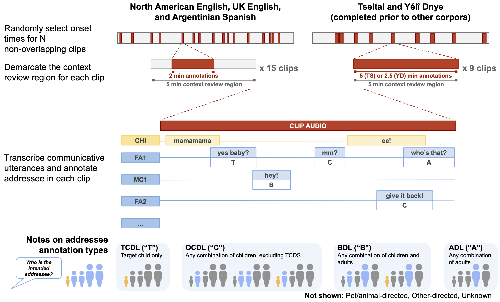

```{r setup, include = FALSE}
source("0_setup.R")
quantity.rand <- read_csv(paste0(
  processed.data.path, "minimal-quantity.rand.csv"))
quantity.rand.bychild <- read_csv(paste0(
  processed.data.path, "minimal-quantity.rand.bychild.csv"))
quantity.rand.st <- read_csv(paste0(
  processed.data.path, "minimal-quantity.rand.st.csv"))
```

```{r analysis-preferences, include = FALSE}
# Seed for random number generation
set.seed(42)
knitr::opts_chunk$set(cache.extra = knitr::rand_seed)
```

```{r tbl-analysis-prep, include = FALSE}
## Get variables ready for modeling
# Quantity rand
nspkrs.m <- mean(quantity.rand$n_spkrs_clip)
nspkrs.sd <- sd(quantity.rand$n_spkrs_clip)
quantity.rand <- quantity.rand %>%
  mutate(
    tchiyr.std = ((age_mo_round - tchiyr.m)/tchiyr.sd),
    nsk.std = ((n_spkrs_clip - nspkrs.m)/nspkrs.sd))

# Quantity rand by speaker type
nspkrs.sa.m <- mean(quantity.rand.st$n_spkrs_clip.st)
nspkrs.sa.sd <- sd(quantity.rand.st$n_spkrs_clip.st)
quantity.rand.st <- quantity.rand.st %>%
  mutate(
    tchiyr.std = ((age_mo_round - tchiyr.m)/tchiyr.sd),
    nsk.st.std = ((n_spkrs_clip.st - nspkrs.sa.m)/nspkrs.sa.sd))
# add by-clip nsk scores (i.e., not divided by speaker type)
quantity.rand.st %<>%
  left_join(select(quantity.rand, c(aclew_child_id, segment,
                                    n_spkrs_clip, nsk.std)))
# NA_English as reference group
quantity.rand$group_corpNE <- factor(
  quantity.rand$group_corpNE, levels = c(
    "NA_English", "UK_English", "Arg_Spanish", "Tseltal", "Yeli_Dnye"))
quantity.rand.st$group_corpNE <- factor(
  quantity.rand.st$group_corpNE, levels = c(
    "NA_English", "UK_English", "Arg_Spanish", "Tseltal", "Yeli_Dnye"))
# Women speakers as reference group
quantity.rand.st$SpkrType <- factor(quantity.rand.st$SpkrType, levels = c(
    "Woman", "Man", "Child"))
```

Across cultures, children's early language experiences vary substantially with respect to who talks to them, what is talked about, and what the children themselves are expected to contribute [e.g., @brown2011cultural; @brown2014language; @casillas2020tseltal; @deleon2011language; @demuth1979introduction; @gaskins2006cultural; @ochs1984language; @pye1986quiche; @rogoff2003firsthand; @shneidman2012language; @vogt2015communicative]. For example, home pedagogical techniques, such as caregiver use of rhetorical questions and directly addressed instructions, are more common in some cultural contexts than others (e.g., US versus Mayan groups, see e.g., @gaskins1996how; @rogoff2003firsthand; @shneidman2016child). 

Research today, primarily revolving around urban, Western contexts, situates child-directed speech (CDS)---and more specifically interactive speech produced by adult caregivers---as a keystone for early language development [e.g., @cartmill2013quality; @hoff2003specificity; @ramirezesparza2014look; @ramirezesparza2017look; @ramirezesparza2017impact]. Recent findings converge on the idea that so-called "high quality" (interactive, one-on-one) CDS is a consistent and robust predictor of children's growing vocabulary [e.g., @ramirezesparza2014look; @rowe2008child]. However, the focus of most research so far using CDS to predict vocabulary outcomes reflects the political and economic priorities of growing, urban societies, especially their need for a unified and literate workforce. These priorities may not generalize across other cultural contexts, where other language phenomena (e.g., grammatical systems or rhetorical practices) may prove more relevant [@ochs2020ethical; @sperry2019language].

Recent cross-linguistic and cross-cultural work on typically developing children supports the idea that there is, in fact, significant natural variation in children's exposure to CDS. For example, Shneidman [-@shneidman2010language; @shneidman2012language] found an almost ten-fold difference in the proportion of child-directed speech in the linguistic environments of Chicago (US) and Yucatec Mayan (Mexico) children before age three. Scaff, Cristia, and colleagues find that Tsimane'-acquiring children (Bolivia) are directly spoken to infrequently, with recent estimates as low as approximately one half minute per hour [@cristia2018talker; @scaffIPlanguage]. Casillas and colleagues [@casillas2020tseltal; @casillas2021papuan] found surprisingly similar, but relatively infrequent rates of directed input in two rural populations with substantially different approaches to child language socialization (Tseltal Mayan (Mexico) and Rossel Island Papuan (Papua New Guinea)). @cristia2023systematic pulls these findings and more together in a systematic review, highlighting a consistent difference in higher versus lower input rates between urban and rural societies, respectively. A recurrent theme across much of this work examining CDS in rural and developing populations has been the role of input from other children (e.g., siblings, cousins, and other peers; see also @loukatou2022child and @cristia2023vocal for perspectives from Sesotho and multilingual children in Vanuatu).

It is not yet understood how differences in CDS exposure play a role in how children process or learn language in their first few years. The emerging evidence on this topic in a cross-cultural context is complex. For example, Ramirez-Esparza and colleagues [-@ramirezesparza2017impact] found that CDS heard in a group context (as opposed to one-on-one interactions) was related to vocabulary development in US Spanish-English bilinguals but not monolinguals from the same population. Consistent with this view, studies of populations where caregiver CDS is relatively rare have found that young children meet language development milestones at roughly the same rate as children growing up in contexts where adult CDS is very common [@casillas2020tseltal; @casillas2021papuan], though lexical development may be more sensitive [@shneidman2012language; @ramirezesparza2017impact].

In short, there is a great deal yet to learn about how language learning is supported by CDS _and_ other sources of input. These other sources may include adult conversations that the infant observes (passively or actively), CDS produced by other children, and multiparty interactions [@casillas2020tseltal; @casillas2021papuan; @cristia2023vocal; @cristia2018talker; @loukatou2022child; @scaffIPlanguage].

The present study takes a first step toward describing multiple sources of input---not just CDS---across a linguistically and culturally diverse sample of young children. Specifically, we examine how child age and cultural group influence the quantities of directly addressed and overhearable adult speech that children encounter in five culturally distinct settings. Before we dive in to the methods and findings, we will set up the present study with three brief overviews of relevant work on measuring children's linguistic input: first we define the constructs of child-directed and adult-directed speech as we use them here, then we review the major factors known to influence the quantities of each in children's language environments, and we then describe prior approaches to estimating each from daylong audio recordings.

## What counts as "child-directed" input?

A great deal of prior work has contrasted child- and adult-directed speech, but what gets counted as "child-directed" varies from study to study. There are two basic approaches. First, these two terms ("CDS" and "ADS") can be used to denote the intended addressee, such that child-directed speech is speech that is _addressed_ to a child and adult-directed speech is speech that is _addressed_ to an adult. Second, the terms can be used to denote the speech _register_ or other characteristics of the speech. In this second approach, speech that contains the prosodic, lexical, grammatical, and affective characteristics typically associated with speech to children is classified as child-directed speech, regardless of the actual intended addressee, with the same for characteristics of speech to adults resulting in classification as adult-directed speech. In the present study, we will measure linguistic input quantities based on the utterance's intended _addressee_ (e.g., separating speech exclusively directed to the target child versus to another child versus to an adult, etc.).

While qualitative properties of different input types are also important to consider for language development (e.g., response contingency; see @masek2021beyond for a recent review), input _quantities_ are ideal for roughly comparing the linguistic material children encounter in their daily lives. Input qualities, such as syntactic simplification, high and variable pitch, and vocal timbre modifications have been recognized across culturally and linguistically diverse datasets of child-directed speech and sign [e.g., @bornstein1992functional; @brentari2011sensitivity; @broesch2015prosody; @farran2016cross; @fernald1989cross; @hilton2022acoustic; @masataka1998perception], but these characteristics still vary across cultural groups and, sometimes may not be present at all [e.g., @broesch2015prosody; @brown2014interactional; @hilton2022acoustic; @ochs1984language; @pye1986quiche]. Since these variations in qualitative features across cultural groups are not yet well understood, we restrict ourselves to defining CDS and ADS based on addressee rather than qualitative features.

Quantity-centered estimates of directed speech can also capture some aspects of input "quality". Addressees have an advantage in comprehension compared to non-addressed others precisely because the utterance in question is suited to the addressee's immediate comprehension, including timing, word choice, and omitted information [@bell1984language; @foushee2021self; @schober1989understanding]. Such addressee effects are theorized to exist universally across cultures and communities, given that they arise from general mechanisms of human coordination [@clark1996using].

Relating back to the idea of input "quality", consider that adult-directed speech is generally more challenging for young children to comprehend and engage with, while speech that is directly addressed to the target child is highly suited for their comprehension and interactive engagement. By classifying speech by addressee, we can capture clear potential for difference in ease of comprehension (one "quality" factor) of different input sources. In the present paper, we compare adult-directed speech (ADS) quantities against target-child addressed (TCDS) speech quantities---that is, speech addressed _specifically_ to the child under study, rather than to another nearby child. These measures represent two distinct sources of linguistic input, so our present study could thus be described as measuring the quantity of two quality types.

## Factors shaping input quantity

A broad spectrum of factors has been suggested to influence the quantity of CDS children encounter in their daily lives. Much less work has investigated factors influencing the quantity of ADS children encounter. We briefly summarize the primary factors examined in prior work, from the macro scale to the micro scale. These factors inform the present study's analyses.

On the macro end of the spectrum, CDS quantities are thought to be influenced through group membership, for example via socioeconomic group membership or via culturally held beliefs and practices around childrearing (e.g., see @rowe2020language for a recent review; see @gaskins2006cultural and @ochs1984language for reviews regarding language socialization and culture). For example, meta-analyses of nearby adult talk in daylong audio data [@piot2022socioeconomic] and CDS in naturalistic, unstructured interaction data [@dailey2022language] suggest a small but significant positive correlation of linguistic input quantity with socioeconomic status [but see also @bergelsonIPbsl].

Also on the macro scale, there is immense cross-cultural variability in how often children are talked to, by whom, and what is talked about [e.g., @deleon2011language; @demuth1979introduction; @gaskins2006cultural; @ochs1984language; @pye1986quiche; @rogoff2003firsthand; @rosemberg2020nouns; @vogt2015communicative]. With respect to CDS quantity, ethnographic and linguistic evidence from two rural communities---Tseltal (Mayan) and Yélî Dnye (Papuan)---suggests that adults in neither community engage in Western-style pedagogical language, but that Tseltal caregivers encourage children to attend to the interactions around them whereas Yélî caregivers more often place infants at the center of social attention [@brown2011cultural; @brown2014interactional; @brownIPchildrearing]. That said, prior work has not found differences in baseline TCDS rate between the two communities, suggesting that the translation from cultural patterns of childrearing to measures of input quantity is complex [@casillas2020tseltal; @casillas2021papuan]. As noted above, @shneidman2012language _did_ observe clear differences in comparing US and Yucatec Mayan children's input, with the US children under age three hearing significantly more directed input, and mostly from adults. This evidence concords with Cristia's [-@cristia2023systematic] characterization of the primary split in input quantities being in rural versus urban populations, more so than culture-to-culture differences.

In the meso part of the spectrum, children's available interactants also shape what kinds of CDS they hear, with prior results pointing to a greater availability of CDS from adults compared to children, and among adults, women compared to men [e.g., @bergelsoncasillas2019what; @shneidman2012language]. As noted above, however, a recurrent theme in work on rural populations is the presence of other children and hence much more CDS from siblings, cousins, and other children [@casillas2020tseltal; @casillas2021papuan; @cristia2023vocal; @loukatou2022child; @rosemberg2020nouns; @scaffIPlanguage].

A separate meso-level factor is child age: prior work does not consistently demonstrate evidence of change in CDS quantity with age but it does demonstrate age-related change for ADS quantity [@bergelsoncasillas2019what; @casillas2020tseltal; @casillas2021papuan]. For example, Bergelson, Casillas, and colleagues [-@bergelsoncasillas2019what] find that ADS rates decreased significantly over the first few years while CDS quantity rates held constant. Converging evidence for this pattern then came from Casillas and colleagues' studies of Tseltal [-@casillas2020tseltal] and Yélî Dnye [-@casillas2021papuan]. Ramírez-Esparza and colleagues [-@ramirezesparza2017impact] also find increases in non-canonical CDS with age---non-CDS-styled CDS and multiparty CDS---in their sample of US English and English-Spanish bilinguals. @shneidman2012language did observe change with age in CDS rate, but only due to increased CDS from other children.

Lastly, on the micro end of the spectrum, CDS and ADS rates fluctuate moment to moment given factors such as the ongoing activity (e.g., playing or eating), the number of potential interactants present, the physical condition of the target child and their surrounding family (e.g., sleeping or awake, stationary or in motion), and more. @soderstrom2013when found that linguistic input rates systematically varied depending on the activity context in Canadian daylong recordings [see also @greenwood2011assessing]. Similar patterns emerged in the daylong recording data of Tseltal and Yélî Dnye-acquiring children [@casillas2020tseltal; @casillas2021papuan]. Though we will not, in the present study, have information about activity context, we will at least be able to account for the number of individual talkers present, because when there are more talkers there is more talk. That is, the presence of each additional talker increases competition for the conversational floor, and when four or more talkers are present, group conversations often split into simultaneous sub-conversations, multiplying the amount of observable talk (conversational "schism" see, e.g., @sacks1974simplest and @holler2021competition).

Minimally, the number of talkers present can be considered a "nuisance" variable to help explain fluctuations in CDS and ADS rate over the day. More informatively, however, the number of talkers may serve as a proxy for activities that involve dense family interaction time versus activities where smaller groups of individuals are on their own.^[The typical number of talkers present may vary systematically between populations [see Supplementary Materials Section 2 and @brown2011cultural; @brown2014interactional; @gaskins2006cultural; @rosemberg2020nouns]. Therefore the number-of-talkers measure may partly capture cultural differences---not just within-participant activity variation. We suspect that, even for children in talker-dense populations, variation in the number of talkers present impacts how much CDS and ADS is observable at a given moment. We thus add this factor as _separate_ from culture in our statistical models.]

## Extracting CDS and ADS from daylong recordings

Ecologically valid estimates of ADS and CDS input rates are now possible via long-format (e.g., daylong) recordings of children's home language environments (e.g. LENA, @greenwood2011assessing; @bergelson2019day; see @pisaniIPlong for a review). However, to date these recording systems cannot reliably and automatically differentiate between CDS and ADS. Studies that have leveraged daylong recordings have therefore relied on manual annotation to supplement any automated output, taking several different approaches. For example, @weisleder2013talking manually classified 5-min blocks of time as primarily child-directed or adult-directed, while Ramírez-Esparza and colleagues [-@ramirezesparza2014look; -@ramirezesparza2017look; -@ramirezesparza2017impact] manually annotated speech-dense clips of audio as having: (1) speech addressed to the child, (2) speech containing the parentese register features of CDS versus ADS (independent of addressee) and (3) who was present as a conversational partner. Moving from the clip level to the utterance level, Bergelson, Casillas, and colleagues [-@bergelsoncasillas2019what] extracted individual utterances using LENA's automated utterance annotations and then annotated them as child- or adult-directed, based on recognizable CDS and ADS register characteristics.

While these studies examine CDS and ADS in large and highly naturalistic datasets, they either take a very coarse perspective (e.g., examining 5-minute intervals), or tell us about input patterns during the day's interactional peaks rather than illustrating patterns in children's average language experiences over the course of a day. In order to extract a representative measure of linguistic input, i.e., how much language children encounter from different types of people in different types of activities across their day (including typical "down" time), we must take random or periodic samples of the language environment [@casillas2019stepbystep] rather than only analyzing interactional peaks or estimating across time periods. To gather accurate and representative estimates of natural, at-home CDS and ADS in the present study, we therefore randomly sampled clips from daylong audio recordings and fully transcribed all hearable speech, annotating intended addressee for each utterance in each clip.^[Alternatively, one could comprehensively annotate and analyze children's daylong input [@montag2020insights], but manually annotating CDS at the utterance level in this way is a many-years-long undertaking.]

## The current work

We examine baseline rates of target-child-directed speech (TCDS) and adult-directed speech (ADS) in the daylong recordings of children growing up in five culturally and linguistically distinct groups: North American English ("NA English"; US & Canadian), United Kingdom English ("UK English"; England), Argentinian Spanish ("Arg. Spanish"; Argentina), Tseltal (Tenejapa, Mayan, Mexico), and Yélî Dnye (Rossel Island, Papuan, Papua New Guinea). As detailed below, some of these corpora include samples from multiple, distinct sub-populations (e.g., NA English includes both US and Canadian English), so we refer to each of these samples as "language groups". This unique metacorpus draws on seven pre-existing collections of daylong recordings ("corpora") that were gathered by different research teams, with a variety of different recording devices (i.e., not all LENA), and for a range of different research purposes. Our primary objective was to quantitatively measure the exposure of young children in these groups to two different sources of linguistic input---TCDS and ADS---and to examine several factors associated with  variation in this exposure---age, language group, talker type, and number of talkers present. 

To accomplish this goal, we defined a second, critical objective: to generate an audio sampling and annotation approach that could be fruitfully employed across recordings made in culturally and linguistically diverse populations [@soderstrom2021developing]. As motivated above, our analyses focus on two distinct types of linguistic input: TCDS and ADS. Our annotation scheme additionally allows us to examine other types of input, e.g., OCDS (other-child-directed speech, i.e., speech directed to children other than the target child; see Figure \@ref(fig:samplingmethods)). For the sake of simplicity, we report data for OCDS in the Supplementary Materials, where we combine it with TCDS to generate parallel analyses of all-CDS (TCDS + OCDS), with similar results to what is reported below.

### Hypotheses

The specific aims of our analysis are to examine how TCDS and ADS vary across age, language group, talker type, and number of talkers in a highly naturalistic and culturally diverse set of daylong recordings. Before analysis, we established a specific set of hypotheses---with corresponding regression formulae---regarding TCDS and ADS. These hypotheses are based on prior work (see Tables \@ref(tab:tab2) and \@ref(tab:tab3) for detailed overviews). The models for TCDS and ADS are similar but slightly different, as the specific hypotheses about these two input sources slightly differ:

Based on the work cited above, we expected for TCDS rate to vary across language groups (e.g., to be higher-rate in more urban groups) and to come most often from women, but with a greater presence of other-child-produced TCDS in some groups (Tseltal, Yélî Dnye, Argentina). We did not expect any effects of child age on TCDS rate. We expected that TCDS rate would be higher when more talkers were present, given the idea that more talkers results in more talk.

We expected for ADS rate to vary across language groups (e.g., to be lower-rate in more urban contexts), to decrease significantly with child age (especially in groups with high ADS rates early on, e.g., Yélî Dnye), to come most often from women, with greater contributions from children in some groups (Tseltal, Yélî Dnye, Argentina). We also expected that ADS rate would be higher when more talkers were present. 

Please note that we limited our hypotheses to simple effects and two-way interactions. We might anticipate other, more complex effects (e.g., the three-way interaction of age-language group-talker type on TCDS rate), but given the limited size of our metacorpus (_N_ = 10 recordings per corpus maximum) we leave these effects to be tested in future, larger datasets.

The present paper is the first to bring together all these different factors known to influence TCDS and ADS and to examine their joint effects across multiple language groups (though see @bergelsonIPbsl for a mega LENA-based analysis). We examine these factors in order to identify axes of consistency and variation across the multi-corpus sample though, as a reminder, we are not attempting to examine all possible interactions and instead take a hypothesis-driven approach to analysis.^[To simplify the structure of our results, we treat the largest sub-corpus---North American English---as the reference level for language group and the most studied talker type---women---as the reference-level for talker type in the analyses below. We in no way imply with this decision that the North American English data are a global "norm". Rather, we mean to highlight which results are likely to have gone under-reported in past work. The Supplementary Materials include alternate models with all language groups as reference level to allow for further inspection and full pairwise comparisons between language groups.] Importantly, while we identify key points of theoretically relevant cultural variation across the samples in this study, we do not argue that these language groups represent the full spectrum of diversity in linguistic input experiences, even within the specific populations we have sampled.


# Methods

## Metacorpus Construction

We use the Analyzing Child Language Experiences around the World (ACLEW) metacorpus [@soderstrom2021developing] of long-form audio recordings of children's everyday language environments, comprising seven corpora from five culturally and linguistically distinct groups, labeled here as: North American English (NA English), United Kingdom English (UK English), Argentinian Spanish (Arg. Spanish), Tseltal, and Yélî Dnye.^[For more information on the caregiving and early language environments of Argentinian Spanish-, Tseltal-, and Yélî Dnye-acquiring children, we refer readers to other work [@brown1998conversational; @brown2011cultural; @brown2014interactional; @brownIPchildrearing; @rosemberg2020nouns]] Each group is represented by a single corpus except North American English, for which we had access to three corpora. Recordings for each corpus were originally collected for the unique research purposes of the individual lab contributing the corpus, and therefore there is variation across corpora in the recruitment practices, recording equipment (i.e., not all LENA), recording length, target child ages (see Supplementary Materials Section 3), and other demographic characteristics (see Table \@ref(tab:tab1) for an overview).

### Sampling technique

Our sampling and annotation scheme needed to be suitable for daylong recordings of different durations made with different recording devices, and for variable annotation situations (e.g., in a lab or in the field).

We selected a single day's recording for 10 children from each corpus, except the McDivitt-Winnipeg corpus from which we selected 9 recordings due to a sampling error (total recordings _N_ = 69); this sample size per corpus reflects what was possible with the smallest corpora in our sample. We used a script to select recordings that were as balanced within and across corpora in reported child gender (male/female), maternal education (below high school–advanced degree), and child age (0;2--3;0; see OSF_URL_MASKED_FOR_REVIEW<!--https://osf.io/739g8/--> for details). The range of available ages was more limited in North American English compared to the other corpora but our statistical approach accounts for this (also see the Supplementary Materials Section 3). Five of the included recordings overlap with those used in @bergelsoncasillas2019what and the same Tseltal and Yélî Dnye annotations have been analyzed somewhat differently in separate work [@casillas2020tseltal; @casillas2021papuan].

Each dataset and contributing lab came with a specific set of constraints on what was possible for manual annotation work (e.g., teams of undergraduate students versus individual collaborations with native speakers in remote field sites), so we settled on two basic techniques for sub-sampling and transcribing data from these long-format recordings. These methods for sampling and preparing clips for annotation are illustrated in Figure \@ref(fig:samplingmethods).

```{r samplingmethods, echo=FALSE, fig.align = "center", fig.cap="Summary of clip selection and annotation method across corpora.", out.width = '100%'}

# https://docs.google.com/drawings/d/14WEXXL0dZ8IKzVzVICOrsp64JFa0wpEWCKBBeeccj5g/edit
```

For North American English, UK English, and Argentinian Spanish (49 of the 69 recordings), we wrote a Python script to randomly pick start times for 15 two-minute clips from throughout the day of each recording, excluding any possibility of clip overlap. The script selected the start and stop times of each clip, as well as the start and stop times of an associated four-minute context period for each clip (see Figure \@ref(fig:samplingmethods), upper left). Thus each of the 15 clips per recording contained one minute of prior context, followed by two minutes of audio to be transcribed and annotated, followed by two more minutes of additional context. The start and stop times of the context and to-be-transcribed clips were then added automatically to a single ELAN [@ELAN] audio annotation file that spanned the entire recording. This process resulted in 30 total minutes of annotation per recording.

The Tseltal and Yélî Dnye corpora (20 of the 69 recordings) used a similar method, except only 9 clips were randomly selected. However, the clips were longer than in the other corpora. Tseltal clips were 5 minutes long and Yélî Dnye clips were 2.5 minutes long, resulting in a total of 45 minutes and 22.5 minutes of annotation per recording for the Tseltal and Yélî Dnye corpora, respectively. The five-minute clips in Tseltal had no additional context; this length of clip already provides significant context. The 2.5-minute clips for Yélî Dnye were followed by an additional 2.5 minutes of recording context. Thus, the total context review period for annotation clips across all corpora was five minutes (Figure \@ref(fig:samplingmethods)).

Minor deviations in the sampling process between corpora are not expected to have meaningful effects on the analyses: all clips are short and randomly selected from throughout the child's waking day. These deviations arose because the Tseltal and Yélî Dnye datasets required significant contributions from native local speakers in each remote community sampled, and so the annotation workflow was adapted to suit the associated researcher's fieldwork schedule. We originally planned for 5-minute clips for the Yélî Dnye data, parallel to the Tseltal data, but this proved infeasible given the time-intensive nature of annotating this community's high-density language environments, so clip duration was reduced from 5 to 2.5 minutes.

The final clip collection therefore consists of 35.8 hours of transcribed and annotated recording time, of which 16.3 hours consists of communicative vocalizations. Given the constraints across corpora on transcription work hours, this was near the ceiling of manual annotation data we could generate. It was unknown in advance how many recording minutes would be needed to produce meaningful results. That said, Casillas and colleagues [-@casillas2020tseltal; -@casillas2021papuan] found that the present amount and distribution of recording minutes were sufficient to detect many of the effects predicted here. Their findings are especially promising for the current set of analyses, which includes a similar statistical approach and re-uses those two datasets (now with additional corpora for comparison). Recent studies [@cychosz2020efficient; @micheletti2020optimal; @marasli2023optimizing] have started building up a more general approach to sampling naturalistic behavior from daylong recordings, but our lack of prior knowledge about the distribution of different input densities from different types of talkers across these groups prevented us from being able to confidently peg our sampling technique to anticipated underlying effects. To counteract what we anticipated would be limited statistical power, we planned to only analyze effects for which we had strong _a priori_ predictions (see an overview in Tables \@ref(tab:tab2) and \@ref(tab:tab3)).

## Annotation technique

Each of the randomly selected segments were annotated using the ACLEW Annotation Scheme [https://osf.io/b2jep/, @casillas2017workflow; @soderstrom2021developing], an ELAN-based approach [@ELAN].  Each annotator undergoes a rigorous and independent training and testing process to ensure intra- and inter-lab consistency in coding. Annotators segmented and transcribed all hearable human communicative vocalizations in the samples, with a separate tier for each individual talker to allow for overlapping talk. Each tier was identified by the talker's perceived age and gender category (adult/child/unknown and female/male/unknown; e.g., FA1 = female adult 1 in Figure \@ref(fig:samplingmethods)). All utterances (except the target child's) were also annotated for the intended addressee (exclusively target-child-directed/other type of child-only-directed/adult-only directed/mixed-age-directed/animal-directed/other-directed/unknown) on the basis of any available contextual and interactional information within the audio recordings.

Annotator reliability was checked by the complete re-annotation of one-minute from each recording by a new annotator. We then compared the original minute's annotations to the re-coded minutes' annotations. A full reliability report is available at URL_MASKED_FOR_REVIEW, but to briefly summarize, error estimates for talker type annotations (e.g., disagreements about whether the talker is the target child or a different child) are far better than prior work has found between human and LENA (i.e., automated) annotations. Further, comprehensive kappa scores reflect moderate-to-substantial agreement (cross-corpus _k_ range = 0.55--0.68) for talker types and slight-to-substantial agreement (cross-corpus _k_ range = 0.32--0.64) for addressee, with wide variability in agreement between corpora. Despite the fact that CDS can have some cross-linguistically recognizable features [e.g., @bornstein1992functional; @fernald1989cross; @hilton2022acoustic], we had expected somewhat lower reliability scores for addressee annotations because the reliability annotators did not always understand the language of the file they were annotating; their annotation decisions were thus less informed by lexicosyntactic content than the (native-speaking) original annotators'. Most cases of disagreement arose when one annotator indicated silence or overlapping talk where the other annotator indicated talk from a single person---confusion between actual addressee categories was relatively low (see Supplementary Materials Section 8 for more details).

```{r tab1, echo=FALSE, message=FALSE, warning=FALSE, results = "asis"}
corp.dem <- read_delim("corpora_breakdown-utf8.csv",
  delim = ",",
  locale = locale(encoding = "UTF-8")) %>%
  mutate(Language = replace_na(Language, ""),
    `Region` = replace_na(`Region`, ""))
apa_table(corp.dem, caption="Details for the corpora in the dataset (Bergelson et al., 2016; Casillas, Brown & Levinson, 2017; McDivitt & Soderstrom, 2016; Rosemberg et al., 2015; Rowland et al., 2018; Warlaumont et al., 2016). Parentheses following the mean indicate the range across participants.")
```

## Data analysis
All statistical analyses were conducted in R with the glmmTMB package [@brooks2017modeling; @R-base] and all figures were generated with ggplot2 [@R-ggplot2]. Analysis scripts and raw anonymized data are available at URL_MASKED_FOR_REVIEW. Our two dependent measures were the rates of TCDS and ADS (both expressed in minutes per hour). We calculated TCDS and ADS input rate for each clip for each of three talker types: female adults (here "women"), male adults (here "men"), and children (here "children", including both male and female children). All other utterances (e.g., language addressed to animals and language produced by electronic devices) were excluded. As motivated above, we designate TCDS versus ADS utterances based on who they were perceivably addressed to: 'TCDS' includes communicative utterances that were addressed exclusively to the target child (from an adult or another child). 'ADS' includes communicative utterances addressed to one or more adults (from an adult or from another child).

TCDS and ADS input rate cannot be negative. In practice, they are modally zero or close to zero. Given our random sampling technique, which can include periods of silence, many clips include no TCDS or ADS. These "down" times for input are part of the representative pattern of children's language experience ^[Note also that while it is a somewhat common practice to exclude naptime from consideration in analyses of longform audio recording (e.g. @bergelson2019day; @ramirezesparza2014look), naptime is not a culturally appropriate construct in some of our sampled populations.] but also present an analytical challenge: observed cases of 0 TCDS/ADS in many clips combined with a skewed non-negative distribution of > 0 TCDS/ADS in other clips. This distribution of TCDS/ADS across sampled clips cannot be modeled with the assumption of normality. We therefore used zero-inflated negative binomial mixed-effects regressions for our analyses. This regression type uses a two-model approach to overcome non-negative, overdispersed data with extra cases of zero—the case for the present data [@brooks2017modeling; @smithson2013generalized].

The two model components constructed for the analyses of TCDS and ADS are: (1) a __zero-inflation model__, which uses a logistic regression to model the likelihood of the _presence_ of 'zero' cases in the data (e.g., answering questions like 'are zero-TCDS clips less likely for older target children?') and (2) a __count model__, which uses linear regression to model how the _rate_ of TCDS/ADS is influenced by the predictors of interest (e.g., answering questions like 'is TCDS rate higher for older target children?'). The _a priori_ predictions we laid out above can be applied to both model components, as shown in Tables \@ref(tab:tab2) and \@ref(tab:tab3).

The simple effects included in the models were target child age (centered and standardized from age in months), number of talkers present in that clip (centered and standardized from the unique number of talkers across all clips), talker type (woman versus man/child), and language sample (North American English versus UK English/Argentinian Spanish/Tseltal/Yélî Dnye). We only included interactions for which we had a strong _a priori_ hypothesis and thus the models for TCDS and ADS differ slightly in their structure  (see the Results for the regression formulae).

We modeled language group and talker type as factorial variables, which limits our ability to make comparisons among language groups; e.g., if Tseltal were the reference level, the model outcomes for language group would give pairwise comparisons between Tseltal and all the other language groups, but not pairwise comparisons between other language groups, for example, between Argentinian Spanish and UK English. We selected 'North American English' and 'women' as our default reference levels for reporting model estimates below given that North American English and linguistic input from female adults are the most well represented in (a) the current dataset and (b) prior work done on our sampled populations. In addition, we are interested in establishing under-studied patterns that may be present in our dataset---effects that diverge from groups that are currently over-represented in the literature. Setting these levels as a reference gives us a first glimpse into the variation that has gone under-examined in past work. This analysis should not be understood as positioning North American English as a global "norm".

That said, there is interest among our author team and others in the field in _pairwise_ comparisons between language groups. To allow curious readers to inspect more closely how the reported effects below are impacted by the selected reference level of language group, we include versions of our models with each language group as the reference level in the Supplementary Materials (i.e., five versions of the TCDS and ADS model each; Section 6). Here in the main text our results focus on models of TCDS and ADS with North American English as the reference level for language group and women as the reference level for talker type.

\pagebreak

```{r tab2, echo=FALSE, message=FALSE, warning=FALSE, results = "asis"}
tds.predictions <- read_delim("TDS-predictions.csv", delim = ";") %>%
  mutate(`Hypothesized outcome` = replace_na(`Hypothesized outcome`, ""),
         Supported = replace_na(Supported, ""))
apa_table(tds.predictions, caption="Predictions for TCDS analysis. Asterisk indicates previously observed with daylong child language data (Casillas et al., 2020, 2021; Scaff et al., under review). The 'Supported' column reflects the extent to which each finding from the current study aligns with its predicted outcome.")
```

\pagebreak

```{r tab3, echo=FALSE, message=FALSE, warning=FALSE, results = "asis"}
ads.predictions <- read_delim("ADS-predictions.csv", delim = ";") %>%
  mutate(`Hypothesized outcome` = replace_na(`Hypothesized outcome`, ""),
         Supported = replace_na(Supported, ""))
apa_table(ads.predictions, caption="Predictions for ADS analysis. Asterisk indicates predictions on the basis of related or similar data. The 'Supported' column reflects the extent to which each finding from the current study aligns with its predicted outcome")
```

\pagebreak

# Results
Descriptive statistics for observed TCDS and ADS rates by language group and talker type are shown in Table \@ref(tab:tab4) and in Figure \@ref(fig:xdsplots). A visual summary of statistical model outcomes from the count models of TCDS and ADS rate is shown in Figure \@ref(fig:modelcoeffsplots). Further, marginal means plots of model-predicted TCDS and ADS rates across age, language group, and talker type are available in Supplementary Materials Section 7. In Tables \@ref(tab:tab2) and \@ref(tab:tab3) we provide a high-level summary of which hypothesized outcomes were statistically supported in the regressions described below.


```{r tab4, echo=FALSE, message=FALSE, warning=FALSE, results = "asis"}
by.corp.rates.TDS <- quantity.rand.bychild %>%
  group_by(group_corpNE) %>%
  summarize(
    mean_tds.mph = mean(tds_mph),
    median_tds.mph = median(tds_mph),
    min_tds.mph = min(tds_mph),
    max_tds.mph = max(tds_mph))

by.corp.rates.ADS <- quantity.rand.bychild %>%
  group_by(group_corpNE) %>%
  summarize(
    mean_ads.mph = mean(ads_mph),
    median_ads.mph = median(ads_mph),
    min_ads.mph = min(ads_mph),
    max_ads.mph = max(ads_mph))

corp.rename.tbl <- tibble(
  group_corpNE = c("NA_English", "UK_English", "Arg_Spanish",
                   "Tseltal", "Yeli_Dnye"),
  Language = c("NA English", "UK English", "Arg. Spanish", 
               "Tseltal", "Yélî Dnye"),
  Order = c(1, 2, 3, 4, 5))

by.corp.rates <- left_join(
  by.corp.rates.TDS, by.corp.rates.ADS,
  by = "group_corpNE") %>%
  left_join(corp.rename.tbl,
            by = "group_corpNE") %>%
  mutate(
    TDS.rate = paste0(round(mean_tds.mph,2), " (", round(median_tds.mph,2),
      "; ", round(min_tds.mph,2), "–", round(max_tds.mph,2), ")"),
    ADS.rate = paste0(round(mean_ads.mph,2), " (", round(median_ads.mph,2),
      "; ", round(min_ads.mph,2), "–", round(max_ads.mph,2), ")"),
    mean.TDS.prop = round(mean_tds.mph/(mean_tds.mph + mean_ads.mph), 2)) %>%
  arrange(Order) %>%
  rename(
    `TCDS rate` = TDS.rate,
    `ADS rate` = ADS.rate,
    `Mean proportion TCDS` = mean.TDS.prop) %>%
  select(Language, `TCDS rate`, `ADS rate`, `Mean proportion TCDS`)

apa_table(by.corp.rates, caption="Average input rates per clip across participants for each language group. Note that these descriptive statistics are raw rates and therefore reflect overall differences between corpora without controlling for, e.g., number of talkers present, which are accounted for in the statistical analyses. Parentheses following the mean indicate the median and range across participants in each group.")
```

```{r TCDS_cross_corp_analysis, message=FALSE, warning=FALSE, include=FALSE, paged.print=FALSE}
# TCDS = any speech from non-target child speakers addressed to the target child
tds.rand.st.zinb <- glmmTMB(round(tds_mph.st,0) ~
    tchiyr.std + # no change with age (or slight increase)
    SpkrType + # Woman > {Man, Child}
    nsk.std + # more speakers = more speech
    group_corpNE + # more TCDS in WEIRD
    SpkrType:group_corpNE + # more child speakers in non-WEIRD
    tchiyr.std:SpkrType + # more TCDS from children (and perhaps also from men) with age
    (1|aclew_child_id),
  data=quantity.rand.st,
  # The probability of producing a structural zero
  ziformula=~tchiyr.std + group_corpNE,
  family="nbinom1")
# summary(tds.rand.st.zinb)
# tds.rand.st.zinb.res = simulateResiduals(tds.rand.st.zinb)
# plot(tds.rand.st.zinb.res, rank = T)

tds.rand.st.zinb.disp <- round(sigma(tds.rand.st.zinb), 2)
tds.rand.st.zinb.COEF.age <-
  coef(summary(tds.rand.st.zinb))[[1]]["tchiyr.std",] 
tds.rand.st.zinb.COEF.man <-
  coef(summary(tds.rand.st.zinb))[[1]]["SpkrTypeMan",] 
tds.rand.st.zinb.COEF.child <-
  coef(summary(tds.rand.st.zinb))[[1]]["SpkrTypeChild",] 
tds.rand.st.zinb.COEF.nsk <-
  coef(summary(tds.rand.st.zinb))[[1]]["nsk.std",]
tds.rand.st.zinb.COEF.spanish <-
  coef(summary(tds.rand.st.zinb))[[1]]["group_corpNEArg_Spanish",]
tds.rand.st.zinb.COEF.tseltal <-
  coef(summary(tds.rand.st.zinb))[[1]]["group_corpNETseltal",]
tds.rand.st.zinb.COEF.ukenglish <-
  coef(summary(tds.rand.st.zinb))[[1]]["group_corpNEUK_English",]
tds.rand.st.zinb.COEF.yelidnye <-
  coef(summary(tds.rand.st.zinb))[[1]]["group_corpNEYeli_Dnye",]
tds.rand.st.zinb.COEF.manSpanish <-
  coef(summary(tds.rand.st.zinb))[[1]]["SpkrTypeMan:group_corpNEArg_Spanish",]
tds.rand.st.zinb.COEF.childSpanish <-
  coef(summary(tds.rand.st.zinb))[[1]][
    "SpkrTypeChild:group_corpNEArg_Spanish",]
tds.rand.st.zinb.COEF.manTseltal <-
  coef(summary(tds.rand.st.zinb))[[1]]["SpkrTypeMan:group_corpNETseltal",]
tds.rand.st.zinb.COEF.childTseltal <-
  coef(summary(tds.rand.st.zinb))[[1]]["SpkrTypeChild:group_corpNETseltal",]
tds.rand.st.zinb.COEF.manUKEnglish <-
  coef(summary(tds.rand.st.zinb))[[1]]["SpkrTypeMan:group_corpNEUK_English",]
tds.rand.st.zinb.COEF.childUKEnglish <-
  coef(summary(tds.rand.st.zinb))[[1]]["SpkrTypeChild:group_corpNEUK_English",]
tds.rand.st.zinb.COEF.manYeliDnye <-
  coef(summary(tds.rand.st.zinb))[[1]]["SpkrTypeMan:group_corpNEYeli_Dnye",]
tds.rand.st.zinb.COEF.childYeliDnye <-
  coef(summary(tds.rand.st.zinb))[[1]]["SpkrTypeChild:group_corpNEYeli_Dnye",]
tds.rand.st.zinb.COEF.ageMan <-
  coef(summary(tds.rand.st.zinb))[[1]]["tchiyr.std:SpkrTypeMan",]
tds.rand.st.zinb.COEF.ageChild <-
  coef(summary(tds.rand.st.zinb))[[1]]["tchiyr.std:SpkrTypeChild",]
tds.rand.st.zinb.COEF.age.ZI <-
  coef(summary(tds.rand.st.zinb))[[2]]["tchiyr.std",]
tds.rand.st.zinb.COEF.spanish.ZI <-
  coef(summary(tds.rand.st.zinb))[[2]]["group_corpNEArg_Spanish",]
tds.rand.st.zinb.COEF.tseltal.ZI <-
  coef(summary(tds.rand.st.zinb))[[2]]["group_corpNETseltal",]
tds.rand.st.zinb.COEF.ukenglish.ZI <-
  coef(summary(tds.rand.st.zinb))[[2]]["group_corpNEUK_English",]
tds.rand.st.zinb.COEF.yelidnye.ZI <-
  coef(summary(tds.rand.st.zinb))[[2]]["group_corpNEYeli_Dnye",]

tds.model.table <- broom.mixed::tidy(tds.rand.st.zinb) %>%
    mutate(model = "TDS_random_z-inb")
write_csv(tds.model.table, "TDS_random_z-inb.csv")

source("plot-predvals-tds.R")
```

```{r TCDS_releveled, message=FALSE, warning=FALSE, include=FALSE, paged.print=FALSE}
quantity.rand.st <- quantity.rand.st %>%
  mutate(
    group_corpUK = fct_relevel(group_corpNE, "UK_English"),
    group_corpAS = fct_relevel(group_corpNE, "Arg_Spanish"),
    group_corpTS = fct_relevel(group_corpNE, "Tseltal"),
    group_corpYD = fct_relevel(group_corpNE, "Yeli_Dnye"),
    group_corpNA = fct_relevel(group_corpNE, "NA_English")
  )

# UK
tds.rand.st.zinb.UK <- glmmTMB(round(tds_mph.st,0) ~
    tchiyr.std + # no change with age (or slight increase)
    SpkrType + # Woman > {Man, Child}
    nsk.std + # more speakers = more speech
    group_corpUK + # more TCDS in WEIRD
    SpkrType:group_corpUK + # more child speakers in non-WEIRD
    tchiyr.std:SpkrType + # more TCDS from children (and perhaps also from men) with age
    (1|aclew_child_id),
  data=quantity.rand.st,
  # The probability of producing a structural zero
  ziformula=~tchiyr.std,
  family="nbinom1")
# summary(tds.rand.st.zinb.UK)
# tds.rand.st.zinb.UK.res = simulateResiduals(tds.rand.st.zinb.UK)
# plot(tds.rand.st.zinb.UK.res, rank = T)

# AS
tds.rand.st.zinb.AS <- glmmTMB(round(tds_mph.st,0) ~
    tchiyr.std + # no change with age (or slight increase)
    SpkrType + # Woman > {Man, Child}
    nsk.std + # more speakers = more speech
    group_corpAS + # more TCDS in WEIRD
    SpkrType:group_corpAS + # more child speakers in non-WEIRD
    tchiyr.std:SpkrType + # more TCDS from children (and perhaps also from men) with age
    (1|aclew_child_id),
  data=quantity.rand.st,
  # The probability of producing a structural zero
  ziformula=~tchiyr.std,
  family="nbinom1")
# summary(tds.rand.st.zinb.AS)
# tds.rand.st.zinb.AS.res = simulateResiduals(tds.rand.st.zinb.AS)
# plot(tds.rand.st.zinb.AS.res, rank = T)

# TS
tds.rand.st.zinb.TS <- glmmTMB(round(tds_mph.st,0) ~
    tchiyr.std + # no change with age (or slight increase)
    SpkrType + # Woman > {Man, Child}
    nsk.std + # more speakers = more speech
    group_corpTS + # more TCDS in WEIRD
    SpkrType:group_corpTS + # more child speakers in non-WEIRD
    tchiyr.std:SpkrType + # more TCDS from children (and perhaps also from men) with age
    (1|aclew_child_id),
  data=quantity.rand.st,
  # The probability of producing a structural zero
  ziformula=~tchiyr.std,
  family="nbinom1")
# summary(tds.rand.st.zinb.TS)
# tds.rand.st.zinb.TS.res = simulateResiduals(tds.rand.st.zinb.TS)
# plot(tds.rand.st.zinb.TS.res, rank = T)

# YD
tds.rand.st.zinb.YD <- glmmTMB(round(tds_mph.st,0) ~
    tchiyr.std + # no change with age (or slight increase)
    SpkrType + # Woman > {Man, Child}
    nsk.std + # more speakers = more speech
    group_corpYD + # more TCDS in WEIRD
    SpkrType:group_corpYD + # more child speakers in non-WEIRD
    tchiyr.std:SpkrType + # more TCDS from children (and perhaps also from men) with age
    (1|aclew_child_id),
  data=quantity.rand.st,
  # The probability of producing a structural zero
  ziformula=~tchiyr.std,
  family="nbinom1")
# summary(tds.rand.st.zinb.YD)
# tds.rand.st.zinb.YD.res = simulateResiduals(tds.rand.st.zinb.YD)
# plot(tds.rand.st.zinb.YD.res, rank = T)

tds.model.table.ALL <- broom.mixed::tidy(tds.rand.st.zinb) %>%
    mutate(lg.grp.ref = "NA English") %>%
  full_join(mutate(broom.mixed::tidy(tds.rand.st.zinb.UK), lg.grp.ref = "UK English")) %>%
  full_join(mutate(broom.mixed::tidy(tds.rand.st.zinb.AS), lg.grp.ref = "Argentinian Spanish")) %>%
  full_join(mutate(broom.mixed::tidy(tds.rand.st.zinb.TS), lg.grp.ref = "Tseltal")) %>%
  full_join(mutate(broom.mixed::tidy(tds.rand.st.zinb.YD), lg.grp.ref = "Yélî Dnye")) %>%
  mutate(model = "TDS_random_z-inb")

write_csv(tds.model.table.ALL, "TDS_random_z-inb-ALL.csv")

```

```{r tdsmodelcoeffs, message=FALSE, warning=FALSE, include=FALSE, paged.print=FALSE}
tds.rand.st.zinb.CIs.countonly <- confint(tds.rand.st.zinb) %>%
  as_tibble(rownames = "Predictor") %>%
  filter(!(grepl("zi", Predictor)) & !(grepl("Intercept", Predictor)))
tds.rand.st.zinb.CIs.countonly$Predictor <- gsub(
  "cond.|SpkrType|group_corpNE", "", tds.rand.st.zinb.CIs.countonly$Predictor)
tds.rand.st.zinb.CIs.countonly$Predictor <- gsub(
  "_", " ", tds.rand.st.zinb.CIs.countonly$Predictor)
tds.rand.st.zinb.CIs.countonly$Predictor <- gsub(
  "tchiyr.std", "Age", tds.rand.st.zinb.CIs.countonly$Predictor)
tds.rand.st.zinb.CIs.countonly$Predictor <- gsub(
  "nsk.std", "# Talkers", tds.rand.st.zinb.CIs.countonly$Predictor)
tds.rand.st.zinb.CIs.countonly$Predictor <- gsub(
  "Yeli Dnye", "Yélî Dnye", tds.rand.st.zinb.CIs.countonly$Predictor)
tds.rand.st.zinb.CIs.countonly$Predictor <- as.factor(
  tds.rand.st.zinb.CIs.countonly$Predictor)
tds.rand.st.zinb.CIs.countonly$Predictor <- factor(
  tds.rand.st.zinb.CIs.countonly$Predictor, levels = c(
   "Age", "# Talkers", "Man", "Child",
   "UK English", "Arg Spanish", "Tseltal", "Yélî Dnye",
   "Man:UK English", "Man:Arg Spanish", "Man:Tseltal", "Man:Yélî Dnye",
   "Child:UK English", "Child:Arg Spanish", "Child:Tseltal", "Child:Yélî Dnye",
   "Age:Man", "Age:Child"
  ))
tds.rand.st.zinb.CIs.countonly %<>%
  mutate(
    pointcolor = case_when(
      grepl("UK English", Predictor) ~ "yellow",
      grepl("Arg Spanish", Predictor) ~ "green",
      grepl("Tseltal", Predictor) ~ "blue",
      grepl("Yélî Dnye", Predictor) ~ "purple",
      TRUE ~ "black"
    ),
    shape = case_when(
      grepl("Man", Predictor) ~ "M",
      grepl("Child", Predictor) ~ "C",
      TRUE ~ ""
    )
  )
col.scale <- hue_pal()(5)

tds.mdl.plot <- ggplot(tds.rand.st.zinb.CIs.countonly,
                        aes(x = Estimate,
                            y = reorder(Predictor,desc(Predictor)),
                            xmin = `2.5 %`, xmax = `97.5 %`,
                            color = pointcolor, shape = shape)) +
  geom_vline(xintercept = 0, lty = "dashed") +
  geom_linerange() +
  geom_point(data = filter(tds.rand.st.zinb.CIs.countonly, shape == ""),
             shape = 19) +
  geom_text(aes(label = shape)) +
  scale_color_manual(values = c(
    "black", col.scale[4], col.scale[3], col.scale[5], col.scale[2])) +
  ylab("Predictor") +
  xlab("Coefficient [95% CI]") +
  scale_x_continuous(breaks = c(-4, -3, -2, -1, 0, 1, 2, 3, 4)) +
  coord_cartesian(xlim = c(-4.3, 4.3)) +
  theme_apa() +
  theme(legend.position = "none")
```

```{r xdsplots, echo=FALSE, fig.align = "center", fig.cap="Mean by-recording rates of TCDS (above) and ADS (below) min/hr rates across language groups and talker types. For example, the upper-leftmost datapoint shows a recording with an average of 10 minutes per hour of TCDS from women talkers in North American English. Left-to-right order of language group within each panel matches the order shown in the legend.", out.width = '100%'}
by.rec.ests.xds <- quantity.rand.st %>%
  group_by(group_corpNE, aclew_child_id, SpkrType) %>%
  summarize(
    .groups = "drop",
    mean.tds_mph = mean(tds_mph.st),
    mean.ads_mph = mean(ads_mph.st)) %>%
  mutate(
    SpkrType = case_when(
      SpkrType == "Woman" ~ "Women",
      SpkrType == "Man" ~ "Men",
      SpkrType == "Child" ~ "Children",
    )
  )

by.rec.ests.xds$Sample <- factor(by.rec.ests.xds$group_corpNE, labels = c(
      "NA English", "Arg. Spanish",
      "Tseltal", "UK English", "Yélî Dnye"))
by.rec.ests.xds$Sample <- factor(by.rec.ests.xds$Sample, levels = c(
      "NA English", "UK English", "Arg. Spanish",
      "Tseltal", "Yélî Dnye"))
by.rec.ests.xds$SpkrType <- factor(by.rec.ests.xds$SpkrType, levels = c(
      "Women", "Men", "Children"))
xds.y.unit <- 5

# figure out max increment for each facet's y-axis
by.spkrtype.ylim.max.ads <- by.rec.ests.xds %>%
  group_by(SpkrType) %>%
  summarize(
    .groups = "drop",
    mean.ads_mph = ceiling(max(mean.ads_mph)/xds.y.unit)*
      xds.y.unit + xds.y.unit) %>%
  left_join(distinct(dplyr::select(by.rec.ests.xds, c("Sample", "SpkrType"))))

ads.x.lg <- ggplot(by.rec.ests.xds, aes(
  x = Sample, y = mean.ads_mph,
  color = Sample, fill = Sample)) +
  geom_blank(data = by.spkrtype.ylim.max.ads, aes(
  x = Sample, y = mean.ads_mph,
  color = Sample, fill = Sample)) +
  facet_wrap(~ SpkrType, scales = "free_y") + 
  expand_limits(y = 0) +
  scale_y_continuous(expand = c(0, 0),
                     breaks = seq(
                       0, max(by.spkrtype.ylim.max.ads$mean.ads_mph),
                       xds.y.unit)) +
  ylab("Mean ADS min/hr") +
  geom_jitter() +
  geom_boxplot(alpha = 0.3, outlier.shape = NA) +
  coord_cartesian(clip = "off") +
  theme_apa() +
  theme(
    axis.text.x = element_blank(),
    axis.ticks.x = element_blank(),
    axis.title.x = element_blank(),
    legend.position = "none",
    strip.text.x = element_blank()
  )

# figure out max increment for each facet's y-axis
by.spkrtype.ylim.max.tds <- by.rec.ests.xds %>%
  group_by(SpkrType) %>%
  summarize(
    .groups = "drop",
    mean.tds_mph = ceiling(max(mean.tds_mph)/xds.y.unit)*
      xds.y.unit) %>%
  left_join(dplyr::select(by.rec.ests.xds, c("Sample", "SpkrType")))

tds.x.lg <- ggplot(by.rec.ests.xds, aes(
  x = Sample, y = mean.tds_mph,
  color = Sample, fill = Sample)) +
  geom_blank(data = by.spkrtype.ylim.max.tds, aes(
  x = Sample, y = mean.tds_mph,
  color = Sample, fill = Sample)) +
  facet_wrap(~ SpkrType, scales = "free_y") + 
  expand_limits(y = 0) +
  scale_y_continuous(expand = c(0, 0),
                     breaks = seq(
                       0, max(by.spkrtype.ylim.max.tds$mean.tds_mph),
                       1)) +
  ylab("Mean TCDS min/hr") +
  geom_jitter() +
  geom_boxplot(alpha = 0.3, outlier.shape = NA) +
  coord_cartesian(clip = "off") +
  theme_apa() +
  theme(
    axis.text.x = element_blank(),
    axis.ticks.x = element_blank(),
    axis.title.x = element_blank(),
    legend.position = "none"
  )

# save the figure for later
ggarrange(tds.x.lg, ads.x.lg, ncol = 1, nrow = 2,
          common.legend = TRUE, legend = "bottom") %>%
  ggexport(filename = "plots/XDS_summary.png",
           width = 2500, height = 1875,
           res = 300)

# show as saved

```

## Target-child-directed Speech

On average, across all recordings, children were exposed to `r round(mean(quantity.rand.bychild$tds_mph),2)` minutes of TCDS per hour (median = `r round(median(quantity.rand.bychild$tds_mph),2)`), with substantial individual variation between children (range = `r round(min(quantity.rand.bychild$tds_mph),2)`–`r round(max(quantity.rand.bychild$tds_mph),2)`). Our model of TCDS rate included target child age (numeric; standardized), talker type (factorial; woman/man/child), the number of talkers  present in the clip (numeric; standardized), and language group (factorial; NA English/UK English/Argentinian Spanish/Tseltal/Yélî Dnye), with two additional two-way interactions (talker type by language group and child age by talker type) and random intercepts by child. The zero-inflation model component included child age and language group as predictors (_N_ = `r nobs(tds.rand.st.zinb)` clips, log-likelihood = `r round(logLik(tds.rand.st.zinb)[1], 2)`, overdispersion estimate = `r tds.rand.st.zinb.disp`; formula = TCDS.min.p.hr ~ child.age + talker.type + num.tlkrs.in.clip + lang.grp + talker.type:lang.grp + child.age:talker.type + (1 | child.id), ziformula = ~ child.age + lang.grp).

As a reminder, we report results from the model of TCDS with North American English as the reference level for language group and women as the reference group for talker type. Identical models with the full range of alternate reference levels for language group are available in the Supplementary Materials (Section 6). Unless otherwise noted, the significant effects reported below are qualitatively similar (i.e., significant in the same direction) in all alternate models.

### Effects of child age, talker type, and number of talkers present

As predicted, we found no evidence that TCDS changed with age (_B_ = `r round(tds.rand.st.zinb.COEF.age[[1]],2)`, _SE_ = `r round(tds.rand.st.zinb.COEF.age[[2]],2)`, _z_ = `r round(tds.rand.st.zinb.COEF.age[[3]],2)`, _p_ `r pval.display(tds.rand.st.zinb.COEF.age[[4]])`). TCDS rate was significantly lower for men compared to women (_B_ = `r round(tds.rand.st.zinb.COEF.man[[1]],2)`, _SE_ = `r round(tds.rand.st.zinb.COEF.man[[2]],2)`, _z_ = `r round(tds.rand.st.zinb.COEF.man[[3]],2)`, _p_ `r pval.display(tds.rand.st.zinb.COEF.man[[4]])`) and for children compared to women (_B_ = `r round(tds.rand.st.zinb.COEF.child[[1]],2)`, _SE_ = `r round(tds.rand.st.zinb.COEF.child[[2]],2)`, _z_ = `r round(tds.rand.st.zinb.COEF.child[[3]],2)`, _p_ `r pval.display(tds.rand.st.zinb.COEF.child[[4]])`). TCDS rate was also significantly higher when there were more talkers present (_B_ = `r round(tds.rand.st.zinb.COEF.nsk[[1]],2)`, _SE_ = `r round(tds.rand.st.zinb.COEF.nsk[[2]],2)`, _z_ = `r round(tds.rand.st.zinb.COEF.nsk[[3]],2)`, _p_ `r pval.display(tds.rand.st.zinb.COEF.nsk[[4]])`).

### Effects relating to language group

The baseline rate of TCDS input in Yélî Dnye was estimated to be significantly lower than North American English (_B_ = `r round(tds.rand.st.zinb.COEF.yelidnye[[1]],2)`, _SE_ = `r round(tds.rand.st.zinb.COEF.yelidnye[[2]],2)`, _z_ = `r round(tds.rand.st.zinb.COEF.yelidnye[[3]],2)`, _p_ `r pval.display(tds.rand.st.zinb.COEF.yelidnye[[4]])`), with no evidence for difference in baseline TCDS rate between North American English and any other language group (all _p_'s ≥ `r round(min(tds.rand.st.zinb.COEF.ukenglish[[4]], tds.rand.st.zinb.COEF.spanish[[4]], tds.rand.st.zinb.COEF.tseltal[[4]]),2)`). TCDS input rate from men varied between language groups: compared to North American English, the TCDS rate from men was significantly higher in both Argentinian Spanish (_B_ = `r round(tds.rand.st.zinb.COEF.manSpanish[[1]],2)`, _SE_ = `r round(tds.rand.st.zinb.COEF.manSpanish[[2]],2)`, _z_ = `r round(tds.rand.st.zinb.COEF.manSpanish[[3]],2)`, _p_ `r pval.display(tds.rand.st.zinb.COEF.manSpanish[[4]])`) and Yélî Dnye (_B_ = `r round(tds.rand.st.zinb.COEF.manYeliDnye[[1]],2)`, _SE_ = `r round(tds.rand.st.zinb.COEF.manYeliDnye[[2]],2)`, _z_ = `r round(tds.rand.st.zinb.COEF.manYeliDnye[[3]],2)`, _p_ `r pval.display(tds.rand.st.zinb.COEF.manYeliDnye[[4]])`). Similarly, TCDS from children varied between language groups: compared to North American English, TCDS from children was significantly higher rate in all other language groups (UK English: _B_ = `r round(tds.rand.st.zinb.COEF.childUKEnglish[[1]],2)`, _SE_ = `r round(tds.rand.st.zinb.COEF.childUKEnglish[[2]],2)`, _z_ = `r round(tds.rand.st.zinb.COEF.childUKEnglish[[3]],2)`, _p_ `r pval.display(tds.rand.st.zinb.COEF.childUKEnglish[[4]])`; Argentinian Spanish: _B_ = `r round(tds.rand.st.zinb.COEF.childSpanish[[1]],2)`, _SE_ = `r round(tds.rand.st.zinb.COEF.childSpanish[[2]],2)`, _z_ = `r round(tds.rand.st.zinb.COEF.childSpanish[[3]],2)`, _p_ `r pval.display(tds.rand.st.zinb.COEF.childSpanish[[4]])`; Tseltal: _B_ = `r round(tds.rand.st.zinb.COEF.childTseltal[[1]],2)`, _SE_ = `r round(tds.rand.st.zinb.COEF.childTseltal[[2]],2)`, _z_ = `r round(tds.rand.st.zinb.COEF.childTseltal[[3]],2)`, _p_ `r pval.display(tds.rand.st.zinb.COEF.childTseltal[[4]])`; Yélî Dnye: _B_ = `r round(tds.rand.st.zinb.COEF.childYeliDnye[[1]],2)`, _SE_ = `r round(tds.rand.st.zinb.COEF.childYeliDnye[[2]],2)`, _z_ = `r round(tds.rand.st.zinb.COEF.childYeliDnye[[3]],2)`, _p_ `r pval.display(tds.rand.st.zinb.COEF.childYeliDnye[[4]])`).

### Interaction between child age and talker type

We found no evidence that TCDS from men changed with age relative to TCDS from women (_B_ = `r round(tds.rand.st.zinb.COEF.ageMan[[1]],2)`, _SE_ = `r round(tds.rand.st.zinb.COEF.ageMan[[2]],2)`, _z_ = `r round(tds.rand.st.zinb.COEF.ageMan[[3]],2)`, _p_ `r pval.display(tds.rand.st.zinb.COEF.ageMan[[4]])`). In contrast, TCDS from children increased with age relative to TCDS from women (_B_ = `r round(tds.rand.st.zinb.COEF.ageChild[[1]],2)`, _SE_ = `r round(tds.rand.st.zinb.COEF.ageChild[[2]],2)`, _z_ = `r round(tds.rand.st.zinb.COEF.ageChild[[3]],2)`, _p_ `r pval.display(tds.rand.st.zinb.COEF.ageChild[[4]])`).

The zero-inflation regression component did not suggest any additional evidence for effects of child age or language group (North American English versus other groups) on the likelihood of a clip containing zero TCDS (all _p_'s ≥ `r round(min(filter(tds.model.table, component == "zi", term != "(Intercept)")$p.value),2)`).


```{r ADS_cross_corp_analysis, message=FALSE, warning=FALSE, include=FALSE, paged.print=FALSE}
# ADS = any adult-directed speech from non-target child speakers
# could be directed to any adult

# Full predictions model
ads.rand.st.zinb <- glmmTMB(round(ads_mph.st,0) ~
    tchiyr.std + # decrease with age
    SpkrType + # Woman > {Man, Child}
    nsk.std + # more speakers = more speech
    group_corpNE + # more ADS in non-WEIRD
    SpkrType:group_corpNE + # more child speakers in non-WEIRD
    tchiyr.std:group_corpNE + # bigger decrease in non-WEIRD
    (1|aclew_child_id),
  data=quantity.rand.st,
  # The probability of producing a structural zero
  ziformula=~ group_corpNE, # removed age bc convergence issues
  family="nbinom1")
# summary(ads.rand.st.zinb)
# ads.rand.st.zinb.res = simulateResiduals(ads.rand.st.zinb)
# plot(ads.rand.st.zinb.res, rank = T)

ads.rand.st.zinb.disp <- round(sigma(ads.rand.st.zinb), 2)
ads.rand.st.zinb.COEF.age <-
  coef(summary(ads.rand.st.zinb))[[1]]["tchiyr.std",] 
ads.rand.st.zinb.COEF.man <-
  coef(summary(ads.rand.st.zinb))[[1]]["SpkrTypeMan",] 
ads.rand.st.zinb.COEF.child <-
  coef(summary(ads.rand.st.zinb))[[1]]["SpkrTypeChild",] 
ads.rand.st.zinb.COEF.nsk <-
  coef(summary(ads.rand.st.zinb))[[1]]["nsk.std",] 
ads.rand.st.zinb.COEF.spanish <-
  coef(summary(ads.rand.st.zinb))[[1]]["group_corpNEArg_Spanish",]
ads.rand.st.zinb.COEF.tseltal <-
  coef(summary(ads.rand.st.zinb))[[1]]["group_corpNETseltal",]
ads.rand.st.zinb.COEF.ukenglish <-
  coef(summary(ads.rand.st.zinb))[[1]]["group_corpNEUK_English",]
ads.rand.st.zinb.COEF.yelidnye <-
  coef(summary(ads.rand.st.zinb))[[1]]["group_corpNEYeli_Dnye",]
ads.rand.st.zinb.COEF.manSpanish <-
  coef(summary(ads.rand.st.zinb))[[1]]["SpkrTypeMan:group_corpNEArg_Spanish",]
ads.rand.st.zinb.COEF.childSpanish <-
  coef(summary(ads.rand.st.zinb))[[1]][
    "SpkrTypeChild:group_corpNEArg_Spanish",]
ads.rand.st.zinb.COEF.manTseltal <-
  coef(summary(ads.rand.st.zinb))[[1]]["SpkrTypeMan:group_corpNETseltal",]
ads.rand.st.zinb.COEF.childTseltal <-
  coef(summary(ads.rand.st.zinb))[[1]]["SpkrTypeChild:group_corpNETseltal",]
ads.rand.st.zinb.COEF.manUKEnglish <-
  coef(summary(ads.rand.st.zinb))[[1]]["SpkrTypeMan:group_corpNEUK_English",]
ads.rand.st.zinb.COEF.childUKEnglish <-
  coef(summary(ads.rand.st.zinb))[[1]]["SpkrTypeChild:group_corpNEUK_English",]
ads.rand.st.zinb.COEF.manYeliDnye <-
  coef(summary(ads.rand.st.zinb))[[1]]["SpkrTypeMan:group_corpNEYeli_Dnye",]
ads.rand.st.zinb.COEF.childYeliDnye <-
  coef(summary(ads.rand.st.zinb))[[1]]["SpkrTypeChild:group_corpNEYeli_Dnye",]
ads.rand.st.zinb.COEF.agespanish <-
  coef(summary(ads.rand.st.zinb))[[1]]["tchiyr.std:group_corpNEArg_Spanish",]
ads.rand.st.zinb.COEF.agetseltal <-
  coef(summary(ads.rand.st.zinb))[[1]]["tchiyr.std:group_corpNETseltal",]
ads.rand.st.zinb.COEF.ageukenglish <-
  coef(summary(ads.rand.st.zinb))[[1]]["tchiyr.std:group_corpNEUK_English",]
ads.rand.st.zinb.COEF.ageyelidnye <-
  coef(summary(ads.rand.st.zinb))[[1]]["tchiyr.std:group_corpNEYeli_Dnye",]
# ZI
ads.rand.st.zinb.COEF.age.spanish.ZI <-
  coef(summary(ads.rand.st.zinb))[[2]]["group_corpNEArg_Spanish",]
ads.rand.st.zinb.COEF.age.tseltal.ZI <-
  coef(summary(ads.rand.st.zinb))[[2]]["group_corpNETseltal",]
ads.rand.st.zinb.COEF.age.ukenglish.ZI <-
  coef(summary(ads.rand.st.zinb))[[2]]["group_corpNEUK_English",]
ads.rand.st.zinb.COEF.age.yelidnye.ZI <-
  coef(summary(ads.rand.st.zinb))[[2]]["group_corpNEYeli_Dnye",]

ads.model.table <- broom.mixed::tidy(ads.rand.st.zinb) %>%
    mutate(model = "ADS_random_z-inb")
write_csv(ads.model.table, "ADS_random_z-inb.csv")

source("plot-predvals-ads.R")
```

```{r ADS_releveled, message=FALSE, warning=FALSE, include=FALSE, paged.print=FALSE}
# UK
ads.rand.st.zinb.UK <- glmmTMB(round(ads_mph.st,0) ~
    tchiyr.std + # decrease with age
    SpkrType + # Woman > {Man, Child}
    nsk.std + # more speakers = more speech
    group_corpUK + # more ADS in non-WEIRD
    SpkrType:group_corpUK + # more child speakers in non-WEIRD
    tchiyr.std:group_corpUK + # bigger decrease in non-WEIRD
    (1|aclew_child_id),
  data=quantity.rand.st,
  # The probability of producing a structural zero
  ziformula=~ group_corpUK, # removed age bc convergence issues
  family="nbinom1")
# summary(ads.rand.st.zinb.UK)
# ads.rand.st.zinb.UK.res = simulateResiduals(ads.rand.st.zinb.UK)
# plot(ads.rand.st.zinb.UK.res, rank = T)

# AS
ads.rand.st.zinb.AS <- glmmTMB(round(ads_mph.st,0) ~
    tchiyr.std + # decrease with age
    SpkrType + # Woman > {Man, Child}
    nsk.std + # more speakers = more speech
    group_corpAS + # more ADS in non-WEIRD
    SpkrType:group_corpAS + # more child speakers in non-WEIRD
    tchiyr.std:group_corpAS + # bigger decrease in non-WEIRD
    (1|aclew_child_id),
  data=quantity.rand.st,
  # The probability of producing a structural zero
  ziformula=~ group_corpAS, # removed age bc convergence issues
  family="nbinom1")
# summary(ads.rand.st.zinb.AS)
# ads.rand.st.zinb.AS.res = simulateResiduals(ads.rand.st.zinb.AS)
# plot(ads.rand.st.zinb.AS.res, rank = T)

# TS
ads.rand.st.zinb.TS <- glmmTMB(round(ads_mph.st,0) ~
    tchiyr.std + # decrease with age
    SpkrType + # Woman > {Man, Child}
    nsk.std + # more speakers = more speech
    group_corpTS + # more ADS in non-WEIRD
    SpkrType:group_corpTS + # more child speakers in non-WEIRD
    tchiyr.std:group_corpTS + # bigger decrease in non-WEIRD
    (1|aclew_child_id),
  data=quantity.rand.st,
  # The probability of producing a structural zero
  ziformula=~ group_corpTS, # removed age bc convergence issues
  family="nbinom1")
# summary(ads.rand.st.zinb.TS)
# ads.rand.st.zinb.TS.res = simulateResiduals(ads.rand.st.zinb.TS)
# plot(ads.rand.st.zinb.TS.res, rank = T)

# YD
ads.rand.st.zinb.YD <- glmmTMB(round(ads_mph.st,0) ~
    tchiyr.std + # decrease with age
    SpkrType + # Woman > {Man, Child}
    nsk.std + # more speakers = more speech
    group_corpYD + # more ADS in non-WEIRD
    SpkrType:group_corpYD + # more child speakers in non-WEIRD
    tchiyr.std:group_corpYD + # bigger decrease in non-WEIRD
    (1|aclew_child_id),
  data=quantity.rand.st,
  # The probability of producing a structural zero
  ziformula=~ group_corpYD, # removed age bc convergence issues
  family="nbinom1")
# summary(ads.rand.st.zinb.YD)
# ads.rand.st.zinb.YD.res = simulateResiduals(ads.rand.st.zinb.YD)
# plot(ads.rand.st.zinb.YD.res, rank = T)

ads.model.table.ALL <- broom.mixed::tidy(ads.rand.st.zinb) %>%
    mutate(lg.grp.ref = "NA English") %>%
  full_join(mutate(broom.mixed::tidy(ads.rand.st.zinb.UK), lg.grp.ref = "UK English")) %>%
  full_join(mutate(broom.mixed::tidy(ads.rand.st.zinb.AS), lg.grp.ref = "Argentinian Spanish")) %>%
  full_join(mutate(broom.mixed::tidy(ads.rand.st.zinb.TS), lg.grp.ref = "Tseltal")) %>%
  full_join(mutate(broom.mixed::tidy(ads.rand.st.zinb.YD), lg.grp.ref = "Yélî Dnye")) %>%
  mutate(model = "ADS_random_z-inb")

write_csv(ads.model.table.ALL, "ADS_random_z-inb-ALL.csv")

```

```{r adsmodelcoeffs, message=FALSE, warning=FALSE, include=FALSE, paged.print=FALSE}
ads.rand.st.zinb.CIs.countonly <- confint(ads.rand.st.zinb) %>%
  as_tibble(rownames = "Predictor") %>%
  filter(!(grepl("zi", Predictor)) & !(grepl("Intercept", Predictor)))
ads.rand.st.zinb.CIs.countonly$Predictor <- gsub(
  "cond.|SpkrType|group_corpNE", "", ads.rand.st.zinb.CIs.countonly$Predictor)
ads.rand.st.zinb.CIs.countonly$Predictor <- gsub(
  "_", " ", ads.rand.st.zinb.CIs.countonly$Predictor)
ads.rand.st.zinb.CIs.countonly$Predictor <- gsub(
  "tchiyr.std", "Age", ads.rand.st.zinb.CIs.countonly$Predictor)
ads.rand.st.zinb.CIs.countonly$Predictor <- gsub(
  "nsk.std", "# Talkers", ads.rand.st.zinb.CIs.countonly$Predictor)
ads.rand.st.zinb.CIs.countonly$Predictor <- gsub(
  "Yeli Dnye", "Yélî Dnye", ads.rand.st.zinb.CIs.countonly$Predictor)
ads.rand.st.zinb.CIs.countonly$Predictor <- as.factor(
  ads.rand.st.zinb.CIs.countonly$Predictor)
ads.rand.st.zinb.CIs.countonly$Predictor <- factor(
  ads.rand.st.zinb.CIs.countonly$Predictor, levels = c(
   "Age", "# Talkers", "Man", "Child",
   "UK English", "Arg Spanish", "Tseltal", "Yélî Dnye",
   "Man:UK English", "Man:Arg Spanish", "Man:Tseltal", "Man:Yélî Dnye",
   "Child:UK English", "Child:Arg Spanish", "Child:Tseltal", "Child:Yélî Dnye",
   "Age:UK English", "Age:Arg Spanish", "Age:Tseltal", "Age:Yélî Dnye"
  ))
ads.rand.st.zinb.CIs.countonly %<>%
  mutate(
    pointcolor = case_when(
      grepl("UK English", Predictor) ~ "yellow",
      grepl("Arg Spanish", Predictor) ~ "green",
      grepl("Tseltal", Predictor) ~ "blue",
      grepl("Yélî Dnye", Predictor) ~ "purple",
      TRUE ~ "black"
    ),
    shape = case_when(
      grepl("Man", Predictor) ~ "M",
      grepl("Child", Predictor) ~ "C",
      TRUE ~ ""
    )
  )
col.scale <- hue_pal()(5)

ads.mdl.plot <- ggplot(ads.rand.st.zinb.CIs.countonly,
                        aes(x = Estimate,
                            y = reorder(Predictor,desc(Predictor)),
                            xmin = `2.5 %`, xmax = `97.5 %`,
                            color = pointcolor, shape = shape)) +
  geom_vline(xintercept = 0, lty = "dashed") +
  geom_linerange() +
  geom_point(data = filter(ads.rand.st.zinb.CIs.countonly, shape == ""),
             shape = 19) +
  geom_text(aes(label = shape)) +
  scale_color_manual(values = c(
    "black", col.scale[4], col.scale[3], col.scale[5], col.scale[2])) +
  ylab("Predictor") +
  xlab("Coefficient [95% CI]") +
  scale_x_continuous(breaks = c(-4, -3, -2, -1, 0, 1, 2, 3, 4)) +
  coord_cartesian(xlim = c(-4.3, 4.3)) +
  theme_apa() +
  theme(legend.position = "none")
```

```{r modelcoeffsplots, echo=FALSE, fig.align = "center", fig.cap="Coefficients with 95% confidence intervals from the count models of TCDS (left) and ADS (right) for all included fixed effects in the model with NA English and women set as the reference levels for language group and talker type, respectively. Intervals not overlapping with zero indicate significance. Color indicates population, 'C' and 'M' indicate effects related to child- and man-produced utterances, respectively. For example, both the left and the right panels show that both child- and man-produced input are significantly less frequent compared to the reference levels of woman-produced input. Note that the fixed effects included in each model are determined by the predictions laid out above separately for TCDS and ADS.", out.width = '100%'}
# save the figure for later
ggarrange(tds.mdl.plot, ads.mdl.plot, ncol = 2, nrow = 1,
          labels = c("TCDS", "ADS")) %>%
  ggexport(filename = "plots/XDS_mdl_summary.png",
           width = 2500, height = 1200,
           res = 300)

# show as saved

```


## Adult-directed speech

On average, across all recordings, children were exposed to `r round(mean(quantity.rand.bychild$ads_mph),2)` minutes of ADS per hour (median = `r round(median(quantity.rand.bychild$ads_mph),2)`), again with considerable variation between children (range = `r round(min(quantity.rand.bychild$ads_mph),2)`–`r round(max(quantity.rand.bychild$ads_mph),2)`). Our model of ADS rate included target child age (numeric; standardized), talker type (factorial; woman/man/child), number of talkers in the clip (numeric;standardized), and language group (factorial; NA English/UK English/Argentinian Spanish/Tseltal/Yélî Dnye), with two additional two-way interactions (talker type by language group and child age by language group) and random intercepts by child. The zero-inflation model component only included language group; we had planned to also include child age in the zero-inflation component, but its inclusion led to issues of model non-convergence. Child age remained a predictor in the count model (_N_ = `r nobs(ads.rand.st.zinb)` clips, log-likelihood = `r round(logLik(ads.rand.st.zinb)[1], 2)`, overdispersion estimate = `r ads.rand.st.zinb.disp`; formula = ADS.min.p.hr ~ child.age + talker.type + num.tlkrs.in.clip + lang.grp + talker.type:lang.grp + child.age:lang.grp + (1 | child.id), ziformula = ~ lang.grp).

Again, we report results from the model of ADS with North American English as the reference level for language group and women as the reference group for talker type, and unless otherwise noted, the significant effects reported are qualitatively similar in all alternate models found in the Supplementary Materials (Section 6).

### Effects of child age, talker type, and number of talkers present

ADS rate decreased significantly with age (_B_ = `r round(ads.rand.st.zinb.COEF.age[[1]],2)`, _SE_ = `r round(ads.rand.st.zinb.COEF.age[[2]],2)`, _z_ = `r round(ads.rand.st.zinb.COEF.age[[3]],2)`, _p_ `r pval.display(ads.rand.st.zinb.COEF.age[[4]])`), but this effect was non-significant in some alternate models with other reference levels (see Supplementary Materials Section 6) and so should be considered preliminary. We note that, across all alternate models, the estimate for an effect of age remained numerically negative. ADS rate was also significantly lower for men compared to women (_B_ = `r round(ads.rand.st.zinb.COEF.man[[1]],2)`, _SE_ = `r round(ads.rand.st.zinb.COEF.man[[2]],2)`, _z_ = `r round(ads.rand.st.zinb.COEF.man[[3]],2)`, _p_ `r pval.display(ads.rand.st.zinb.COEF.man[[4]])`) and for children compared to women (_B_ = `r round(ads.rand.st.zinb.COEF.child[[1]],2)`, _SE_ = `r round(ads.rand.st.zinb.COEF.child[[2]],2)`, _z_ = `r round(ads.rand.st.zinb.COEF.child[[3]],2)`, _p_ `r pval.display(ads.rand.st.zinb.COEF.child[[4]])`). This result, suggesting a difference between children and women, depends on which language group is chosen for the reference level. The predictor is non-significant, though still numerically negative, when UK English is set as the reference level (see Supplementary Materials Section 6). As with TCDS, ADS was significantly higher when there were more talkers present (_B_ = `r round(ads.rand.st.zinb.COEF.nsk[[1]],2)`, _SE_ = `r round(ads.rand.st.zinb.COEF.nsk[[2]],2)`, _z_ = `r round(ads.rand.st.zinb.COEF.nsk[[3]],2)`, _p_ `r pval.display(ads.rand.st.zinb.COEF.nsk[[4]])`).

### Effects relating to language group

There was no evidence for differences between baseline ADS input rate in North American English and any other language group (all _p_'s ≥ `r round(min(ads.rand.st.zinb.COEF.ukenglish[[4]], ads.rand.st.zinb.COEF.spanish[[4]], ads.rand.st.zinb.COEF.tseltal[[4]], ads.rand.st.zinb.COEF.yelidnye[[4]]),2)`). There was also no evidence that the difference in women's and men's ADS input rates varied between North American English and any other language group (all _p_'s ≥ `r round(min(ads.rand.st.zinb.COEF.manUKEnglish[[4]], ads.rand.st.zinb.COEF.manSpanish[[4]], ads.rand.st.zinb.COEF.manTseltal[[4]], ads.rand.st.zinb.COEF.manYeliDnye[[4]]),2)`). In contrast, the difference in women's and children's ADS input rates was significantly smaller in UK English compared to North American English (_B_ = `r round(ads.rand.st.zinb.COEF.childUKEnglish[[1]],2)`, _SE_ = `r round(ads.rand.st.zinb.COEF.childUKEnglish[[2]],2)`, _z_ = `r round(ads.rand.st.zinb.COEF.childUKEnglish[[3]],2)`, _p_ `r pval.display(ads.rand.st.zinb.COEF.childUKEnglish[[4]])`). There was also no evidence that age-related change in ADS input rates varied between North American English and any other language group (all _p_'s ≥ `r round(min(ads.rand.st.zinb.COEF.ageukenglish[[4]], ads.rand.st.zinb.COEF.agespanish[[4]], ads.rand.st.zinb.COEF.agetseltal[[4]], ads.rand.st.zinb.COEF.ageyelidnye[[4]]),2)`).

The zero-inflation regression component did not suggest any additional evidence for effects of child age or language group (North American English versus other groups) on the likelihood of a clip containing zero ADS (all _p_'s ≥ `r round(min(filter(ads.model.table, component == "zi", term != "(Intercept)")$p.value),2)`).

Readers interested in exploring further pairwise comparisons of TCDS and ADS effects between language groups (e.g., Tseltal versus UK English) are encouraged to view alternate versions of the models of TCDS and ADS in the Supplementary Materials (Section 6).

# Discussion

We examined how two input sources, TCDS and ADS, vary in children's early language environments, depending on child age, talker type, language group, and number of talkers present. Our data come from a metacorpus of 69 daylong recordings from children under three in five culturally and linguistically distinct groups. The present paper is the first to examine the joint effects of these factors across multiple language groups, shedding light on typical patterns in children's early language experiences across these diverse contexts. This project also presented a successful model for sampling and annotating child language data in a unified manner across diverse language groups. In this discussion we highlight four major findings: (1) Minimal effects of age, (2) women's input predominates, men's is rare, and children's varies between cultural groups, (3) more talkers leads to more talk, and (4) minimal evidence for _baseline_ differences in TCDS and ADS input rates between language groups. While many of the predictions we made were supported, some were not (Tables \@ref(tab:tab2) and \@ref(tab:tab3)). In what follows, we briefly discuss each of the four major findings highlighted, raising the most relevant implications of each.

## Minimal effects of age

TCDS rate showed no significant change across this developmental period (0;0--3;0) while ADS rate significantly decreased with target child age. The result replicates prior findings on daylong TCDS and ADS in these groups [@bergelson2020comprehension; @bergelsoncasillas2019what; @casillas2020tseltal; @casillas2021papuan]. However, this significant effect of target child age on ADS rate should be taken as preliminary given that alternate reference-level models do not always show this effect. The lack of evidence for an increase in TCDS rate with age is consistent with our predictions may appear inconsistent with the findings reported in Ramírez-Esparza and colleagues' [-@ramirezesparza2017look] study. The substantial differences in their and our constructs (i.e., "parentese" register versus TCDS) and measurement approach (i.e., clip-by-clip classification versus utterance-based transcript analysis) unfortunately prevent direct comparison between these two studies, but future work may examine both approaches within the same corpus to get a more comprehensive view of how child age impacts the quantities of different input sources.

It is not yet clear what would lead to this decrease in ADS with target child age. One existing proposal is that children become independently able to wander away from adult conversation as they gain mobility and independence [@bergelsoncasillas2019what]. This proposal is consistent with our main result, but confirming it would require information beyond the current recordings, and we would moreover need to explain why the decrease in ADS is sensitive to which language group is selected as the reference.

The lack of evidence for an increase in TCDS during this early period, when we *know* that children experience immense growth in their linguistic knowledge and processing capacity, aligns with recent work reasoning that growth in early linguistic skills reflects children's changing efficiency and sophistication in extracting relevant information from their ambient linguistic environments, _not_ direct changes to their linguistic input [see @bergelson2020comprehension for a review]. Rather than attributing developmental change to changes in the input, this theoretical approach looks instead to changes in children's ability to engage in real-time language prediction and use of already acquired world and symbolic language knowledge [@bergelson2020comprehension; @meylan2022learn; @snedeker2007starting]. To this account, the current findings add an important cross-linguistic perspective: this basic idea may apply across diverse linguistic contexts.


## Women's input predominates, men's is rare, and children's varies between cultural groups

Regarding the talkers producing children's input, we found that women predominate in children's language environments. The prevalence of woman-produced language over man- and child-produced language was evident for both TCDS and ADS. However, the extent to which women's input predominates---especially for TCDS---varied. TCDS produced by men was significantly higher rate in Argentinian Spanish and Yélî Dnye compared to North American English. TCDS produced by children was significantly higher rate in all language groups compared to North American English, and TCDS produced by children increased more with age relative to TCDS produced by women. In contrast, we found very little evidence for change in the rates of ADS from different talkers across age or language group: only UK English showed a significant difference from North American English, with a significantly smaller gap between children and women's ADS rates.

One implication of these findings is that, across these diverse language groups, women's input plays an outsize role in their children's input, both in terms of directed and observable language. While there was very clear cross-cultural variation in the contribution of different talker types, this central role for woman-produced linguistic input was clear across our dataset. We are far from the first researchers to make this observation for child language input [see, e.g., @bateson1979epigenesis; @bergelsoncasillas2019what; @bruner1983childs; @cooper1989language; @mannle1992two], and talker-specific effects on early linguistic representations have been demonstrated previously in experimental tests of implicit language knowledge [e.g., @bergelson2018young; @hillairet2015perception; @houston2000role; @martin2015mothers]. However, our findings underscore how cross-culturally pervasive these effects may be, urging further work on the talker-specific properties of infants' early linguistic representations and the mechanisms by which these early representations become more robust to different talker types over time.

## More talkers leads to more talk

As predicted, and consistent with prior work [@casillas2020tseltal; @casillas2021papuan; @sacks1974simplest], we found that more talkers leads to more input, both for TCDS and ADS. As discussed in more detail below, systematic cross-cultural differences in multi-party interaction suggest that this effect can be partly understood as cultural rather than situation-specific. Here we briefly discuss the component of this effect that is not cultural---the simple fact that, all else being equal, more talkers leads to more talk.

Our interpretation of this basic effect, which is not mutually exclusive with the cultural interpretation, is that the presence of more talkers increases competition for the floor [@holler2021competition; @sacks1974simplest]. When there are four or more individuals present, as is the average case in all but the English-speaking groups (see Supplementary Materials Section 2), there is an opportunity for conversational schism. In cases of schism, subgroups break off into smaller conversations (e.g., 2 two-person conversations), potentially doubling the observable talk in the input [@sacks1974simplest]. Future work might selectively examine subsets of daylong data to more precisely characterize how interactionally driven factors such as the number of talkers present in a clip accounts for fluctuations in a child's linguistic input rate, both within and across language groups.

It is notable that multi-party talk and, in general, observable talk between others is abundant across these diverse groups, with raw ADS estimates typically far outpacing exclusive, directed input (i.e., TCDS). While a variety of language-learning processes may indeed benefit from early exposure to observable talk (e.g., syntactically complex prosodic structures in adult-adult conversation), ADS learning effects in infancy and early toddlerhood have gone largely unexamined (though see, e.g., @akhtar2001learning and @oshima1996birth). Given the current results, it may be worthwhile to dig deeper into how observable talk and multi-party talk influences the very early stages of language learning, especially the early development of non-referential linguistic knowledge (e.g., regarding phonology, see @cristia2020language, regarding conversational turn taking, see @dunn1989becoming).


## Minimal evidence for _baseline_ differences in language group

Regarding effects of cultural group on baseline TCDS and ADS input rates, we had predicted that children acquiring Argentinian Spanish, Tseltal, and Yélî Dnye would encounter less TCDS and more ADS compared to North American English-acquiring children. By and large, our results do not support these hypotheses. When it came to TCDS, we only observed one case where input rates differed: Yélî Dnye's baseline TCDS rate was significantly lower than that of North American English. When it came to ADS, we found no evidence for differences in baseline ADS rate between North American English and other language groups. This set of results may come as a surprise, considering that the raw rates of TCDS and ADS clearly vary between language groups, in ways that often align with our original predictions (e.g., the raw ADS rate of Yélî Dnye is nearly two and a half times larger than that of North American English; Table \@ref(tab:tab4)). A reasonable question is then why our model estimates don't reflect these differences.

Many of these apparent inconsistencies with mean overall TCDS and ADS rate come from systematic between-group differences in the number and composition of talkers. For example, Yélî Dnye children had an average of 6.06 talkers present in addition to the target child, while North American English children only had 1.81. So, even if the baseline rate of TCDS is significantly lower per talker in Yélî Dnye (as our model above suggests), there are _many more_ talkers present in the Yélî children's acoustic environment compared to the North American children. Consequently, the overall experienced TCDS by children in these two groups appears overall comparable (Table \@ref(tab:tab4)).

We tested this idea in a _post-hoc_ analysis where we removed number and type of talker from the regression models, only leaving child age and language group as predictors (Supplementary Materials Section 4, i.e., formula = min.p.hr ~ child.age + lang.grp + + (1 | child.id), ziformula = ~ child.age + lang.grp). To the extent that number of talkers and talker type are correlated with language group, their associated variance will be incorporated with language group effects in these simpler models [@wurm2014residualizing], giving us an interpretive view closer to that implied by the by-language-group averages in Table \@ref(tab:tab4). The simpler models suggested no evidence for difference in TCDS rate between North American English and the other groups, and suggest significantly higher ADS in Yélî Dnye (and significantly lower likelihood of a zero-ADS clip) compared to North American English. In sum, the results for Yélî Dnye look very different depending on whether variance in the number of talkers (and thereby variance in the quantity of TCDS/ADS) can be attributed to the language group (i.e., in the "simple" models) or whether it's pulled out as a separate predictor (i.e., in the primary models). This point is important for two reasons.

First, the same data can lead to very different conclusions depending on what variance is treated as culture-specific vs. culture-general. From an ethnographic perspective, it may be completely valid to consider features like number and composition of talkers a part of children's specific cultural and linguistic milieu. The number of talkers present, after all, likely relates to cultural practices around childcare (e.g., alloparenting), household organization (e.g., multigenerational housing), and daily activities (e.g., food preparation routines; see @gaskins1999childrens and @casillas2023learning for more discussion of these issues). Put differently, variation in the number of talkers present is _cultural_ and not just situation specific. However, our perspective is that, in order to understand how these factors might generally and cross-culturally influence children's linguistic input, we need to analyze them as (partly) separate from culture. Doing so gives us a glimpse into how basic processes of conversational coordination and caregiving may shape children's input in broadly similar ways across diverse human groups and thus give us insight into how children learn language so robustly across widely varied home environments.

Second, and complementarily, a lack of cultural group effects (beyond differences in the prevalence of multiparty talk) does _not_ imply that early language environments are cross-culturally and cross-linguistically similar. Our measures represent highly simplified quantifications of two sources of linguistic input---one designed specifically for the target child and one designed for adults---but capture nothing about the content of naturalistic input or its integration into children's interactive or multi-modal experiences [e.g., @bergelson2019day; @broesch2016similarities; @deleon1998emergent; @kuchirko2018becoming; @montag2020insights; @rowe2012longitudinal]. The measure we use here, while a crucial starting point, is too coarse to make detailed conclusions regarding qualitative similarities or differences in children's early language experiences. To do so, we would need much more than the present data can offer, at least: (1) detailed generative models of how much input children encounter, from whom, and under what conditions---to which the present study contributes, (2) an understanding of the content of that input and how it fluctuates under different conditions, and (3) documentation of the local cultural, social, economic, and material realities that may radically change the experienced linguistic input.

Finally, we note that our findings do not cleanly divide between so-called "WEIRD" and "non-WEIRD" [@henrich2010beyond] groups. For example, Yélî Dnye and Tseltal---the two rural subsistence communities represented here---do not pattern together in our data, and neither do the two historically related urban populations---North American and UK English (see @cristia2023systematic for further discussion). This highlights the importance of considering each population in its own right when making claims about cultural similarities and differences. While ultimately we hope to pinpoint areas of similarity and systematic variation in language development across a wide variety of developmental contexts, it is far too early to make universalist claims about patterns in children's real-world language experiences. The WEIRD or non-WEIRD distinction, while helpful to illustrate cultural biases in behavioral research, can also unfortunately reinforce those same biases by grouping together very distinct cultural groups in opposition to a Western, primarily North American, groups (see @singh2023diversity for further discussion relating specifically to infant research).

## Limitations

There were minor methodological variations in sampling due to the logistical constraints in doing annotation across corpora. We have no specific reason to believe that these discrepancies impacted our findings in any meaningful way. Of greater concern, however, is whether our collection of annotated clips constitute enough data to reveal true underlying effects. We sampled randomly over the course of the daylong recording to capture a representative sample of young children's input, which often includes "down" time moments. Also, given the diversity of populations in our metacorpus, random sampling was the most straightforward way to ensure that our sampling method itself did not introduce confounds across corpora (e.g., if we had picked high-vocal-activity segments only or otherwise activity-centered moments like "play"). However, the highly zero-inflated nature of children's daily experiences [@mendoza2021everyday] provides challenges both for statistical modeling and for interpreting the findings.

Best estimates to date suggest that our sample size (22.5--45 minutes per recording) _is_ reasonable for obtaining preliminary stable estimates  [@cychosz2020efficient; @micheletti2020optimal]. For example, @marasli2023optimizing examine estimated versus true word counts from daylong recordings using a variety of random sampling schemes, finding that a total of 30 minutes of randomly sampled 1--5-minute clips generates accurate average word count estimates, with varying but symmetrical rates of error depending on clip size (shorter is better). Word count and utterance duration are highly correlated, and utterance duration directly corresponds to our measure of quantity (see @deanda2016language and also @rasanen2021alice for evidence from the corpora used here). Therefore we consider the currently sampled data as sufficient for an accurate approximation of input rates from daylong recordings. However, we leave it to future work to refine this assumption based on a greater diversity of daylong recording types.

Importantly, we see the present study as an initial assessment of differences between these populations in children's home linguistic experiences, and do not believe that any single study should be considered the final word in comparisons of this nature. Indeed, another weakness of the current study is a lack of deep incorporation of existing ethnographic and language socialization claims about these populations [@brown2014language; @gaskins2006cultural; @ochs1984language]. What our findings _do_ highlight is that specific facets of behavioral patterns (e.g., housing arrangements, child caregivers, etc.) are actually visible in quantitative measures of children's language environment in ways that allow us to identify axes of cross-cultural variation relevant for developing generalizable theories of language learning. By looking deeper at the local context for each dataset, we would better understand variation within each. For example, we have not yet been able to meaningfully analyze variation in socioeconomic status among the included language groups.^[While we do have indicators of maternal education for the recordings used here, we are unconvinced that this indicator is similarly meaningful across such economically and culturally diverse populations and so we do not use it in our analyses.] We strongly urge readers to take caution in generalizing our results (or those of other researchers) beyond the current data, to new populations.

Finally, the present set of analyses examines input without taking into account patterns of target child vocalization, turn-taking with the target child, or examining how overlapping vocalizations would change the estimates presented here [e.g., @broesch2016similarities; @deleon1998emergent; @donnelly2021longitudinal; @elmlinger2023immature; @kuchirko2018becoming; @scaffIPlanguage]. Examinations of the target children's vocalizations and their active interaction with other talkers is outside of the scope of the present paper but is an active area of work by the present author team. Determining what overlapping vocalizations may be seriously degraded in children's perception of their input [@erickson2017influences; @hall2002spondee] is also beyond the scope of the present paper, complicated by the varying types and levels of background noise, the time spent outdoors, and the activity contexts in which overlap is embedded (e.g., two simultaneous adult conversations versus simultaneous chanting of a phrase by three children during a game). Surely excluding all overlapping talk would reduce the estimates presented here, but we are unconvinced that doing so would contribute much more to our understanding than the current data do. For research directly considering this issue of overlapping speech and its impact on input estimates, we point readers to work by Scaff and colleagues [@scaffIPlanguage].

## Conclusion

Our findings revealed that, across a diverse set of cultural and linguistic contexts, the quantity of input directed to children during the first three years is both relatively low and stable across age. Overhearable adult-directed input is much more available, but preliminary evidence suggests that it decreases across age. Language group also impacts who input comes from, especially when it comes to _directed_ input from other children, which is more common in some groups than others. However, women's input predominates overall. Finally, the number of talkers who are present matters a great deal for the amount of language encountered, both target-child directed and adult-directed. These results add to a growing body of work quantifying the outsize role women's input plays in children's early language exposure across diverse cultural groups. It also highlights the fact that children's relative exposure to input from other talker types---especially language from other children---is an important and understudied aspect of their early linguistic input. Finally, it underscores the importance of understanding how other aspects of everyday life drive patterns in language exposure (e.g., the number of others present), opening up pathways for future work to more precisely pinpoint the nature of these differences and their relationship to early language development.

\newpage

# References
```{r create_r-references, include=FALSE}
r_refs(file = "ACLEW-CDSquantity.bib")
```

\begingroup
\setlength{\parindent}{-0.5in}
\setlength{\leftskip}{0.5in}

<div id = "refs"></div>
\endgroup
